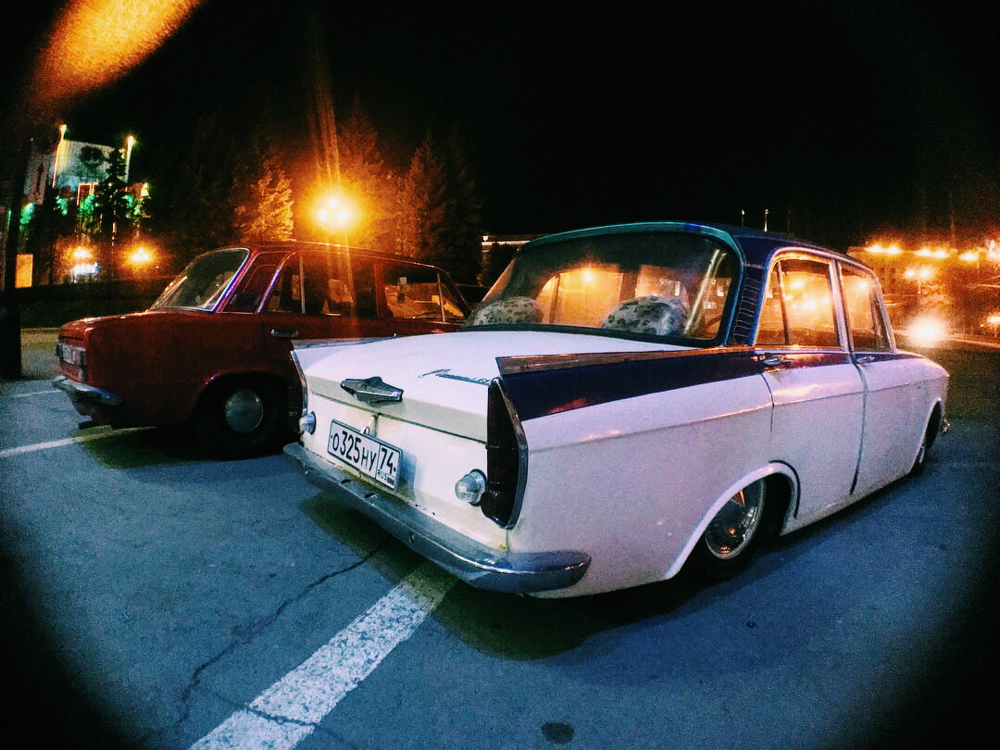
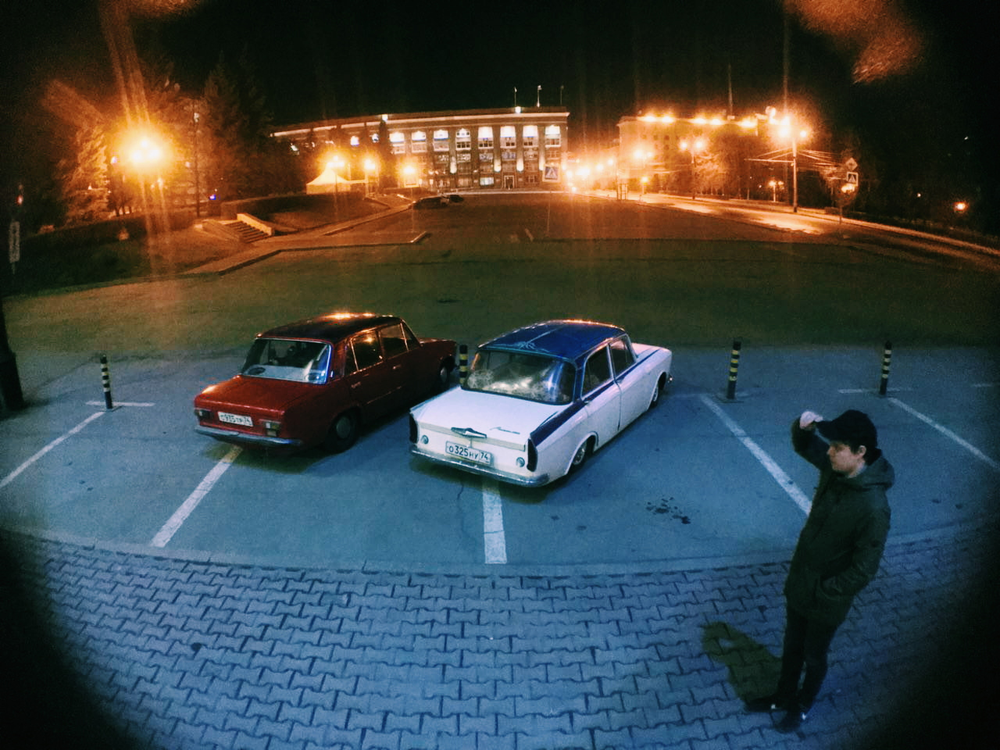

Поздним вечером меня разбудил телефонный звонок. Это был мой старый друг - Коля.

> "У тебя есть последний шанс прокатиться на 408", - раздалось в трубке.

Осознание того, что это не предложение, а ультиматум пришло сразу и других вариантов, как согласиться мне не оставалось.

"Оденься победнее, у меня выхлопные газы в салоне",- продолжил Коля.

Другой одежды у меня не было и я, напялив мятую кофту и черную кепку "как у дальнобойщиков", тихо прикрыл дверь спальни. Стараясь не разбудить возлюбленную, я выскочил в подъезд в ночную неизвестность. Кажется, она уже привыкла. Или только делает вид.

Холодный ветер приятно трепал волосы. Неоновые вывески магазинов и погасший свет витрин мегаполиса напоминал, что город-чудовище спит и у меня есть хотя бы пара дней придти в себя до возвращения в эту крысиную гонку со временем и нищетой.

Раздался грохот. В условленном месте встречи трудно было не заметить как подъехал, сверкая крышей, легендарный "четыреставосьмой". Вот так встреча. Прошло семь лет с того, как мне впервые Коля показал фотографию этого автомобиля.

> "Куда мы направляемся?", - безнадежно спросил я.

> "На ЮУрГУ, конечно же", - ответил Коля. Он знал, что нет в этом городе лучше места, где можно было бы эффектнее похвастаться автомобилем.

Парковка университета была забита. Среди припаркованных автомобилей и громкой музыки я не видел лиц, лишь вспышки фар и зажигалок.

Боже, сейчас я тот, кого всегда презирал и над кем всегда смеялся.

Стритрейсинг и увлеченные автотюнингом люди никогда не находили отклика в моей душе. Зачастую это были просто тупые прожигатели жизни и бесполезные папины сынки на дорогих, но, по сути бесполезных, тачках.

Но 408-й... Это была легенда. Воспетая группой Truckdrivers, известная в узких кругах на всю страну машина. Она всегда ассоциировалась у меня с рассветом челябинской подземной жизни: первые DIY-концерты в подвалах, первые попытки взять гитару в руки и собрать людей вокруг себя, первые путешествия и выезда. И вот, спустя семь лет, я сижу не переднем сидении и наблюдаю взгляды, полные одобрения от тех, кому тоже не спится.

*"О-о-о, что за пневма?", "О-о-о, красава, сколько вложил?"* - устав от глупых вопросов, я отрешенно слушал разговоры, делая глотки горького, кислого кофе.

Вечер пятницы закончился и через час парковка опустела. Ветер гонял по площади мусор.

*"Поехали, я отвезу тебя домой."*

Заводи, погнали.

