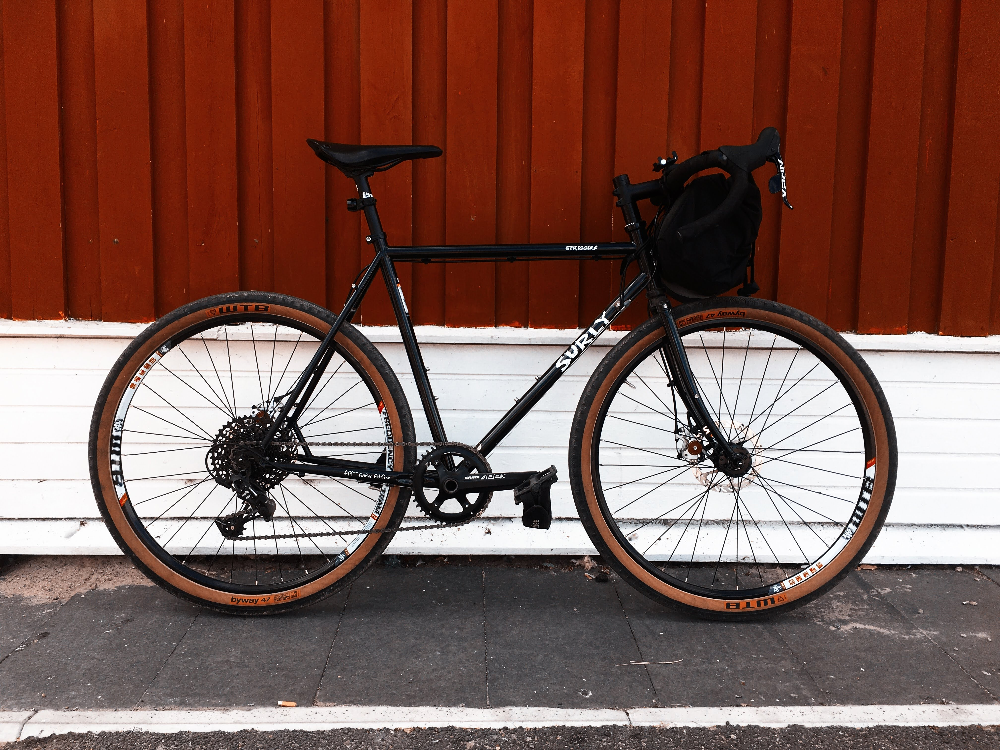
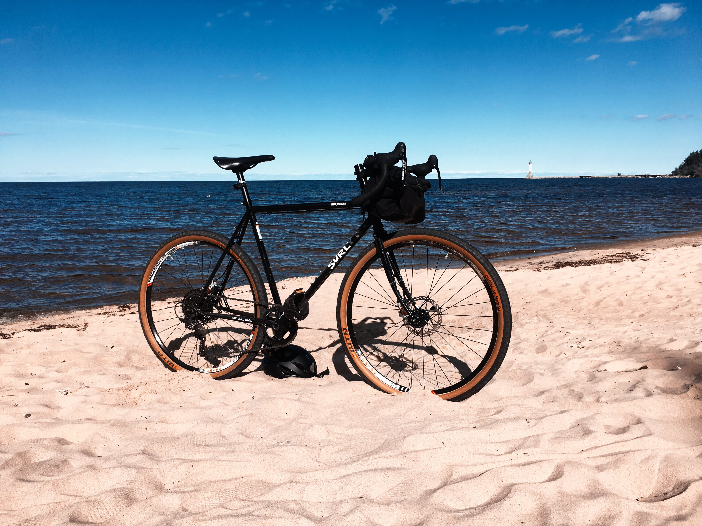
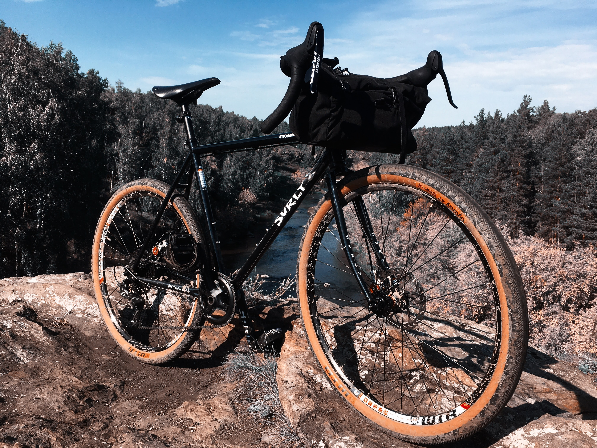
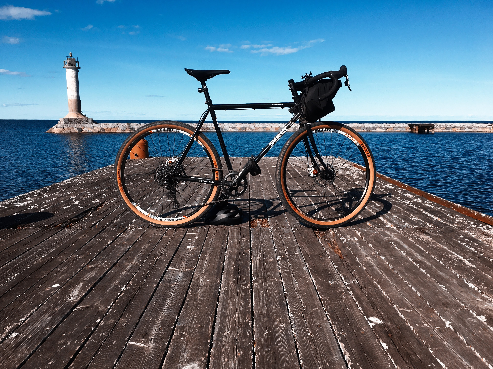
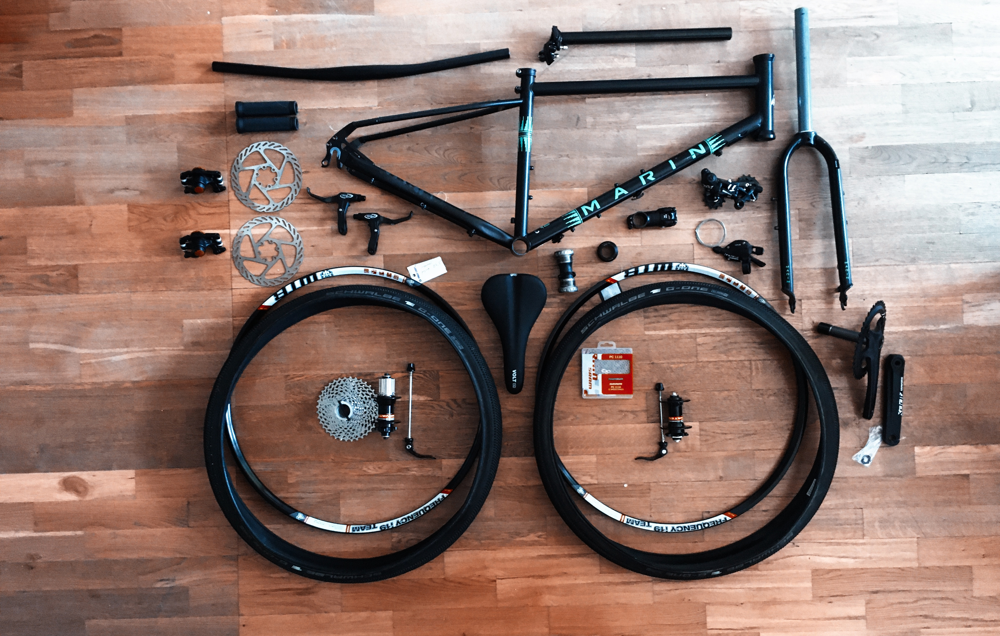

Привет. Решил поделиться с вами подробностями эпопеи по сборке велосипеда-кастома для Алины. 

Для тех, кто не знает, “кастом” - это велосипед, собранный на заказ с личным подбором деталей и компонентов. Главная цель этого предприятия — собрать байк, который будет на 100% удовлетворять потребностям наездника. У меня уже есть один кастом, который я собрал себе этой весной - Surly Straggler 650b. 

В прошлом году я увлёкся поездками на дальние расстояния и велотуризмом. Мой старый MTB-байк не удовлетворял моим требованиям, поэтому я собрал себе новый велосипед. 

Составить компанию мне было некому. Друзья не любят оффроад, а я не люблю шоссе. Моя девушка Алина давно хотела велик, и я подумал, что она станет моей боевой подругой и точно составит компанию в поездках по лесам и грунтам. 

Решено было подарить ей велосипед на день рождения. Так как Алине неискушенный юзер, то и велосипед ей требовался попроще без провалов в совсем уж мусорные компоненты. 

Почему нельзя было просто купить велосипед в том же “Триал-Спорте”? Всё потому, если и покупать велосипед, то он должен быть во всех моментах идеальным. А такое можно позволить себе только при сборке кастома. На отечественном рынке модели турингов и гревелов можно пересчитать по пальцам двух рук, а тех что подходят мне и Алине еще меньше. 

**С чего начинается сборка велосипеда?**

Правильно, с выбора фреймсета.

Основные моменты, за которыми надо было уследить:

- хроммолибденовая рама с бонками для крепления багажников и сумок
- дорожная геометрия с возможностью установки 650b-колёс
- классический дизайн
- сборка за приемлемые деньги.

Бюджет я рассматривал в районе 55000 рублей.

**Поясню про каждый пункт.** 

**Хроммолибденовая рама с бонками** — зачем? Так как мой велосипед — универсальный гравийник с возможностью быстрого сбора в туристическую поездку, то и спутнице хотелось собрать нечто подобное. Хроммолибденовый стальной сплав рамы гасит вибрации и ремонтопригоден, хотя и тяжеловат. 

**Дорожная геометрия с 650b-колёсами.** Для гравийных велосипедов характерна широкая резина — больший объём воздуха также, как и рама гасит вибрации, а сами колёса имеют большую прочность и позволяет проехать там, где шоссейный велосипед будет страдать. А размер колёс 650b или 27.5 дюймов удобен для байкеров низкого роста (у девушки рост 158 см). Ниже центр масс, больше контроля, меньше перекрытия носком колеса (toe overlap).

**С классическим дизайном** всё просто — Алина просто показала пальцем на изображения понравившихся велосипедов. Логики и расчёта здесь нет.

**Собрать подешевле.** Алина неискушенный велосипедист и даже пока вообще не велосипедист, так что она вряд ли заметит разницу между конусными подшипниками и промышленными во втулках и не отличит TRP Spyre от Avid BB7 по качеству торможения.

**Итак, начнём проект**

Фреймсет с такими запросами очень трудно найти на просторах нашей родины. Выбор пал на несколько моделей:

- Marin Nicasio Plus
- Fairdale Archer Weekender
- Marin Four Corners
- Surly Straggler 650b

- 
    
    Marin Nicasio +
    
- 
    
    Fairdale Weekender
    
- 
    
    Marin Four Corners
    
- 
    
    Surly Straggler 650B
    

Marin Nicasio не понравился Алине из-за цвета.

От Fairdale я был восторге. То, что нужно и укладывается в бюджет. Я даже был готов купить в США комплит, но мне не ответили на письмо с запросом покупки, а на сайте они внезапно закончились (вероятно, из-за пандемии). Так что, Fairdale тоже отпал.

Surly Straggler — такая же рама и вилка как у меня, но б/у вариант нужной ростовки невозможно найти. Из-за рубежа везти его очень дорого. Пошлина, курс евро и цена новой продукции всё портят. 

Прошло пару месяцев поисков. Я уже смирился с тем, что никогда не смогу найти нужную раму. И вот, я случайно захожу на Авито и ввожу запрос. Что там по гравийникам на рыночке? Что я вижу? Нужный фреймсет, нужного цвета, нужной ростовки с нужным размером колёс — Marin Four Corners XS 650b! Бывший в употреблении, в хорошем состоянии, за приемлемую цену. У меня даже руки затряслись. Неужели самый сложный этап по поиску “базы” закончен?

После беседы с владельцем байка милейшей девушкой Алёной и работы курьерских служб рама и вилка оказались у меня.

Теперь встал вопрос о поиске остальных компонентов. Не менее сложный, но тут хотя бы можно выбирать. Цель всё та же — купить нормальный бюджетный обвес за как можно нищие деньги. 

**Какие нужны компоненты?** 

- **Механические тормоза.** Среди них есть достойные модели, которые существенно дешевле гидравлики. Лучше поставить нормальную механику, чем хреновую гидравлику. Плюс механика более ремонтопригодна. 
- **Трансмиссия 1х11.** Сейчас это тренд и он позволяет сэкономить на системе и переднем переключателе. Сам я тоже езжу на 1х11 и горя не знаю — одной рукой передачи переключаю, другой слёзы счастья вытираю. Хватает ли передач? Да, хватает. Разве что на трассе хочется побыстрее, на самой низкой передаче ноги захлебываются в каденсе на скорости 45+ км/ч. Но такую скорость трудно поддерживать и для туринга это совсем не важно.
- **Прямой руль**, а следовательно МТБ-компоненты (тормоза, ручки, шифтеры), которые будут установлены на дорожном велосипеде. Поиск их - это такое себе удовольствие. 

Какие у нас есть варианты? Купить новое в России, купить новое в зарубежных интернет-магазинах и купить подержанное. 

Думаю, ворвусь на Авито, найду там добрые компоненты и сэкономлю. Но сразу увидел несколько проблем. 

**Первая проблема.** То, что мне нужно — это очень узкоспециализированные части, которые надо искать по всей стране месяцами.

**Вторая проблема** — обычно это сильно изношенная ерунда, от которой просто хотят избавиться за деньги. Бриллианты опять же надо искать кропотливо и долго. А времени мне жалко.

**Третья проблема,** которая перевешивает вообще все плюсы Авито. Почти все продавцы ориентируются на цены нового оборудования на российских сайтах и цены с Chain Reaction. Потом они сбрасывают 20–40% от этих цен и продают. Но дело в том, что на “чайнике” и прочих интернет-магазинах стоят изначально дорогие цены и когда вы видите предложение даже якобы со скидкой, то вы видите обычную цену с bike-components и bike24. Доказательства прилагаю.

<table><tbody><tr><td class="has-text-align-center" data-align="center">Компонент</td><td class="has-text-align-center" data-align="center">bike-components.de</td><td class="has-text-align-center" data-align="center">bike24.com</td><td class="has-text-align-center" data-align="center">chain-reaction.com</td><td class="has-text-align-center" data-align="center">Триал-Спорт</td></tr><tr><td class="has-text-align-center" data-align="center">Задний переключатель Apex 1</td><td class="has-text-align-center" data-align="center">47€</td><td class="has-text-align-center" data-align="center">48€</td><td class="has-text-align-center" data-align="center">75€</td><td class="has-text-align-center" data-align="center">50€</td></tr><tr><td class="has-text-align-center" data-align="center">Седло WTB Volt Steel</td><td class="has-text-align-center" data-align="center">57€</td><td class="has-text-align-center" data-align="center">51€</td><td class="has-text-align-center" data-align="center">64€</td><td class="has-text-align-center" data-align="center">59€</td></tr><tr><td class="has-text-align-center" data-align="center">Тормоза Avid BB5</td><td class="has-text-align-center" data-align="center">25€</td><td class="has-text-align-center" data-align="center">25€</td><td class="has-text-align-center" data-align="center">32€</td><td class="has-text-align-center" data-align="center">23€</td></tr><tr><td class="has-text-align-center" data-align="center">Кассета SRAM PG-1050</td><td class="has-text-align-center" data-align="center">32€</td><td class="has-text-align-center" data-align="center">40€</td><td class="has-text-align-center" data-align="center">58€</td><td class="has-text-align-center" data-align="center">49€</td></tr></tbody></table>

Сравнительная таблица цен в различных магазинах (курс евро взят 1€=78₽)

Делаю вывод, что поиск компонентов на Авито не имеет смысла — можно купить новое за ту же цену.

Итак, покупаем новое. Где? После анализа, я пришёл к выводу, что самые приятные предложения находятся на bike-components.de. Плюс, там есть всё, что мне нужно.

С момента, как я собирал себе свой велосипед и текущей сборкой прошло больше полугода. За это время изменились правила ввоза импортных товаров в РФ — нужно заплатить пошлину, если сумма посылки превышает 200€. Таким образом, при получении мне пришлось заплатить 1600₽ пошлины сверху. На оплату этой суммы действует комиссия, потому что перевод в таможенную службу осуществляется только наличными в отделении Почты России. Пришлось заплатить еще 170₽ сверху. Абсурд.

**На чём я сэкономил?** 

- Вилсет. Оба обода и спицы я купил из старой коллекции в “Триал-Спорте”, правда пришлось заказывать из разных городов. Втулки я заказал на “Али-Экспресс”
- Каретка. Также “Триал-Спорт”+доставка.
- Подседельный штырь. Купил на Авито.
- Седло. Древняя коллекция “Триал-Спорта”.

Отдельно хочу отметить работу курьерских служб. Сравнивая несколько, я выбрал “Деловые линии”. Там есть клёвый тариф — от двери до двери за 600₽, если посылка меньше кубометра. Курьер просто забирал в нужном мне городе деталь и после перевозки другой курьер приносил мне прямо в руки домой. Удобно и экономит время.

Так же, пару компонентов мне доставил курьер от Яндекса. 

<table><tbody><tr><td class="has-text-align-center" data-align="center">Фреймсет</td><td class="has-text-align-center" data-align="center">Marin Four Corners XS</td></tr><tr><td class="has-text-align-center" data-align="center">Втулки</td><td class="has-text-align-center" data-align="center">Novatec DB041, DB042SB</td></tr><tr><td class="has-text-align-center" data-align="center">Тормоза</td><td class="has-text-align-center" data-align="center">Avid BB5</td></tr><tr><td class="has-text-align-center" data-align="center">Ручки тормоза</td><td class="has-text-align-center" data-align="center">Avid FR-5</td></tr><tr><td class="has-text-align-center" data-align="center">Рулевая колонка</td><td class="has-text-align-center" data-align="center">FSA N.8D</td></tr><tr><td class="has-text-align-center" data-align="center">Подседельный штырь</td><td class="has-text-align-center" data-align="center">Brand-X Inline</td></tr><tr><td class="has-text-align-center" data-align="center">Задний переключатель</td><td class="has-text-align-center" data-align="center">SRAM Apex 1 11S</td></tr><tr><td class="has-text-align-center" data-align="center">Каретка</td><td class="has-text-align-center" data-align="center">SRAM GXP</td></tr><tr><td class="has-text-align-center" data-align="center">Система и шатуны</td><td class="has-text-align-center" data-align="center">SRAM APEX 1 42t</td></tr><tr><td class="has-text-align-center" data-align="center">Ободья</td><td class="has-text-align-center" data-align="center">WTB Frequency Team i19</td></tr><tr><td class="has-text-align-center" data-align="center">Покрышки</td><td class="has-text-align-center" data-align="center">Scwalbe G-One 650Bx40</td></tr><tr><td class="has-text-align-center" data-align="center">Седло</td><td class="has-text-align-center" data-align="center">WTB Volt Sport 142</td></tr><tr><td class="has-text-align-center" data-align="center">Руль</td><td class="has-text-align-center" data-align="center">Levelnine 660mm</td></tr><tr><td class="has-text-align-center" data-align="center">Шифтеры</td><td class="has-text-align-center" data-align="center">Apex 1 Flat</td></tr><tr><td class="has-text-align-center" data-align="center">Вынос</td><td class="has-text-align-center" data-align="center">Levelnine 75mm</td></tr><tr><td class="has-text-align-center" data-align="center">Кассета</td><td class="has-text-align-center" data-align="center">SRAM PG-1050 10S</td></tr></tbody></table>

Итоговый сетап

Итак, части будущего велосипеда лежат на полу. Теперь всё надо соединить в единый механизм. Предварительно я обработал фреймсет антикоррозийным спреем. Сталь имеет свойство ржаветь. Чтобы рама и вилка дольше служили, нужно раз в 2–3 года её изнутри обрабатывать простым советским…. 

Осталось собрать

Для сборки я обратился в [“Правь-Сервис”](https://vk.com/prav_service). Парням доверяю и всегда ремонтируюсь у них. 

Итак, представляю вашему вниманию то, что получилось.

Какие выводы можно сделать? Особо сэкономить у меня не получилось. Новый велосипед с доставкой из Москвы стоил бы около 80 000₽. Итоговая цена этой сборки вышла в 68 000₽. Получается, что можно было сэкономить время, но мне интересно заниматься этим самому. Эта статья —  мой опыт и ни в коем случае не инструкция. Возможно, сейчас бы я собирал велосипед по-другому. 

Самое главное, чтобы новая хозяйка была им довольна и проехала на нём тысячи километров в тысячах километров от дома.
