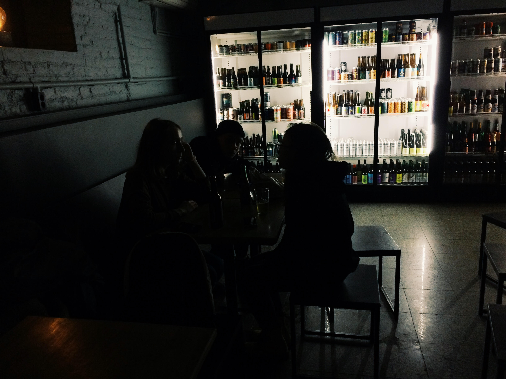

Этой осенью я оказался в Санкт-Петербурге. Хотелось заценить местные питейные заведения и вот, как результат, появилась эта статья. Не претендую на звание барного критика. Всё, что тут есть - исключительно личное мнение, написанное с похмельными страхами и тревогой.

Итак, вы оказались в Петербурге и не знаете куда вам податься.

НА БРОВЯХ

Наливайка рядом с улицей Рубинштейна. Обстановка как раз напоминает стоячки. Трудно провести там много времени, но алкогольная карта предлагает большой выбор напитков. Фирменные шоты с домашними заготовками согрели нас в этот вечер. Музыку не помню. Я бы начал пятничный поход по барам именно с этого заведения.

ПОДДОН БАР

В "Поддон" я уже пришёл в изрядном подпитии и собирался лишь интеллигентно выпить положенной ипы. Но в итоге покинул это заведение сильно на рогах, еле мог устоять на своих ногах. Виной тому кумовство и балаковская франшиза "Поддон", по которой открылось это замечательное заведение. Внутри всё располагает к приятному времяпрепровождению в кругу единомышленников, персонал дружелюбный, из колонок играет рок. Помимо обширной карты алкогольных напитков бар может предложить еще такие забавы как кикер и плейстейшн. Удобное месторасположение рядом "Цоколем" и "Ионотекой" позволяет продолжить любую вечеринку в режиме афтепати. В целом, если бы я жил в Петербурге, то это место я бы посещал регулярно.

ПИФ-ПАФ

Довольно приятное место на набережной канала Грибоедова. Большой выбор еды, несколько вегетарианских позиций в меню и выпить можно не только пива. Приветливые официанты, приятная публика и уютная обстановка скрасили наш вечер. Особенно стоит отметить настойки, которыми славится это место. Шоты с медом и корицей и яблоком на закуску были великолепны.

БАЛАНС БЕЛОГО/ОДНОЙ ЛЕВОЙ

"Баланс белого" -  домашняя обстановка, будто пришёл в гости к друзьям. Музыка не орёт, поэтому можно комфортно строить козни врагам и обсуждать насущные проблемы. Пиво вкусное, еду не видел. После 23-х часов нас выгнали в соседнюю комнату допивать свои напитки, которая была уже другим баром - "Одной Левой". Представляет из себя только барную стойку и бармена, который в то же время сам активный участник возлияний. Мы покинули это заведение как только наши стаканы стали пустыми, но опрокинуть за воротник и тут можно с комфортом и достоинством.

ПИВНАЯ ДИЕТА

Бар с крафтовым пивом. Большой выбор пивоварен на кранах и в холодильниках. Скромный интерьер -  кафель, столы и холодильники. В таком месте долго не посидишь. Хотя, может мы попали в неудачное время и обычно там творится чад кутежа с моднейшими пивоварнями. Но всё окупается звучанием Black Sabbath из колонок, приветливой барвумен и большим пространством для людной компании. Уверен,  в выходные здесь классно.

Пивная диета

REDRUM

Фаворит этого списка. Приятная спокойная атмосфера, вкуснейшее пиво. Уютный интерьер и отсутствие громкого пьяного галдежа сделали это место изысканным для свиданий и усталых посиделок. Мы пришли к выводу, что сюда хочется зайти еще не раз. На кранах - во основном крафт от пивоварни AF Brew, но есть и другие позиции. В меню только закуски. Из музыки - какая-то спокойная электронщина.

Такой вот список, друзья. Скорее всего, он не полный и это не все крутые места Петербурга. Так что, есть много причин вернуться.

[Поддержать](https://rocketbank.ru/m.skndlst)
