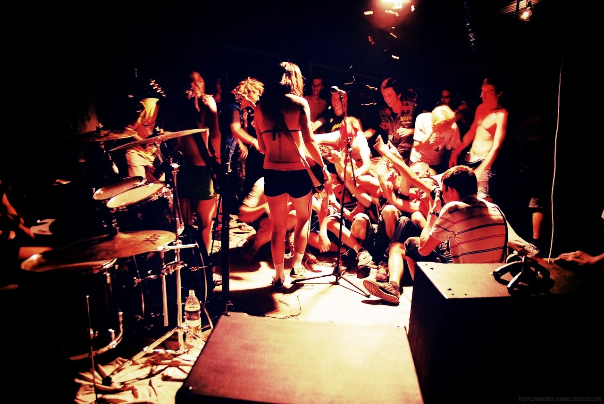
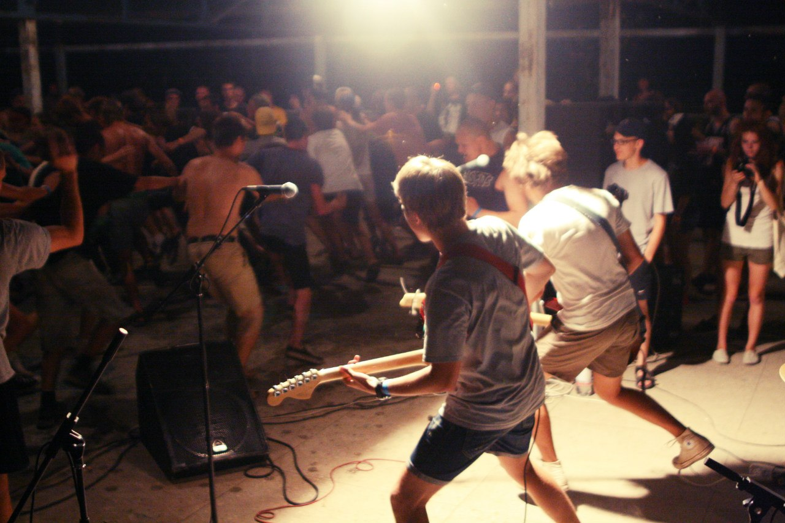
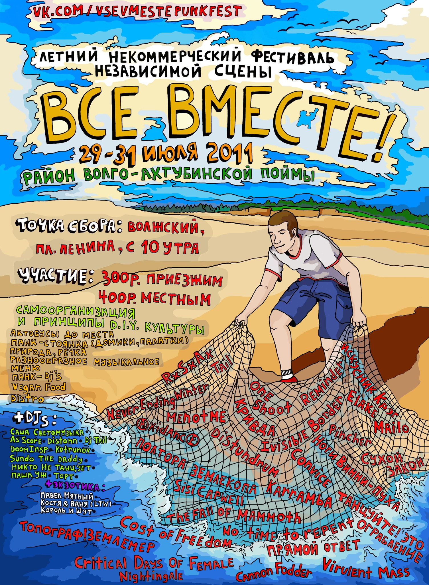
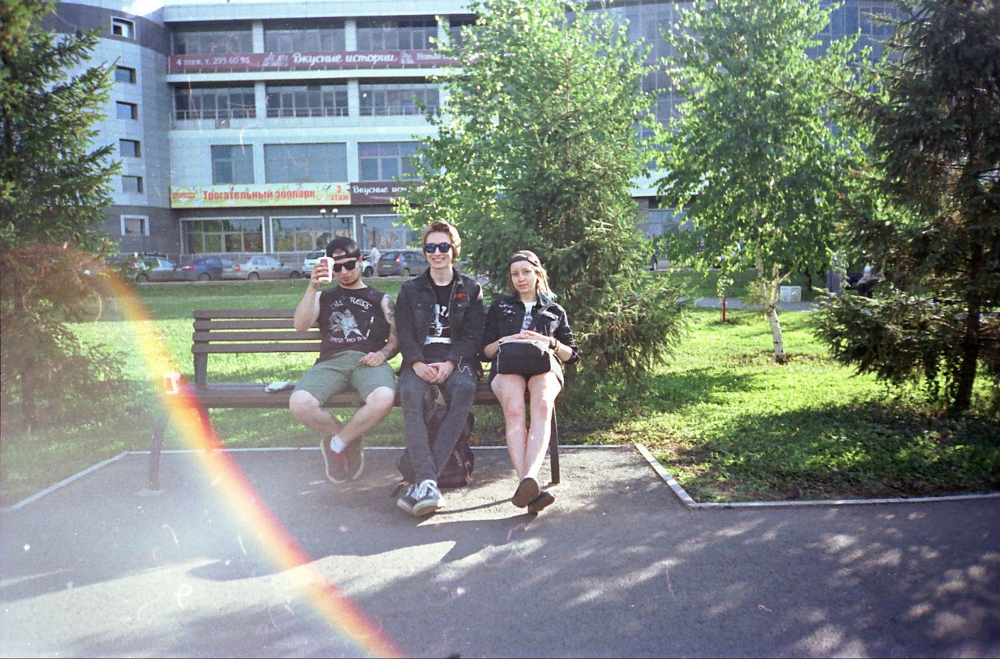
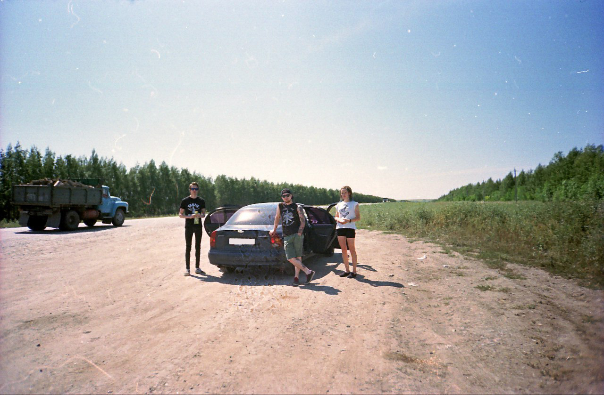

Много кто просил меня этим летом представить отчет по рокнролл-трипу в русский Лос-Анджелес, а именно в город-легенду Волжский. Так что, вот он.

Начну с самого начала, хаха. «Миха, ты что опять будешь рассказывать какая в тот день стояла погода и как тебя обсчитали на кассе в „Пятерочке“?. Нет.

Погнали.

Почему именно Волжский? Поводом туда поехать является летний панк-рок фестиваль „Все Вместе“. Когда-то, в далеком 2010 году один гражданин приехал с феста и сказал, что там было нереально круто. Ну мы и поехали в следующем году, дабы убедиться в этом лично. Два дня жары, пляжа, пива, диайвайного панка не могли не оказаться крутым времяпрепровождением, поэтому челябинские жюри единогласно подняли таблички с цифрой „10“ и долго еще вечерами на вписках обсуждали эти лихие дни. Плюс удобно было потусоваться и встретиться с друзьями по пути на различные курорты СНГ. Ну и как-то завертелось, тусовки скорешились и вскоре наша тусовка стала долгожданным гостем в этих краях.

  

  

  

Не стал исключением и 2015 год. Обсудив планы дальнейшей жизни после Волжского (рассредоточиться кто-куда, кто в Крым, кто в Грузию), мы собрали свои вещи и уселись в роскошное корыто, которым владел великолепный мастер руля и педалей Колхоз. Долгие сборы и попытки взять всё что необходимо и вот мы вчетвером трясемся на трассе в „Шевроле Ланос“. Два часа сна и опять всё идет не так как надо. Колхоз начинает жаловаться на то, что машина „проседает в мощности“, я начинаю жаловаться, что Колхозный не поменял сцепление. Ну он говорит, что вроде поменял. Ладно, едем дальше. Спустя еще сотню км мы чувствуем запах горелого сцепления и решаем заехать на какую-нибудь станцию техобслуживания. Поколесив по Юрюзани и выслушав советы от различного рода алкашей и иногда джентльменов, мы решаем доехать всё-таки до Уфы. У нашего водителя есть привычка: он не снижает скорость перед крутыми поворотами. Я, как второй пилот, делал ему замечания и он со мной соглашался. И вот, Юрюзань, крутой поворот 90 градусов. Что вы думаете? Колхоз снизил скорость и плавно вошел в поворот? Конечно же нет! Видимо, пока он ехал, ему явилось откровение в виде Вина Дизеля с крутой фразой про дороги и тачки. Восприняв это как руководство к действию, товарищ К. не снижая скорость влетает в поворот, я ору, машину несет, слева на встречке другая тачка, справа столб. Ну мы уворачиваемся от обоих, останавливаемся, Колхоз как придурок ржет, остальные пассажиры в виде молчаливых Лины и Артёма просто молча офигевают, я же выдергиваю седые волосы и ору на водилу, начиная сомневаться в том, что мы вообще попадем в Волжский. Когда я спросил, зачем он так сделал, он ответил: „Я хотел с дрифтом войти в поворот“. На переднем приводе и в хлам перегруженной машине, ну.

  

  

Ладно, поехали дальше. Сцепление воняет уже на полную катушку, а на горке кажется, что тачка сейчас поедет назад. Принимаем решение остановиться в Уфе и заменить. Нет, не тачку. Сцепление. Потратив кучу времени на обзвон магазинов и сервисов, находим детали, быстро отвозим тачку в ремонт и идем гулять по Сипайлово. В ближайшем ТРК покупаем себе кофе и садимся ждать. Уставший Колхоз говорит: „Мих, я не знаю, что меня задолбало больше — Уфа или твои истерики“. =(.

Дождавшись окончания ремонта мы всё-таки двинули в путь. Я пересел за руль, включил свою флешку в магнитолу. Круто уезжая в закат под Сектор Газа, мы почти доехали до Самары, но усталость дала о себе знать и мы решили искать место для сна. Зассав ночевать в лесу, мы сняли комнату в мотеле. Я долго не мог уснуть, потому что накануне упился энергетиками, но в конечном итоге, после душевного разговора с Линой, я всё таки уснул.

Наступил следующий день нашего дорожного путешествия. Нас много кто отговаривал ехать на тачке, мол устаешь быстро и вообще с ней возиться надо. Я ездил поездом, ездил стопом. Но всегда хотел иметь дорожное приключение, поехать куда-нибудь в крутое место с друзьями. Нет ничего круче чувствовать прохладу ночи, стоя на обочине у трассы, рассказывая друзьям какую-нибудь нелепую историю, при этом смеясь и затягиваясь сигаретой и разминая затекшие конечности.

Позавтракав тем, „шо було“ мы двинулись в путь. До вечера ничего особенного не происходило, мы с Колхозом размеренно ехали, по-очереди меняясь правом рулить. К вечеру наступила очередь Сереги и я решил немного поспать. Оказалось зря. Сижу, сплю. Слышу какую-то возню. Открываю глаза. Не понимая даже такие факты, какой сейчас год, я вижу что мы на встречке, справа фура, спереди несется какая-то „семерка“, Серега не успевает завершить обгон. Он уходит на обочину встречной полосы, нас несет из стороны в сторону, мы сваливаемся в кювет и чуть не переворачиваемся. Всё, приехали. Машина стоит под углом в градусов 60 и готова вот-вот перевернуться. Мы вылазим через „верхние двери“. Все в диком шоке, у меня трясутся руки, а Колхоз опять ржет и спрашивает: „Кто-нибудь сфоткал?“. Я прихожу в ярость и со словами „Иди нахер, мудак!“ почти начинаю с ним драку, но меня отвлекают остановившиеся помочь машины. За минуту сразу три, очень добрые люди. Какой-то газелист пытается нам помочь, но, не пойми откуда возникают ребята из бригады, которая обслуживает дорогу, которые оказались очень душевнейшими людьми, моментально успокоив меня словами: „Ну че, ребят, не ссыте, ща всё путём будет!“. Вывернув руль, мы спустили машину с кювета на полосу обслуживания рядом с трассой и Серега нормально выехал, пока я нервно курил и обсуждал с Артёмом и Линой этот инцидент. Побольше бы таких людей как эти ребята, что нам помогли. Воистину, дорога ярости. На удивление, тачка цела, ничего не пробито-не разбито, стойки на месте. Продолжаем наш маршрут. Цель — добраться сегодня в Волжский. Больше не доверяя Колхозному, я сажусь за руль, брызгаю серебрянкой себе на зубы, говорю что-то про Вальгаллу, и, будучи мотивированным устроить мощнейший оттяг, даю по газам и доезжаю к ночи до пункта назначения.

Дождавшись уже приехавших на тот момент ребят и устав обниматься и жать руки, я наконец-то напился пива и просто рухнул спать в гостях у приютившей нас Риты.

Мы приехали.

Продолжение читайте в следующем выпуске.

