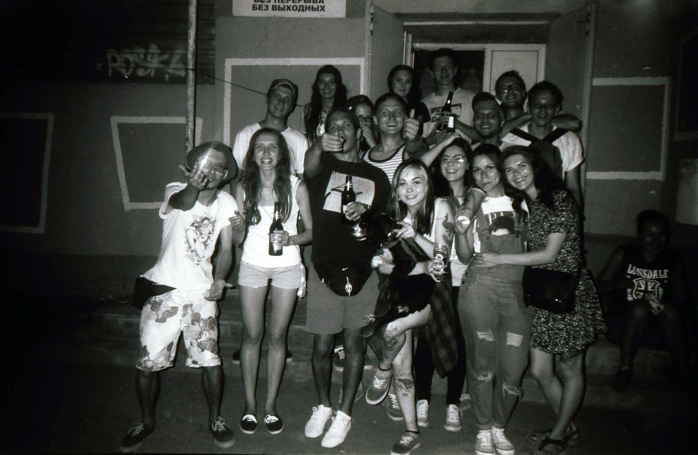
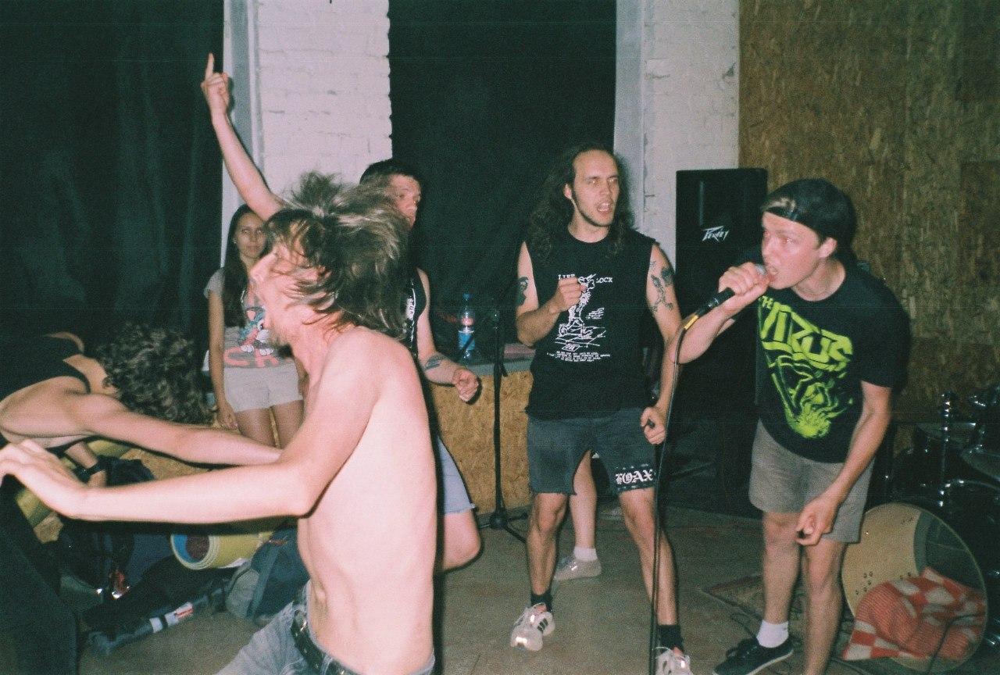
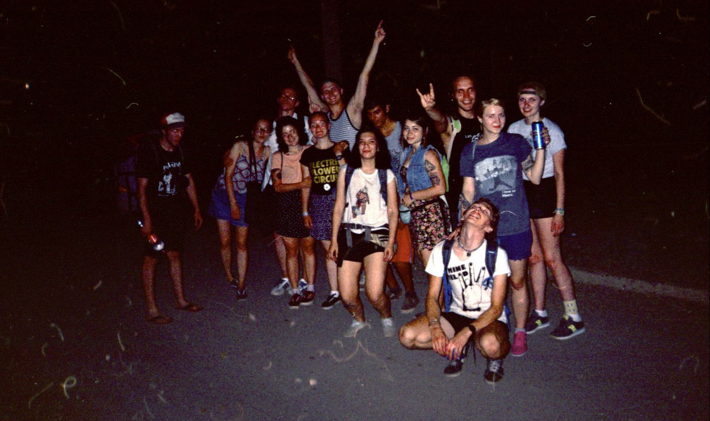

Итак, продолжаем рассказ, который получил кодовое название «Волжский — город моей судьбы».

В этом году в Волжском оказалась просто тысяча вписок, поэтому все, кто пригнал были комфортабельно размещены на лучших полах этого города и никто не был стеснен. Вписывались мы прямо в сердце города, через дорогу был ЦУМ и площадь.

Проснувшись утром, позавтракав и наведя все утренние туалеты, мы выдвинулись на встречу друзьям и приключениям. Что делать дофига часов до пре-пати? Было решено штурмовать пивные полки супер-маркетов и греть кости на городском пляже. Было утро, было уже супер-жарко, яркое солнце слепило сквозь солнцезащитные очки, а запотевшая бутылка с пивом доживала свои последние минуты.

Мы встретились с чуваками и дошли до пляжа. Прошли мимо легендарной «Веранды», на которой мне так и не довелось потусить, но ребята говорят, что там было нереально круто.

На пляже все было по обычным пляжным делам. Купания, загорания, с бегущих в воду чуваков трусы срывания. Впрочем, весело, но ничего особенного.

\[gallery ids="114,115" type="rectangular"\]

Прошло несколько часов, мы восстановили силы в столовке и съездили за вещами тех, кто решил в эту ночь спать на пляже.

Наступил вечер, мы затарились огненной водой и отправились к клубу «Маркс». У входа в клуб уже было прилично народу, был рад встретить чуваков, с которыми не виделся около пяти лет. Ну и всё, понеслась: разговоры, алкогольные возлияния, в общем, типичное «околоконцерта». В это время уже чекались The Slurm и вроде пора было бы уже подниматься, но общаться с людьми, которых давно не видел было круче и к тому-же я не поклонник их творчества, поэтому я решил дождаться сета Scrap Monsters на улице. В моих руках постоянно оказывались новые банки с пивом, люди смеялись и всё было очень душевно.

Околоконцерта.

Наступила очередь Scrap Monsters и ижевские рокеры просто подожгли танцпол. В воздухе витали искры, мертвые поднимались из могил, инвалиды вставали на ноги дабы как в последний раз отбегать под хиты этой панк-рок группы.

Scrap Monsters.

Пре-пати подошло к концу, но тусовка ждала продолжения, поэтому решено было пойти на пляж.  
Пока шли на пляж, я успел по пьяному обсудить с чуваком, его Олег кажется зовут, различные панк-рок группы и движухи, обсудить музыку. Ну вы знаете как это происходит. «Моя любимая группа A Global Threat» и прочее. Мне кажется по этой фразе можно определить степень моего опьянения.

Что будут делать около сотни пьяных рокеров ночью на пляже? Конечно же купаться голышом! Ну это комментировать не буду, скажу лишь, что было супер весело. И вот значит такая история. Стою я голый, прикрыв руками свои причиндалы, обсыхаю, и с кем-то веду светскую беседу. Подходит Саша Шмырь и происходит такой диалог:

— Ты еще долго тут своей жопой светить будешь?  
— Я обсыхаю, ты нагишом не купался чтоли?  
— Купался, но я уже оделся, а не стою тут как мудак.  
— Я типа Апполон.

Ну короче, я пристыдился и с досадой заметив, что ни одна фея не клюнула на мою атлетичную фигуру, я одел трусы. На что получил ответ от ижевских: «Тебе че, эти трусы из занавески в поезде сшили чтоли?» А ведь это были мои самые нарядные трусы =(

Ну дальше все накупались и пришло время романтического вечера — песни у костра на песочном пляже. Гришуне досталась не пойми откуда возникшая акустическая гитара и он исполнил для присутствующих шлягеры беспокойной молодости и различного подземелья.

Спустя какое-то время гитару забрали, народ потихоньку сраженный усталостью и алкоголем, отправлялся по впискам. Я же дообсудив какой-то «супер важный вопрос» тоже двинул домой. По пути до дома нас попытались спровоцировать какие-то любители творчества одного австрийского художника (откуда они ваще взялись в этом городе?), но у них ничего не вышло.

День закончился и я отдался пьяному сну в гостях у Риты.

Продолжение читайте в следующем выпуске.

Ссылка на первую часть: http://wp.me/p84Y0N-10

Ссылка на третью часть:http://wp.me/p84Y0N-1d

\[jetpack\_subscription\_form subscribe\_placeholder="Email адрес" show\_subscribers\_total="false" button\_on\_newline="true" submit\_button\_text="Подписаться" custom\_font\_size="16" custom\_border\_radius="0" custom\_border\_weight="1" custom\_padding="15" custom\_spacing="10" submit\_button\_classes="has-text-color has-background-color has-background has-primary-background-color" email\_field\_classes="" show\_only\_email\_and\_button="true"\]
