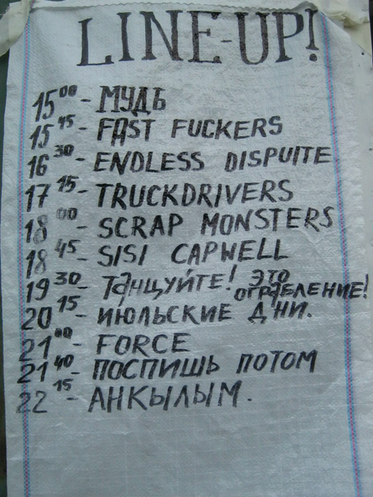
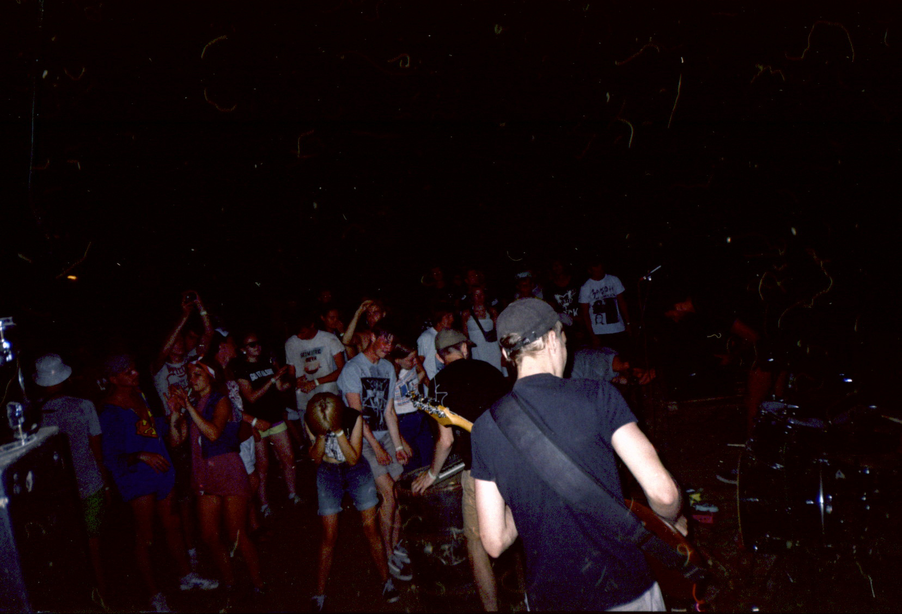
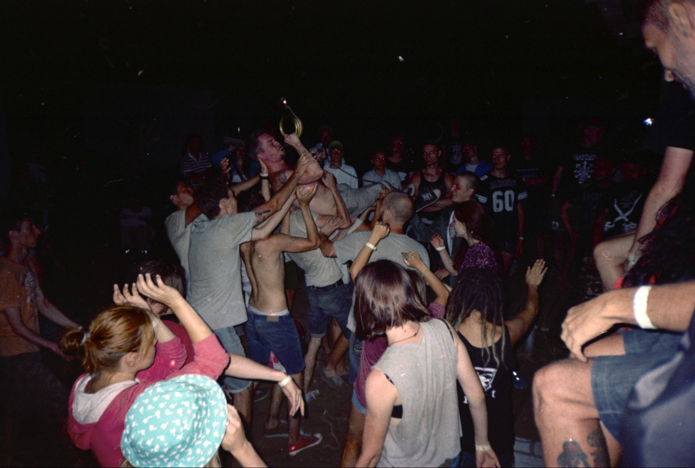
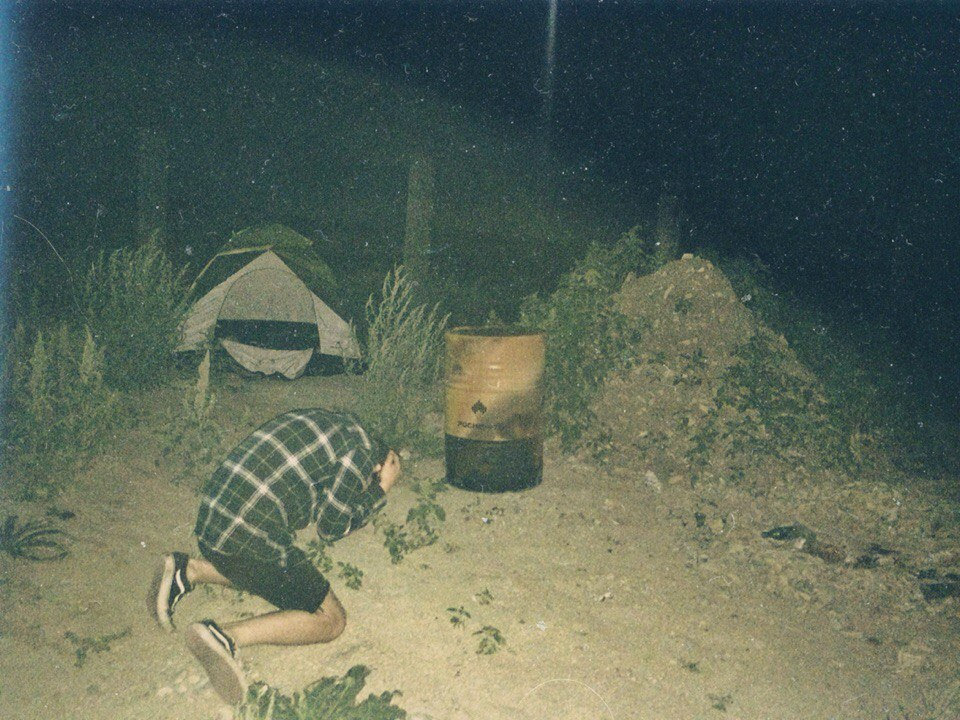
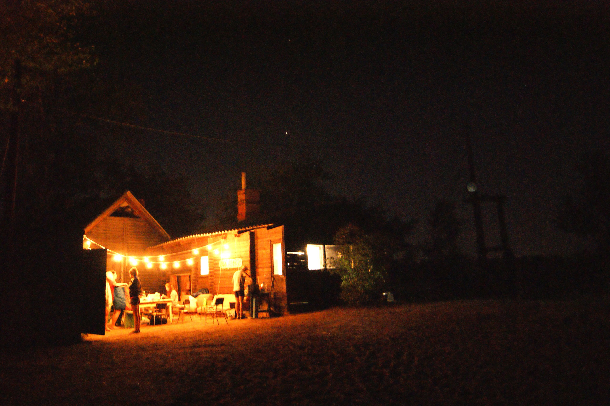

**День первый**.

Проснувшись утром следующего дня и утолив потребность горящих жабр в воде, мы принялись выслушивать указания по помощи в организации феста. Нам вдвоем с Колхозом было поручено съездить за булочками, за газовым краном и за гитарным стеком. Утолив голод местной шаурмой, которая, к слову, оказалась совсем невкусной («лига шаурмы» на выезде) мы выдвинулись в лютое пекло города. Ну дальше, как и до этого, ничего интересного не случилось, мы просто ездили по городу в лютую жару, я ворчал на Колхоза, Колхоз говорил, что я дед и что он меня выкинет прямо сейчас из машины. Сделав всё, что нам было велено, мы отправились на фестиваль.

Первым, кого я увидел оказались Аким и Сергуня. Второй настойчиво предлагал мне выпить виски, но я был совсем не в настроении, поэтому пошел здороваться с теми, кого не видел и осматривать базу. База была довольно уютная, в баре вовсю уже стучали бутылки, а на сцене раскладывали аппарат. Волжские девахи по приезде в наш город обмолвились, что мол, фест будет на старом месте, где большая веранда. Это было очень круто, но что-то там не срослось и, в очередной раз, фест сменил свою дислокацию. Ну что-там: домики с верандами, пляж, сцена в низине и два воспетых группой «Сектор Газа» сельских туалета прямо на проходе, хаха)

Едва я успел поправить свое настроение банкой холодного пива и начать вести светские беседы с окружающими меня джентльменами, как возникли нежданные, но ожидаемые гости. Люди напряглись. После выборочной проверки документов у присутствующих и того факта, что тут собрались любители музыки, а не сектанты (хаха), хозяева базы ввели некоторые ограничения (не включать звуковую аппаратуру после 23:00) и покинули место тусовки вместе с «гостями». Веселье продолжилось.

Рокнрольщики раскупали вещи, представленные на многочисленных дистро, постоянная очередь в бар, в котором (к слову) подавали яблочный сидр и чешское пиво, я же просто слонялся от компании к компании и обсуждал насущные вопросы. Какие, вы и сами знаете.

\[gallery ids="77,78" type="rectangular"\]

Изрядно набравшись, я было решил продемонстрировать окружающим свой талант игры на гавайской гитаре и знание 4-х песен на 4-х аккордах. Едва я получил разрешение сыграть и гитару от какого-то чувака из Новгорода, как я тут же был с позором изгнан из клуба любителей гавайской песни. Причем гитару у меня отобрали прям за гриф хаха. Ничего, этим вечером я нашел других жертв.

«4-songs killer» как прозвал меня Саша Шмырь. Да, я исполнил свой сет чувакам из Ижевска, но они были непротив или же у них было какое-то проявление «стокгольмского синдрома».

Тем временем на сцене доигрывала крайняя группа (Barrenyards, кажется) сегодняшнего дня и всё, что оставалось делать — это штурмовать бар и душевно общаться с чуваками, которых не видел по несколько лет. Чем я, собственно и занимался до самой поздней ночи.

Решил сходить к бару, увидел там какой-то адский рейв, взял еще пива и отправился в лагерь, где спали наши чуваки. Там я понял, что уже достаточно наросиянился, и со словами «пора спать, чуваки» я завалился в палатку.

**День второй**.

Опять похмелье (но, как обычно бывает на отдыхе — лайтовое). Проснулся, пошел на завтрак. Чуваки круто заморочились с кухней, каждый раз был необычная веганская еда, ее было много и она была вкусная. Позавтракав, я поправил свое здоровье пивом (походу, я спился). Сегодняшний день феста был основной, но из групп я хотел послушать всего несколько. Решено было начать играть первой группе где-то в 16:00, потому что в прошлом году много кто офигевал от жары и просто проводил весь день на пляже. Ну, собствтенно, так этот день и прошел, согласно всем канонам матрасного отдыха. Возлежания на пляже, купания, покупка вареной кукурузы и прочих курортных ништяков.

Начали играть челябинские Truckdrivers, собрав вокруг себя уже достаточно большую тусовку. Ребята порадовали новыми песнями и старыми хитами. Да вы сами всё видели: пляски, сканки и анекдоты от человека-инкогнито.

\[gallery ids="84,85" type="rectangular"\]

Остальные группы я протусовался где-то в других местах. Наступил вечер. Когда я ехал на фест, то особо ждал сета Июльских Дней и как оказалось не зря. Группа играет депрессивный пост-панк/колдвейв, и в этот жаркий день я просто замерз в этот час, погрузившись в их музло. Дальше все ждали «Поспишь потом», которые могли не выступить, потому что собирался дождь.

Июльские дни.

Прошел слушок, что челябинская тусовка собирается на веранде домика праздновать день рождения Кати и все начали потихоньку подтягиваться к месту назначения. Появились более крепкие алкогольные напитки и пьянка начала набирать просто неимоверные обороты. Подтягивались всё новые и новые адепты культа Зеленого Змия, огненная вода лилась рекой, вот этот тост «ЗАВАССКИНЫ!!!11» хором (челябинская фишка, не вникайте, скины тут не причем совершенно). Кто-то орет песни под гитару, кто-то ржет, кто-то пьет, но в общем, все горят в чаду кутежа и круто тусуются.

\[gallery ids="91,92" type="rectangular"\]

Пошел дождь, я всех успокаивал, что это всё лишь на 20 минут. Вопрос сета «Поспишь потом» был под вопросом, ну и чтоб скрасить минуты ожидания, люди продолжали звенеть жестяными кружками.

Услышав знакомые гитарные рифы, рокнрольщики и рокнрольщицы ломанулись к сцене (которую перенесли на другую веранду под навес). Начали играть «Поспишь потом», и все просто потеряли последние остатки разума и человеческого облика. Песня «Я — Неудачник», время уже больше 23:00, вечеринка тотально вышла из под контроля...И тут загорается яркая вспышка красного света. Я уж было подумал, что приехал пативен, что «вечеринка окончена» и это свет от мигалки, как вижу, что это гражданин К. зажег красный фальшфейер просто добавив бензина в и без того безумную смесь беспечной молодости, музыки и алкоголя. Весь сет прошел в том же духе, песни, которые все орали хором, стейдждайвинг с крыши и всякое такое остальное.

\[gallery ids="95,96" type="rectangular"\]

Отыграли свой фолк-панк сет АНКЫЛЫМ. И все вернулись догорать и допивать то, что осталось. Когда я упал спать, на веранде оставалось человек 5 из 30 первоначальных.

Анкылым!

**Третий день. Дорога домой**.

— Миш, ты выглядишь так, будто плакал.  
— Я итак плакал.

Адское похмелье. Колхоз задолбал, хочет сегодня выезжать домой. А я не могу стоять на ногах, не то что рулить его автомобиль. Ладно пофиг, это вечером. Пошел на завтрак, кое-как затолкал в себя какой-то хот-дог с сейтаном и поправился чаем.

Собрали свой скарб, я выслушал упреки в том, что какой-же я мудак, все едут на курорты, а я домой, работать. А я все деньги пропил и потратил за эту поездку. В следующий раз.

Серега всё еще настаивает на том, что хочет ехать домой сегодня вечером. Меняем Лину (отправляется дальше путешествовать) на Толяна и едем к Кате, которая согласилась предоставить на свою квартиру для того, чтоб мы стали похожи на людей. У Кати дома был музыкальный домофон в подъезд, на котором можно было приятно удивить какую-нибудь подругу и сыграть соло на домофоне в случае удачного свидания, вкусный обед и прикольный ласковый кот, которые успел у всех посидеть на коленях. За что ей спасибо.

Ну и всё. Безумный Колхоз врубил «Герой асфальта» Арии и мы поехали в закат. С похмелья, невыспавшись и с лютой усталостью мы доехали до темноты и решили искать место для ночевки. Ночевали мы на стоянке с дальнобойщиками. Они спросили, не буйные ли мы. Наверное думали, что если мы с палаткой, значит будем пить водку и орать песни под гитару. Ну, кемпинг нон-стоп. Я спал с Серегой в тачке, Тёма с Толяном в палатке неподалеку. Кстати, спать в тачке мне было удобно.

Под утро произошел такой случай. Дело в том, что машину было видно из палатки, а справа от машины были небольшие кусты. С утра яркое и жаркое солнце разбудило меня и я попросил Колхоза проехать три метра вперед, в тенёк. И получилось, что мы скрылись из виду палатки. Ну и продолжили дальше спать. Дальше видимо Тёма увидел что машины нет и пошел на проверку. Увидел, что машина стоит в другом месте, вернулся к Толяну и говорит: «Там пацаны отъехали...». Толян, вспоминая, что мы вчера ложились спать злые и уставшие, подумал что мы померли от перенапряжения.

Я и та самая палатка.

Ну это всё шуточки. Следующим днем Колхоз топил, я спал и мы хотели успеть до ночи в Челябинск. И поняли, что во всяком случае приедем к утру. Весь день мы ехали и к вечеру пришла моя очередь управлять мечтой Колхоза. Я был невыспавшийся и попросил Артема включить какой-нибудь русский панк-рок. Это был альбом «Протест Деталей Механизма» известной группы. Под монотонные рифаки и песни про мегаполис и атомную романтику мне думалось, будто я в каком-то гиперпространстве на космическом корабле. Спустя сотню километров, я понял, что уже и с пургеном не вывожу и начал упрашивать Колхоза остановится хоть немного поспать. Встали опять с дальнобойщиками. Решили поспать час, но в итоге целый час мы просто ржали над тем, что «там пацаны отъехали». В итоге прозвенел будильник, я попросил поспать еще час. Все по аду уставшие. Спим...Час..Второй....Тут Серега резко открывает глаза и орет «ЕДЕМ!». Включает свою машину и уезжает уже в рассвет.

Ну собственно под утро мы доехали. Я переживал, что Колхозный не выспался и в очередной раз предпримет попытку избавиться от нашего существования, но он был уже опытным, поэтому доставил нас в целости и сохранности.

Дома я понял, что скучаю по всем чувакам из Волжского и по тому, что не поехал тусоваться дальше. В Волжском я здорово отгородился от проблем, что меня тревожили и засыпал счастливым и пьяным, что бывает очень редко. Спасибо чувакам-организаторам за такой праздник буйства молодости. Как сказал Кирилл из группы ТЭО! на фесте, что «Все Вместе это детский летний лагерь для взрослых!». Что ж, впереди последние недели лета и начало новой взрослой жизни.

Спасибо всем, кто читал эту словарную диарею от человека, который не может заткнуться)

видео от Кима, смотреть с 2:50. Вот так вот всё примерно и было.  
[https://vk.com/video24867606\_171281602](https://vk.com/video24867606_171281602)

Ссылка на первую часть: http://wp.me/p84Y0N-10

Ссылка на вторую часть: http://wp.me/p84Y0N-1O

\[jetpack\_subscription\_form subscribe\_placeholder="Email адрес" show\_subscribers\_total="false" button\_on\_newline="true" submit\_button\_text="Подписаться" custom\_font\_size="16" custom\_border\_radius="0" custom\_border\_weight="1" custom\_padding="15" custom\_spacing="10" submit\_button\_classes="has-text-color has-background-color has-background has-primary-background-color" email\_field\_classes="" show\_only\_email\_and\_button="true"\]
