Всегда хотел попробовать автостоп в Европе, но ездить при помощи хитчхайкинга не входило в наши планы. А тут удобное расстояние – всего 300 км и мы решили угореть и попробовать, а на сэкономленные деньги по-царски поужинать.

**21 июля.**

С утра мы, попрощавшись с Дарио, покинули нашу вписку и двинули на трассу. Добрались до удобной точки для автостопа. Ну как «удобной», это был съезд для поворота направо, где начинался автобан и парковка для клиентов автозаправки. Нас было четверо, и ехали мы, естественно, парами. Миша и Оля уступили нам право стопить первыми. Позже подошли еще бэкпэкеры, которые оказались чуваками из Польши. Они тоже не стали нам мешать и отошли в сторонку, ожидая, пока мы уедем. Немного поругались с Толяном из-за таблички, хаха. Я нарисовал табличку, но Толе она показалась недостаточно крутой и он дорисовал буквам ОБЪЕМ. Всё нахер, с такой табличкой нас довезут прям до Милана!

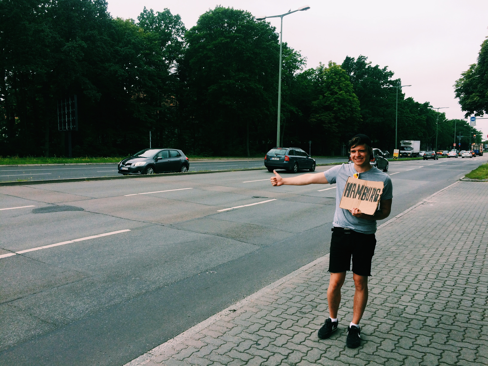

Кажется, стоп у нас не идёт. Простояли около 2-х часов и всё бестолку. Отошёл поговорить с поляками. Миша и Оля к этому времени уже уехали с какими-то пенсионерами на доме на колёсах. Во время разговора один парнишка говорит мне: «Чувак, походу тебе пора». Я оборачиваюсь и вижу, что Толян застопил какой-то дорогой мерседес и обо всём уже договорился. Мы бросаем рюкзаки на заднее сиденье и садимся в машину. Наш водитель – седоватый типичный гражданин Германии, походу даже совсем не «средний класс», раз у него такая тачка. Говорит, что провезет нас 70 км до поворота на Креммен и высадит на заправке. Ну ок, 70 – тоже хорошо. Только эти 70 км пролетели минут за двадцать. Этот мужчина включил спортивный режим на коробке передач и показал нам, что такое немецкий автопром. Я никогда так быстро не ездил, и не видел спидометр, но, по ощущениям, мы ехали больше 200 км/ч, потому что пейзажи за окном проносились как на карусели-«тошниловке» из моего детства и в кресло вжимало, будто ты на аттракционе. В общем, я кайфанул! Водила еще постоянно общался голосом с машиной, строил голосом маршрут и переключал режимы. Еще в Германии сводки с ситуацией на дороге транслируются прям в магнитолу. Ну типа: "Внимание-внимание! На 359-м километре трассы М-29 перевернулась ламборджини с арбузами! Повторяю, это не учебная тревога, тут ламборджини с арбузами!" и всё в таком духе. Долетели с ветерком, но какой русский не любит быстрой езды да еще на дорогом мерседесе?

Высадил он нас на какой-то автозаправке с большой парковкой и обилием кафешек. Мы выбрали место, где будем стопить следующую тачку и я залип в бесплатном вай-фае, долетавшем до нас из Макдональдса. Прошло минут десять, я поднимаю глаза и вижу девушку на универсале, которая приглашает нас поехать с ней. «Чуваки, не надо мне ничего объснять, я знаю кто вы такие, поехали! Я еду в Росток, но высажу вас на развилке на Гамбург!». В общем, мы обрадовались и поехали уже в компании этой замечательной девушки. Она рассказывала, что уважает автостоп и сама объехала всю Европу по молодости. Мы же поведали ей о нашем путешествии, кем работаем в Челябинске и я порассуждал с ней  о альтернативных источниках энергии, потому что увидел огромные ветряки за окном. Провезла она нас около сотни километров, которые за беседой пролетели так же незаметно. Говорит, у меня не такая мощная тачка, чтоб топить на автобане, но тут бывают и психи, которые ездят на тех же ламборджини и поршах и вообще не знают меры. Еще она нам сказала, что ей кажется, что в Берлине люди выглядят не очень счастливыми. На что я ей ответил, что если в Берлине люди выглядят несчастными, то тогда в Челябинске люди выглядят так, будто они готовы хоть прямо сейчас покончить с собой. Но я еще и много хорошего рассказал про Урал, про горы там, про озера, ей понравилось. Приятная девушка.

Оказались мы на очередном островке рядом с автобаном. Стоит сказать, что в Германии запрещено законом ловить машину на автобане - это опасно для всех и для автостопщиков, и для других участников движения. И все это понимают и стопят либо на заправках, либо на площадках для отдыха. Вот и мы стоим на такой площадке для отдыха и ждём нашего следующего водителя. Познакомились с чуваком из Дании, который тоже очень долго не мог уехать. Но он отошел подальше, чтоб водилы не думали, что мы хотим уехать втроем. Долго стояли, часа два. На жаре я уже отчаялся и думал, какой же отстойный автостоп в Германии. В России я бы уже давно трёсся в газели, доверху набитой арбузами и слушал бы вопли Елены Ваенги из магнитолы.

И вот, останавливается чувак на форде-универсале и выражает желание нас подбросить.  Водитель – молодой парень и в тачке у него играет качественный известный рок. Поговорить с ним не очень удалось, потому что после вопросов «откуда едете?» и «где живете?» иностранец больше не знает, что у нас спросить. Попали в часовую пробку и я понял, что меня уже вырубает. Клевал носом всю дорогу, пока водитель не угостил жевательной резинкой. Довёз прям до Гамбурга и наша табличка отправляется на помойку – она нам больше не пригодится.

«Чёто мне пока не нравится Гамбург…»- говорит Толя. Эта фраза стала первой фразой, которую мы произносили в каждом новом городе. Не знаю, мне было всё равно. Вокруг частные дома, немного жарко, но в целом, всё ничем не отличается от Берлина. Миша и Оля уже доехали и ждут нас в какой-то кафешке в центре города. Идём до метро, чтоб добраться до них. Метро в Гамбурге тоже условно-бесплатное, хаха.

Выходим на нужной нам станции и по навигатору пытаемся добраться до чуваков. «Мы во дворе кафешки сидим за столом». Двор найти было трудно, но обойдя эту кафешку вокруг, мы понимаем, что это не кафешка, это блин – сквот! Позже я узнал, что он называется «Gängeviertel» .



Вот тут и начинается самое интересное! Пока мы шли навстречу нашим друзьям, с балкона первого этажа с нами заговорил какой-то дед, который сидел в компании какой-то темнокожей женщины. У этого деда, кстати, на балконе висит какое-то чучело типа как на масленицу (позже выяснилось, что это чучело Дональда Трампа) и табличка, на которой написано, что это международный дом, где есть бесплатное жилье, еда и напитки, с подписью «Zervano – president of the world!»

>*— Ребята, вы откуда?,- спрашивает нас этот мужчина.*
>
>*— Мы из России.*
>
>*— Вы туристы?*
>
>*— Да.*
>
>*— Может быть вы голодные? Хотите есть?*

И тут Толя говорит «да» и дед говорит: «сейчас спущусь и открою». Я тяну за рукав Толяна и говорю: «Блин, Толян, это какой-то городской сумасшедший! Он называет себя президентом мира, давай свалим!» и увожу Толю как наказанного подальше от этого деда, а самому деду говорим, что мол нам надо спешить.

Встречаемся с друзьями. Стоит сказать, что Толя в этом трипе как с цепи сорвался. Я не знал его таким до поездки: ему интересно ВООБЩЕ всё - от пляжных сумок на витринах магазинов до зарядников для электрокаров, от различных помещений и подворотен до всяких сомнительных авантюр. В общем, чувак дорвался до приключений.

Рассказываем нашим друзьям историю про деда и Толя говорит: «Оля, пошли со мной, узнаем чо это за дед! Кто знает, МОЖЕТ ОН НАМ КАРТОХИ НАВАЛИТ!?» и, забрав Олю с собой, ушёл знакомиться с дедом. Мы с Мишей остались сторожить рюкзаки и что-то угорали с фразы Толяна про «картохи навалит». Толя позже объяснил это тем, что очень хотел поесть картошки в тот день.

Я проспонсировал сквот и купил себе местного кофе. Ждём чуваков, их нет уже минут 20, потом минут 40. Воображение рисует картины, как эти ребята на урановых рудниках в рабстве добывают руду или шьют кроссовки в подвалах Nike. Миша решается сходить на разведку, возвращается и говорит:

>*— Прикинь, они с этим дедом на великах кататься уехали!*
>
>*— Блиииииииииииннн, да что за херня происходит!, - начинаю ныть я.*

Сидим еще минут десять и они приезжают к нам на этих самых великах в компании этого самого деда.

У Толяна бешеные глаза:

>*— Блин, ЧУВАКИ, это охеренный дед! Чуваки, мы поели фриган-еды и он дал нам велики кататься! И вам он тоже даст! Мы сейчас бросаем рюкзаки у него и все вместе едем кататься по Гамбургу! Ночуем мы тоже у него! Миша, отменяй вписку на каучсерфинге! Блин, чуваки!*
>
>*— Толя, стоит ли ему доверять? Я немного очкую, просто дед с улицы и мы у него живем…, - сомневаюсь в разумности авантюры я.*
>
>*— Миша, не ссы, это угар!, - Толю трудно было переубедить.*

Другой Миша говорит «ну, такое…», но нам ничего не остается как пойти вместе с ними, пусть и с полными сомнения сердцами.

Мне комфортно, когда я чувствую контроль над ситуацией. Но тут я понимаю, что я уже ничего не решаю и меня просто ведёт поток событий. Ладно, остается только лавировать.

В квартире у «президента мира», которого, кстати зовут Зервано, чисто и уютно. Темнокожей женщины уже не было, походу она просто заходила в гости, чисто чаи погонять под беседы. С ним в другой комнате живет какой-то итальянец, который не может говорить ни на каком языке, кроме итальянского. Зервано сказал, что он ищет работу в Гамбурге, но фиг знает как он ее найдет, если он не понимает даже немецкий.

В общем, ребята торопят, беру все ценные вещи с собой, а рюкзак оставляю в квартире у Зервано. Спускаемся в подвал, где президент выбирает нам с Мишей велики. И мне и Мише достались обычные дорожные велики, так как Толян выменял у Миши свой дорожный велик на гоночный велосипед «Пежо», в общем, как он любит.

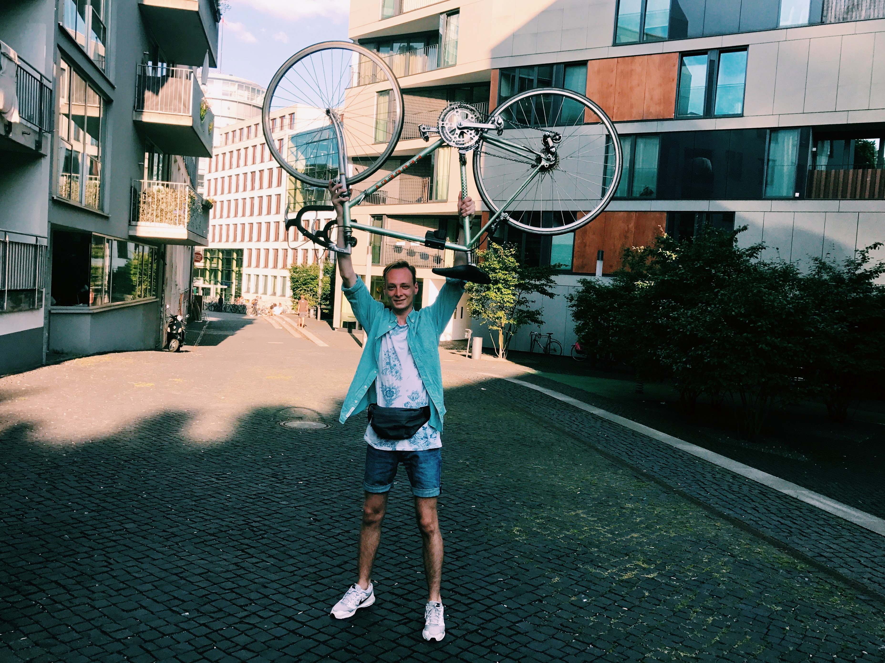

И мы поехали. Блин, чуваки, трудно описать это чувство. Вечерний Гамбург, я еду на велике, как давно хотел, вокруг мои друзья тоже на великах и с безумными улыбками на лицах. Закатное солнце пробивается сквозь деревья и слепит через солнцезащитные очки. И мы едем за каким-то дедом, которого знаем от силы час!

Что вообще происходит? Откуда у него так много великов? Они краденые? Почему мы едем за ним? Как закончится этот день? Эти мысли сменялись в голове со скоростью той самой карусели-тошниловки, но я чувствовал себя свободным и счастливым. Вот оно, то что я искал.

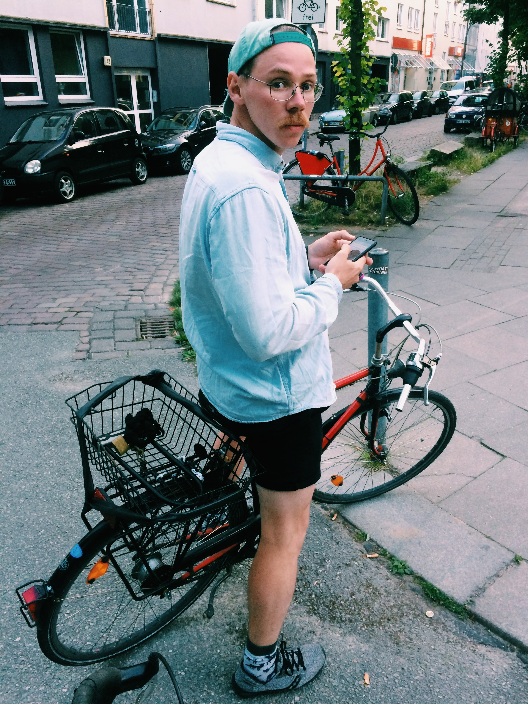

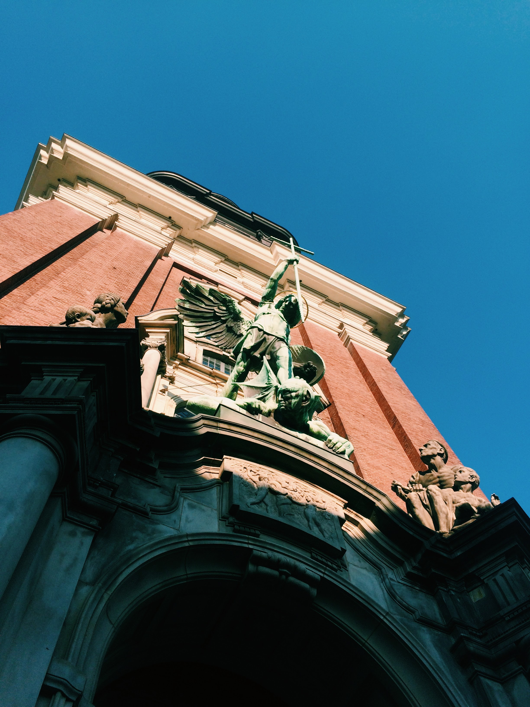

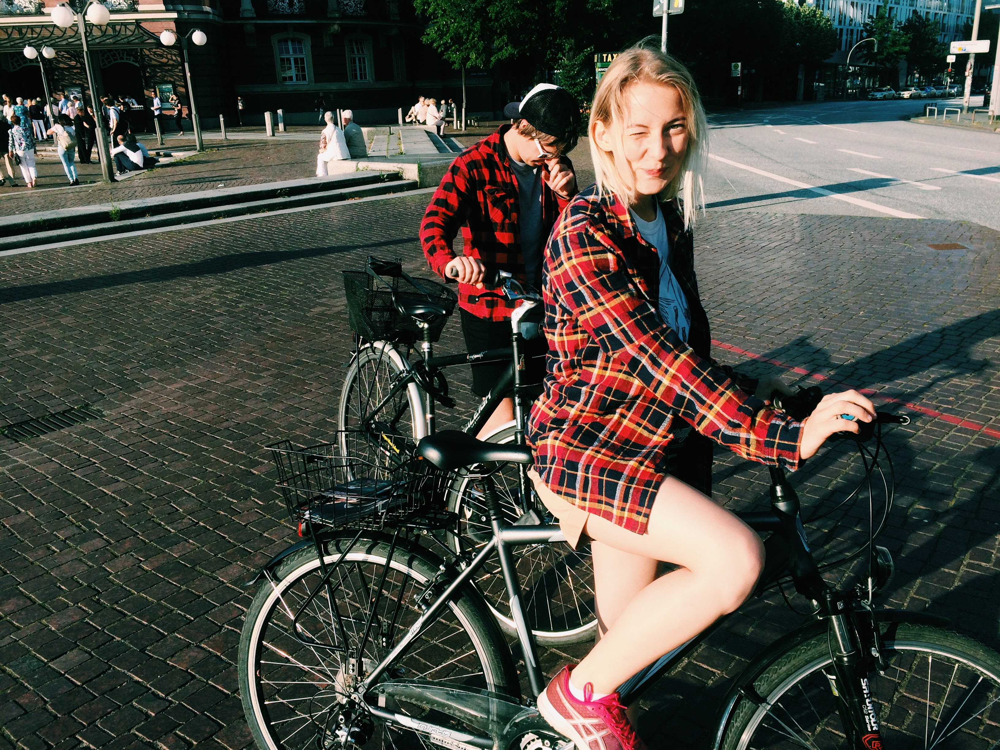

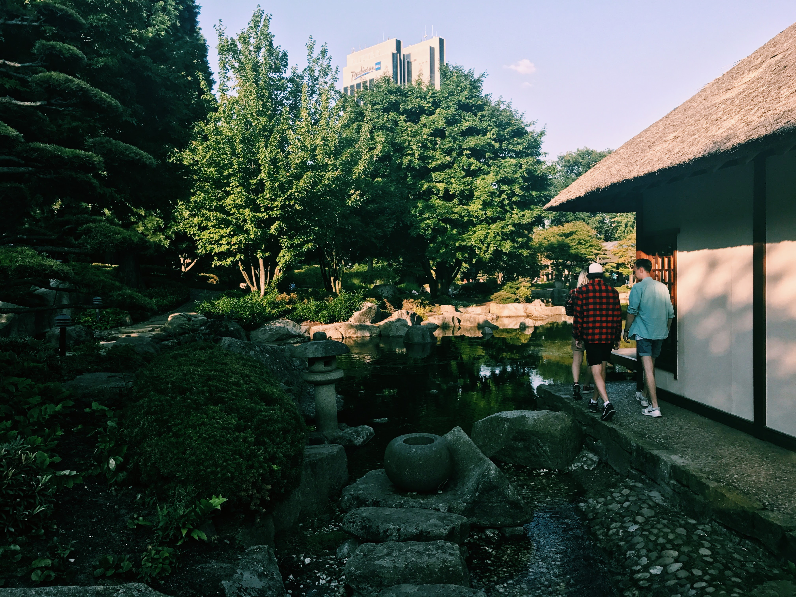

Президент мира решил нам показать окрестности, благо мы жили на границе центра и района Санкт-Паули. Видели городской парк, выполненный в китайском стиле. Там даже была китайская пагода, в которой можно было заварить зеленый чай и попить его сидя в позе лотоса, маленькие столики вот эти, китайские чайные церемонии.

В европейских городах создана уникальная для человека среда. Здесь твой комфорт не заканчивается порогом твоего дома, а продолжается улицей, общественным транспортом, различными мелочами типа питьевых фонтанчиков на улицах или автоматизированных городских туалетов. В общем, создано всё, чтоб ты мог культурно проводить свой досуг или быт. Здесь непринято пить пивас на лавке, харкая себе под ноги. Есть множество возможностей развлечь себя в свободное время: кругом парки, футбольные поля, стадионы, игровые площадки, скейт-парки. Каждый может найти для себя место, где ему будет весело и спокойно.

Потом мы поехали в лютеранскую церковь замаливать грехи и послушать орган. Те соборы, что мы посетили отличались величественностью и красотой. Наверное, все лютеранские церкви такие.

Перед тем, как ребята приехали с Зервано к нам (ну там, у кафе), президент провел экскурсию по сквоту, что привело Толяна в дикий восторг и, к тому же, он увидел, как какой-то панк-рокер прибивает к стене афишу, выполненную простым черным маркером на листе А4: «Сегодня панк-концерт в 23:00». Вот и вся афиша, но мы уже знали, что мы туда пойдем! И вот, Зервано привозит всю нашу шайку к алкомаркету и говорит с дурацким англо-немецким акцентом: «Зе бир он зе консерт из ту экспенсив. Иф ю вонт бир, ю кэн бай ит зере». Никто из нас не хотел пива именно сейчас, да и таскаться с бутылками не хотелось, так что мы отказались.

Последней точкой нашей экскурсии должна была стать прогулка на пароме.

>*— Чуваки, только не говорите, что мы еще и на пароме будем кататься!, - начал паниковать я.*
>
>*— Конечно будем!, - говорит Оля и мы смотрим, как наш президент спрашивает какие-то карточки на пирсе у прохожих.*

Блииин, краденые велики, какие-то карточки, этот чувак походу ваще антисошл. Но я всё объясню: велики не краденые, просто в Гамбурге настолько сильно перенасыщен рынок велосипедов, что их можно коллекционировать, некоторые просто выбрасывают велосипеды на помойку. И президент спрашивал не про карточки, а про то, когда придёт паром, на котором нет контроллеров, хаха. В общем, паром тоже был условно-бесплатный, мы загрузились туда и поднялись на верхнюю палубу кайфовать.

Блин, чуваки, супер-крутое чувство. Закат, паром, вид на Гамбург с воды, твои друзья рядом и всё это бы не случилось, если бы не случайное знакомство с Зервано. Мы бы просто провели обычный туристический день в Гамбурге и ни за что бы не покатались ни на великах, ни на пароме. Наш тур нам подсунул просто невероятные события и я до сих пор не мог поверить, что вместо того, чтобы крутить отверткой на работе, я сейчас один из главных персонажей истории о приключениях четырёх руссо-туристо в Европе. Волшебное чувство.

>*— Ребят, вам нравится? Всё ништяк?, - спрашивает Зервано.*
>
>*— Да конечно, всё просто очень круто!, - отвечаем мы.*
>
>*— Президент классно придумал…, - говорит Зервано и мечтательно смотрит вдаль.*

Мы что-то угорели с фразы «президент классно придумал» (нам ее так Оля перевела) и начали ее использовать всегда, когда видели что-нибудь крутое в Гамбурге!

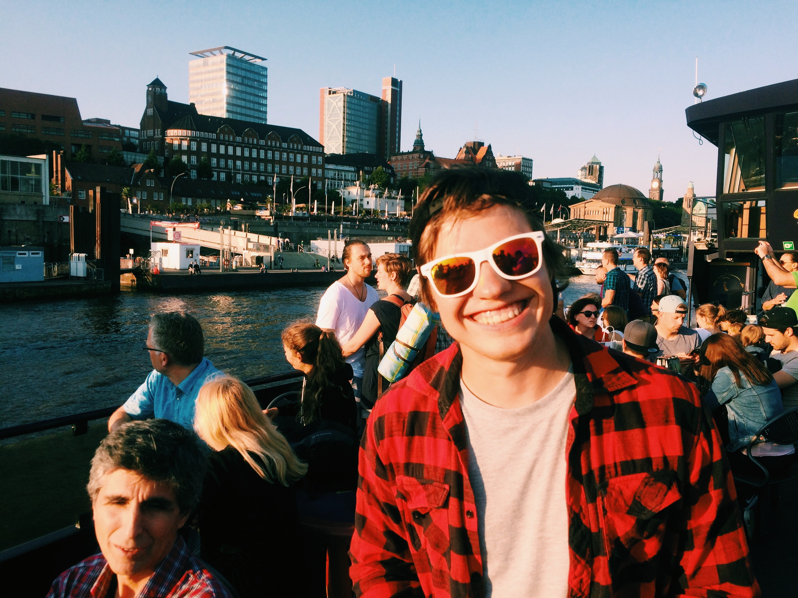

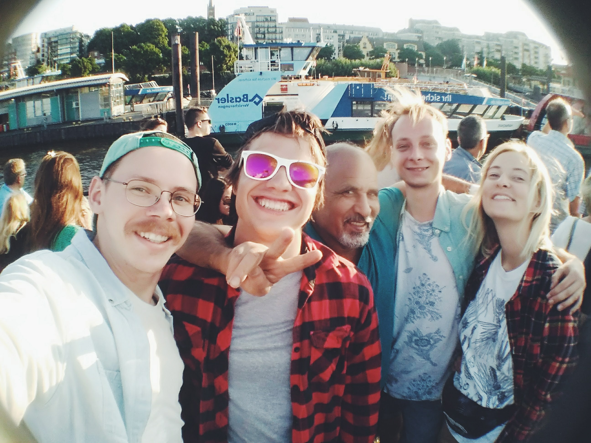

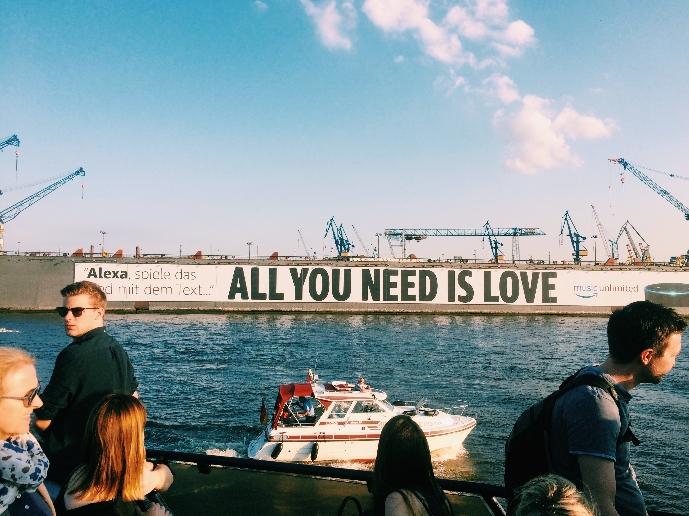

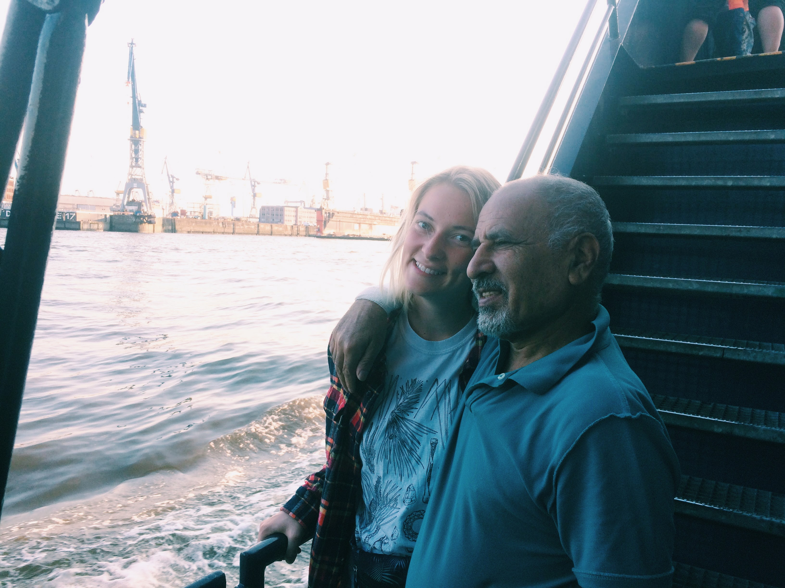

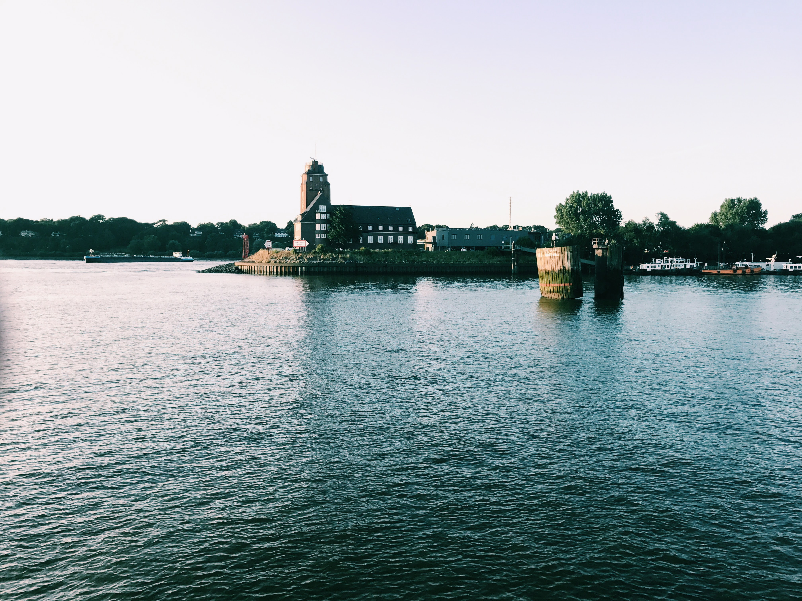

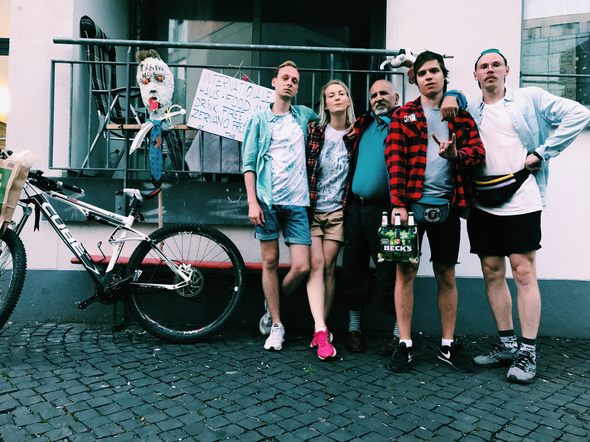

Прогулка подошла к концу и мы отправились обратно на квартиру. Сегодня вечером должен был быть концерт и я очень хотел на него не опоздать. Припарковав велики, мы принялись готовиться к концерту, благо до него было идти 100 метров.

Оля обиделась на что-то, я не стал вникать, и осталась сидеть в компании с дедом и говорить про житуху. На все наши уговоры пойти с нами Оля говорила «не хочу» и мы пошли на концерт. Миша и Толя молодцы, парились за Олю и постоянно ходили проверять, всё ли с ней впорядке.

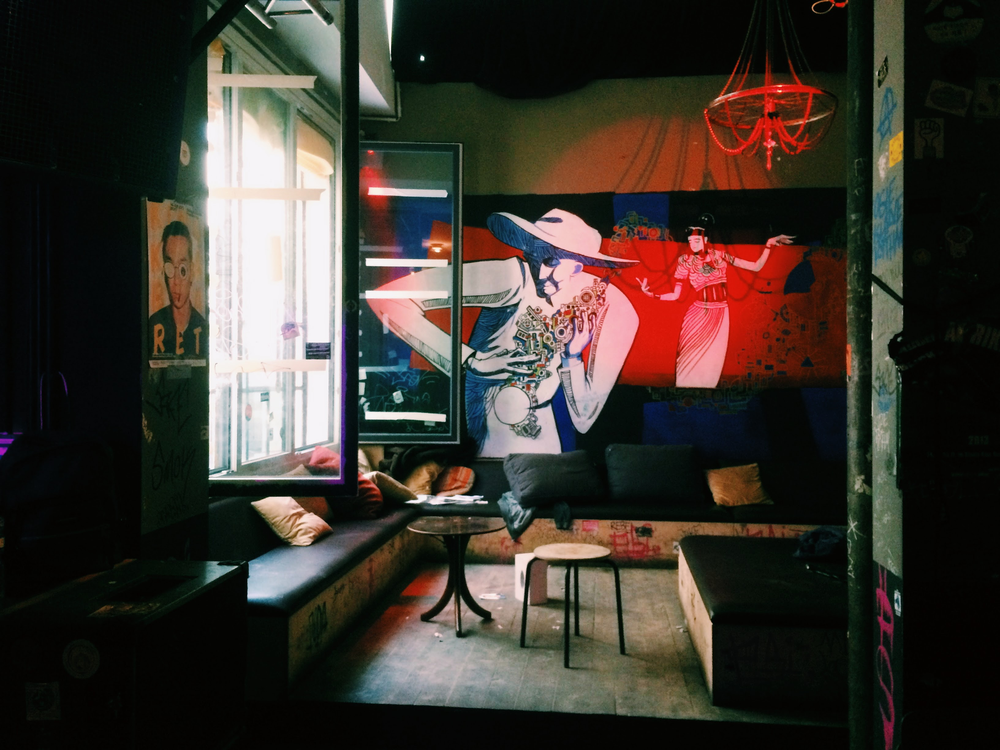

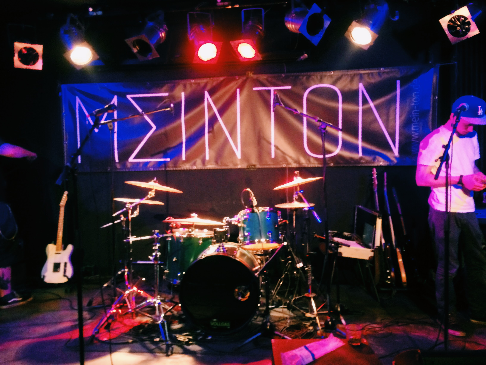

Вокруг сквота толпа. Панков мало, в основном просто молодежь. Пробираемся сквозь толпу в здание и попадаем в прокуренное помещение со сценой. Чуваки чувствуют себя неловко, а я первым же делом иду в бар за пивком.

>*— Почём пиво?*
>
>*— Заплати столько, сколько хочешь, у нас фри-прайс!, - отвечает рокер-бармен.*
>
>*— Один евро пойдет?*
>
>*— Это всё, что у тебя есть?*
>
>*— Нет, но я хочу заплатить один евро.*
>
>*— Окей!,- отвечает бармен и протягивает мне бутылочку пива.*

День становится просто круче некуда.

На сцене какая-то эмо-группа доигрывает последнюю песню и мы понимаем, что мы опоздали, концерт закончился. Ну пофиг, думаю я, хоть потусуюсь.

>*— Миша, ты здесь будешь? Мы пойдем найдем что-нибудь пожрать.*
>
>*— Да, чуваки, я потусуюсь здесь.*

Миша и Толя ушли искать кафе, а я остался на улице. «Так, пойду еще пива возьму». Пошёл обратно в концертный зал, но перепутал лестницы и спустился на этаж ниже вместо того, чтоб подняться. Слышу – за дверью рок-звуки и вот это барабанное «ту-па-ту-ту-па». Открываю исписанную маркером и обклеенную стикерами дверь и вижу… Подвальное помещение с низкими потолками до отказа забитое панками в клёпаных шмотках и каким-то панк-роком на сцене. Чуваки, я был в полнейшем восторге, как будто открыл дверь в Нарнию или попал в какую-то параллельную реальность! Купил в баре еще пива, нашёл «жертву» для разговора – им оказался какой-то металюга с патлами и в жилетке из нашивок.

>*— Чувак, привет, я из России, подскажи, какой сегодня лайн-ап?*
>
>*— Из России? Нихера! Короче, сегодня играют (сейчас я буду перечислять группы, как я их услышал, хаха) Demolition Motherfuckers, Apokross и третья группа, которые играют только каверы на G.B.H., Exploited, Minor Threat и прочее.*
>
>*— Оп, моя остановочка. Спасибо, чувак, выпьем! NA ZDOROVIE!*
>
>*— NA ZDOROVIE! PIZDETS!,- ответил чувак и я пошёл снова на улицу проветриться.*

Встретил Мишу и Толю: «Чуваки, вы даже не представляете на сколько там охеренно!» и убежал тусоваться обратно. Наверное они подумали, что я что-то принял, потому что я был точно не в себе.

"Демолишн Мазафакерс" доигрывали свой сет и начинали саундчек группа "Апокросс" Снова встретил Мишу и Толю на лестнице, они сказали что, хотят пойти спать.

>*— Вы чо, по-русски говорите?- заговорила с нами какая-то панкуха.*
>
>*— Ну типа, да.*
>
>*— Нихера. Я- Яна, из Одессы и из Москвы. Пить будете?, - сказала Яна предложив испить из панковского кубка.*
>
>*— Круто. – сказали мы и тоже представились, а я приобщился к напитку, уточнив при этом, с алкоголем он или нет.*

Позже я пытался поговорить с Яной, но она была очень пьяна, поэтому поговорить на русском о жизни на чужбине не получилось.

Сет "Апокросс" напоминал смесь дойч-панка и Toxic Holocaust. Но, в целом было круто, народ рубился, мощная поддержка. Я же охеревал от того, что я нахожусь на настоящем европейском панк-концерте в каком-то подвале среди кучи пьяных панков и дико кайфовал от этого факта. И ждал третью группу, потому что их музыка должна была быть наиболее понятной мне.

И вот, уже почти 2 часа ночи и проведать меня приходит Оля. Супер-кайф. Мне очень понравилось взаимопонимание и уважение в нашей тусовке к прихотям и кайфам, которые каждый хотел получить от путешествия. Никто не гнал тебя домой, потому что уже поздно и "ты пьяный придёшь и всех разбудишь", потому что они понимали, что для меня это всё как праздник. Каждый уважал то, что хотел получить от путешествия другой чувак, будь то желание попробовать какой-то определенный сорт пива или мороженого или желание посмотреть "именно ту достопримечательность", которая была интересна нашему другу, даже если до всего этого надо было переться через весь город.

Уже поздно и я пьяный в хлам. Круто было получить заботу и поддержку от подруги из нашей бригады, потому что когда я пьяный, я могу попасть и в неприятности, а тут я под присмотром стрейтэдж-чуваков и чувих, так что они уберегут меня от лишнего чада кутежа и отведут домой спать. Спасибо, Оля!

Начинает играть кавер-группа. Первая песня «Fuck the USA!» от Exploited и я теряю рассудок. Это лучшее время в моей жизни и я так рад быть здесь и сейчас, а не дома за компом или на работе и думать «ничего, ничего, может быть в следующем году ты съездишь в свою европку». Хиты от G.B.H, Misfits, Minor Threat, Black Flag и я уже еле стою на ногах.

>*— Оля, давай еще одна песня и ты отведешь меня домой!*
>
>*— Давай!*

(начинают играть следующую песню, только уже свою)

>*— Ой, эту песню я не знаю, пошли нахер отсюда!, - говорю я и мы покидаем сквот и концерт.*

До дома надо было пройти 100 метров, залезть на балкон (первый этаж) и постучаться в окно. В домофон звонить было невежливо и я уже хотел лезть через калитку, но решили всё таки через балкон. Но по пути мы решили сесть на лавочку и записать видосы и аудиосообщения для наших друзей и блогов.  Я двадцать минут распинался о этом крутом вечере, но потом понял, что камера всё время была выключена. Ну фигли взять с алкаша, хаха.

Когда мы были дома, то чуваки уже спали. Я едва могу держать вертикальное положение тела, но понимаю, что места на полу мне уже нет. Два варианта: или спать на кровати Зервано, а Зервано пусть спит там, где найдёт или спать в какой-то конструкции, которая напоминает кошачий домик, свернувшись как улитка в пространстве 50х50 см. Сперва я лёг на кровать Зервано, но потом мне стало стыдно и я пошёл извиняться перед президентом.

>*— Зервано, (иик), кароче, твоя кровать is free, я не буду на ней спать, понятно?, - говорю я. Ну вы помните и представляете меня пьяного.*
>
>*— Миш, сегодня ночью в соборе играет орган, я пойду туда, мне сегодня не нужна кровать, или я посплю в другом месте.*
>
>*— Не-не, Зервано, your bed is free! Ты можешь на ней спать!*
>
>*— Спасибо, Миша.*

В итоге я рухнул рядом с чуваками на полу и проснулся в ущелье между кроватью президента и матрасом (спортивным матом) чуваков с лютым похмельем. Какой же крутой был день! Президент классно придумал.

_Небольшая ремарка о группах: я нашёл афишу концерта и понял, что названия групп я услышал неправильно. Я мог бы их написать уже с правильными названиями, но лучше уж травить байку в хронологическом порядке. Играли в этот вечер: Disillusioned Motherfuckers, Upper Crust и Spittin Bones (тот самый кавер-бэнд). У всех есть бэндкэмпы, можете заценить._

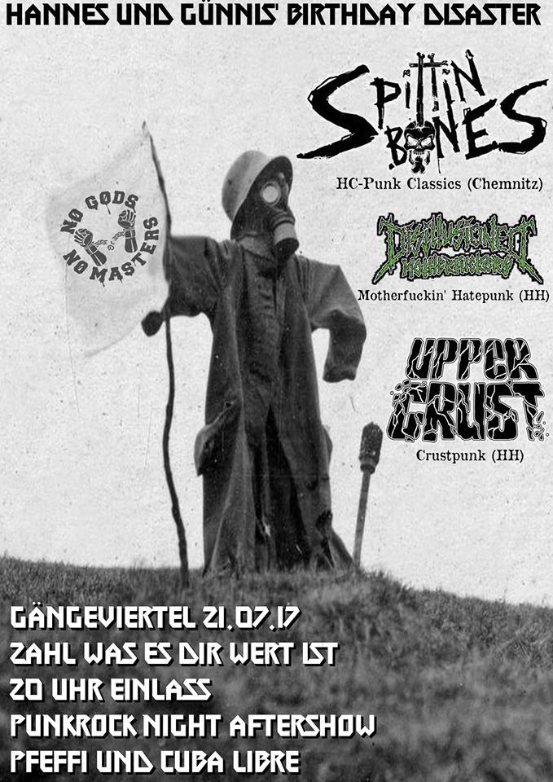

 **22 июля**

Утром у Миши и Оли была запланирована поездка в Дюссельдорф к их знакомой старушке. Встретиться мы пообещались уже в Амстердаме.

За окном был дождь, и, после «брёкфоста» с президентом и я потратил два часа, чтоб поговорить с ним по душам и узнать, что это за человек.

Президент приехал в Гамбург 10 лет назад. Он устал от несправедливости мира, от того, что большого числа людей в мире нет банальных для жизни вещей: еды и крыши над головой, много кто умирает в войнах за ресурсы и капитализм. Поэтому он хочет добра тем, кто в этом нуждается и, когда он увидел нас с рюкзаками, он понял, что мы бродяги и что тоже нуждаемся в еде и ночлеге, потому и пригласил.

>*— А ты, Миша, убежал!, -упрекнул меня президент за случай, когда мы познакомились.*
>
>*— Прости, Зервано, в России такое поведение как у тебя, считается странным. От добра добра не ищут и бескорыстная помощь часто сулит проблемы. Поэтому я убежал., - попытался оправдаться я, но стало немного неловко.*
>
>*— Ну теперь-то ты думаешь по-другому?*
>
>*— Да.*

Поговорили про политику, про ситуацию в мире, про несправедливость, про Сталина, про русскую историю и про то, как нам живется в нашей стране.

Какой же удивительный дед нас вписывает. Я хочу извиниться за то, что назвал его городским сумасшедшим. Это удивительный и добрейший человек. Просто жизнь в России настолько запугала и обозлила меня, что я не доверяю людям и боюсь необоснованной и бескорыстной доброты от незнакомого человека. Как наверное любой русский человек. Здесь люди открыты и у них кардинально другой менталитет. Россия - одна большая тюрьма. Гамбург - город свободы.

Я влюбился в Гамбург, и (спойлер!) могу сказать, что Гамбург больше всех понравился мне в нашем путешествии и я хочу сюда еще не раз вернуться.

Дождь кончился и Толя предложил попросить велосипеды у Зервано и покататься уже самостоятельно.

>*— Да, не вопрос. Куда вы хотите поехать?, - согласился президент.*
>
>*— Санкт-Паули.*
>
>*— О, тогда берите эти велики!*

Президент мира зажопил Толяну его вчерашний гоночный велик и дал ему обычный городской. Толя не стал спорить и мы поехали на не очень удобных великах в Санкт-Паули. Как оказалось, мы жили на границе с Санкт-Паули и до него было около 5 минут езды.

За час до этого, Толе на каучсерфинге написала девушка из России с желанием "выпить пива в каком-нибудь баре". Эта функция называется «hangout» и отображает чуваков, которые хотят потусить вокруг. Толя оставил заявку на «потусить» и эта девушка откликнулась. Договорились встретиться в центре и уже потом решить куда пойти.

Поехали сквозь дождливый Гамбург. В Гамбурге так же, как и в Берлине очень развито велосипедное движение. Когда мы приехали в центр, мы просто пристегнули велики на u-lock и пошли в Макдональдс, где договорились встретиться

>*— Привет, ребята – сказала девушка и подсела к нам.*
>
>*— Привет! – ответили мы.*
>
>*— Я – Эмма, как дела?*

Мы тоже представились и сказали, что мы в евротуре, и что когда мы приехали в Гамбург, у нас не было жилья и ...

>*— НЕ-НЕ-НЕ, я сразу говорю, у меня ночевать нельзя!! - перебила историю о Зервано Эмма.*
>
>*— Да нам и не нужно жилье, ты чего!*

Эмма смотрела на нас с осторожностью, будто мы какие-то бичи или психи. Договорились, что мы пристегнем наши велики в другом месте и просто пойдем погулять по Гамбургу, а по пути зацепим чего-нибудь выпить.

Эмма – студентка из Санкт-Петербурга, которая приехала в Гамбург на летнюю практику изучать логистику, потому что Гамбург – один из крупнейших портов в мире и самый большой в Германии.

Мы рассказали ей о наших приключениях, о нашем путешествии, где были, где еще будем и прочее. В общем, мы подружились с Эммой. Особенно после того, как начали понимать шутки друг-друга, поели пиццы и выпили по алкогольным напиткам. Эмма, если ты это читаешь – привет! Ты классная девка, хаха!

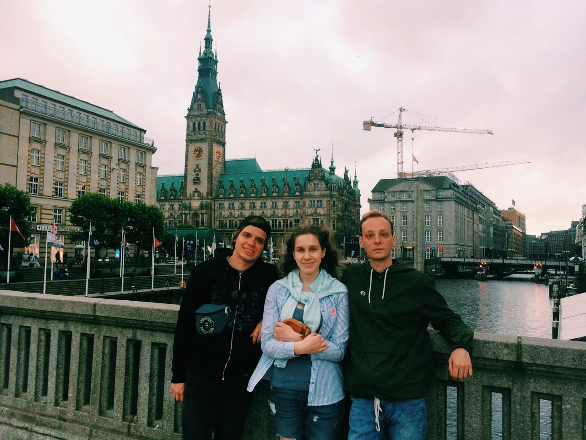

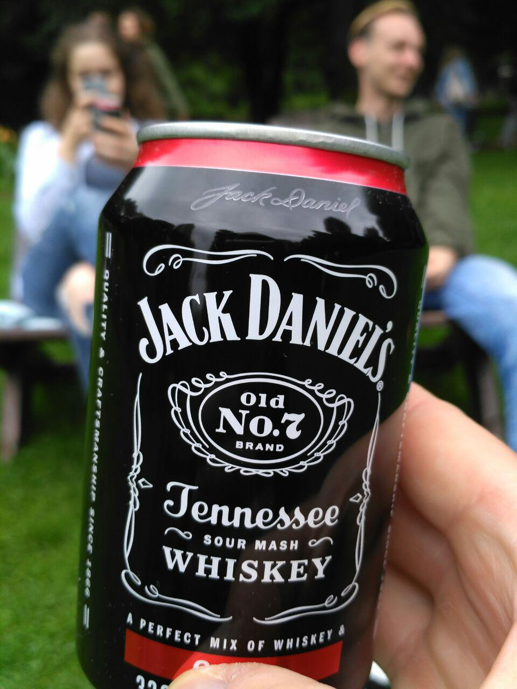

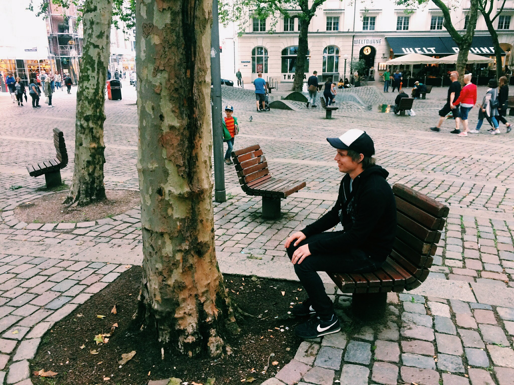

Гамбург – очень красивый город. Мы пришли в один из городских парков и там на лужайке тусовались КРОЛИКИ. Их было очень много и они просто беззаботно прыгали по ярко-зеленому густому газону. Правда, они все попрятались, когда мы к ним подошли, так что потискать их не удалось.

В Гамбурге 85% населения ходит в майках с символикой футбольного клуба «St. Pauli», фанаты которого славятся своей нелюбовью к деятельности поклонников творчества одного плохого австрийского художника. Майки, нашивки, татуировки. Эти ребята просто обожают свой район и город!

Посмотрели центр Гамбурга, но мне не очень там понравилось, потому что было очень много людей. Я не люблю толпу, у меня обостряется социофобия, хаха. Пофоткались и пошли в парк, дабы испить сидру и джека-дениелса, заботливо заранее замешанного с колой в жестяной банке объемом 0.33л. Проведя время за беседами обо всём и ни о чём, мы вспомнили, что должны спешить домой, потому что пообещали президенту быть к 21:00 дома.

Найдя свои велики велики в центре, проводив и попрощавшись с Эммой у метро, мы двинули домой. Зервано дома не было и нам открыл этот итальянец. Принялись залипать в вай-фай, как кто-то постучался в балкон.

На улице стоял какой-то чувак, похожий на немецкого уличного репера и какой-то араб. "Передайте Зервано, что его ищет Башир!", сказал этот араб, предварительно узнав, кто мы такие и что мы делаем в квартире у Зервано.

>*«Блин, и тут башкиры». – сказал Толян.*

Президент вернулся домой в прикиде интеллигентного старичка с бутылочкой пива в руках, было видно, что он накануне припил.

Мы сказали, что его искал Башир, на что он сказал, что видел Башира и, мол, тот в говно, не обращайте внимания. И Зервано вернулся из сквота, где был кинопоказ каких-то короткометражек.

День подошел к концу, завтра нам надо было ехать в Амстердам, поэтому мы хотели лечь пораньше, чтоб выспаться.

