В расстроенных чувствах пишу этот пост. Расставаться с этим, как расставаться с близкими друзьями на перроне или прощаться с девушкой, с которой больше не можешь быть вместе.

Да, чуваки, клуб "Дом" закрывается и сейчас мне хочется рассказать почему и подвести итоги, что это вообще было.

## **Как появился "Дом"?**

Я и мои друзья очень долгое время вдохновлялись клубом "[MARKS](https://vk.com/marksbar)" в славном городе Волжский. Ребята из сцены этого города держали свой клуб, где всегда можно было устроить крутой андерграундный концерт или попить с друзьями пива на своей территории без обязательств "покупай, пей и проваливай". Мы подумали - а чем мы хуже? У нас есть тусовка, есть сцена, мы уже достаточно взрослые и ответственные люди, почему мы не можем позволить себе такое же место?

И вот, сидя на одной из душных кухонь и разговорившись про это дело, люди дали себе пьяное обещание - замутить свой клуб. Честно говоря, тогда мне все эти разговоры показались простой бравадой - пьяные чуваки что-то считают на калькуляторе на коленке, что-то планируют, обсуждают кто будет помогать и как мы круто заживем. Всерьез я тогда это всё не воспринял.

Удивительно было на следующий день. Человек, который согласился взять на себя ответственность в документах и профинансировать первые месяцы стройки "Дома" начал искать варианты. Сразу скажу, что я отнесся скептически к этой затее предвещая новые проблемы, упрёки в том, что мало кто помогает и ссоры из-за денег, потому что "Дом" не окупается. Не все горели желанием брать обязательства в этом деле, но чуваки, которые замутили здание были непоколебимы. Возможно, каждому нужен толчок для принятия каких-то важных решений, ибо если ждать "хорошего дня" и всю жизнь копить силы для того, чтобы начать жить как тебе нравится, то можно пропустить саму свою жизнь и никогда не начать делать реально крутые вещи. И вот, первое апреля 2016 года, и Серега пишет: "Чуваки, тот коттедж наш!". Хорошая шутка.

Поначалу всё было круто. Так и не смогли придумать прикольное название и оставили банальное "Дом". "Идешь в "Дом"? "В "Доме" есть кто?". Мы приходили красить стены и общаться-выпивать будто бы в какую-то подсобку, где на 100 квадратных метров светит одинокая лампа накаливания. Кругом какой-то хлам, мусор и прочий строительный стафф. В будущий "Дом" сразу заехали татуировщица Алёна и ее парень Паша. Прикольно было, когда в первый день жизни клуба к ним в течение дня приезжало по нескольку панков, которые помогли отремонтировать и привести в жилой вид комнату. Всё было как в песне: "Живём сейчас и завтра будем жить!".

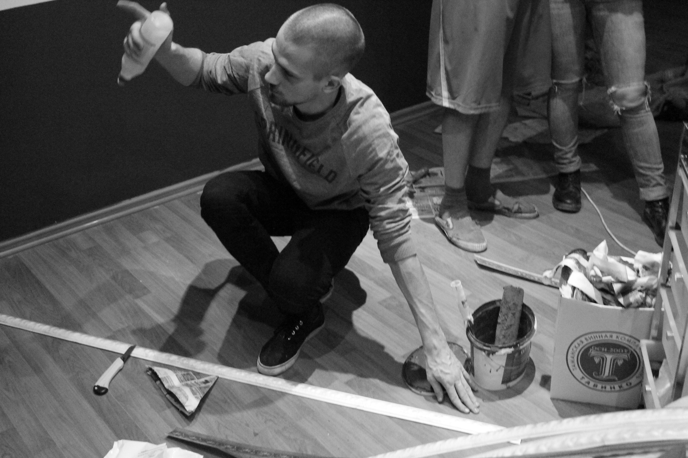
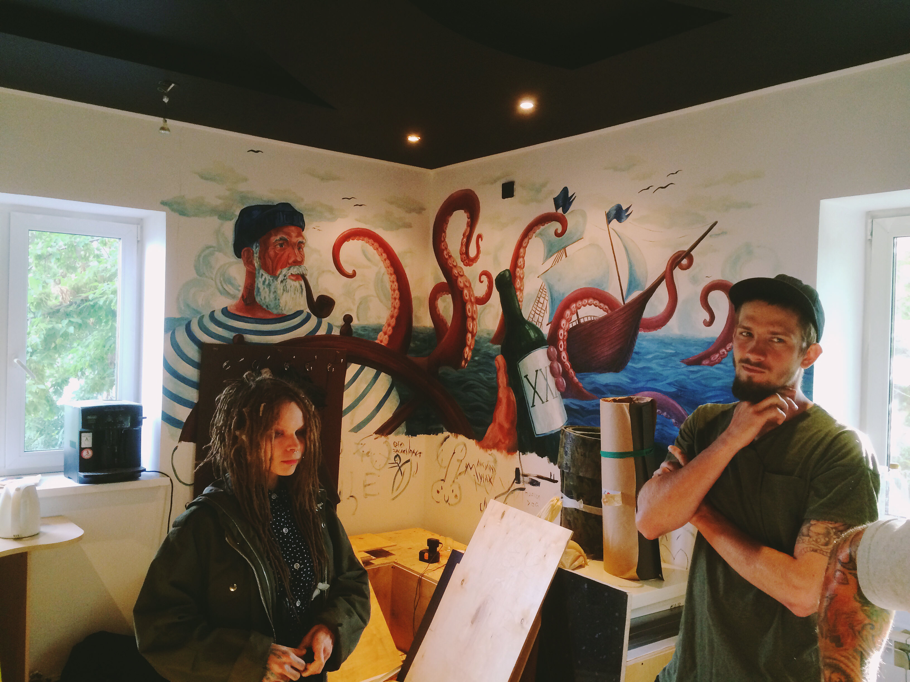
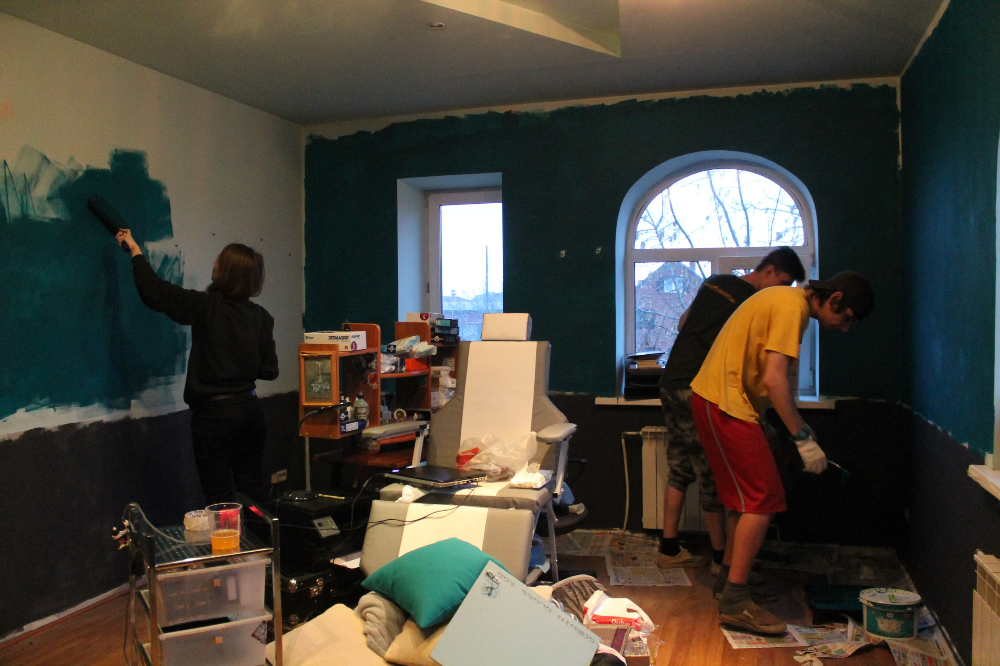
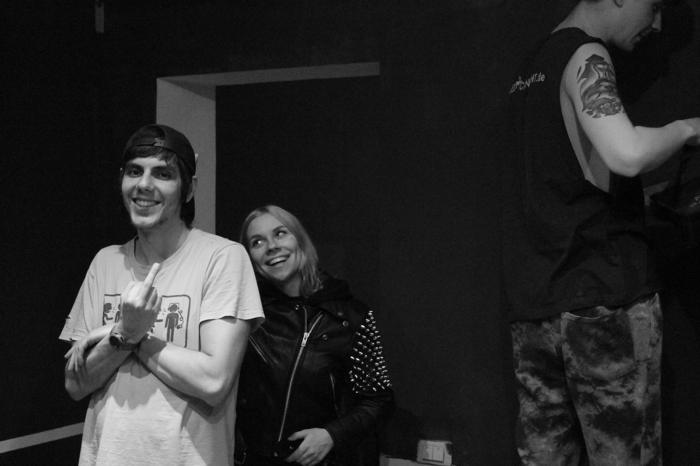

И потихоньку всё начало изменяться. Лампочки встали на свои места, начала создаваться из говна и палок DIY мебель, начали появляться какие-то приколы, каждый из своих квартир тащил какие-то клёвые вещи, будь то плакат или какой-нибудь шкаф. До этого в "Доме" были просто голые стены. Всё, что вы видели, кроме стен когда тусили - всё результат полугода трудов энтузиастов этой тусовки. Я помогал ребятам с электричеством и проводкой. Будучи по профессии инженером-электриком, я привёл сеть в надлежащее состояние. И собрал гирлянду освещения над барной стойкой, но с этим бы справился любой ПТУшник. Ну и в основном по мелочи. Может быть мне стоило прилагать больше усилий, но я всегда работал в "Доме" честно и по совести.

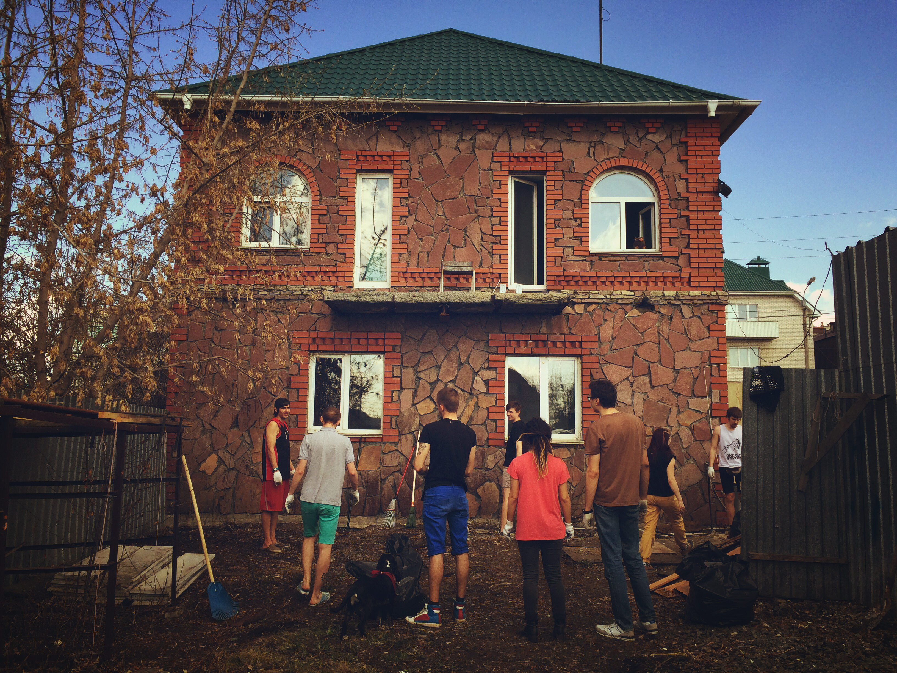
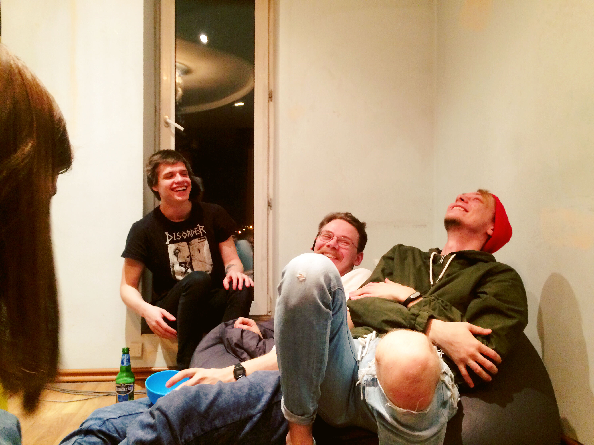
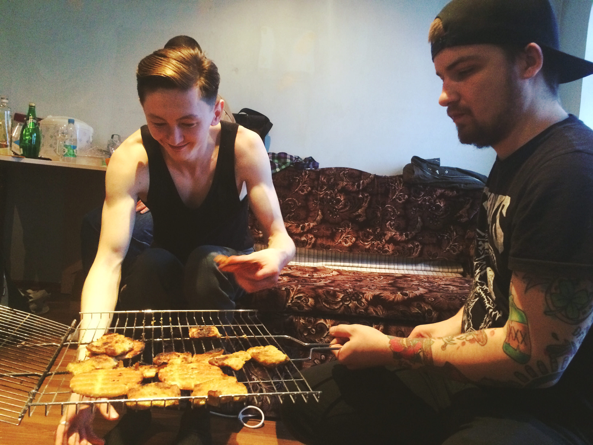
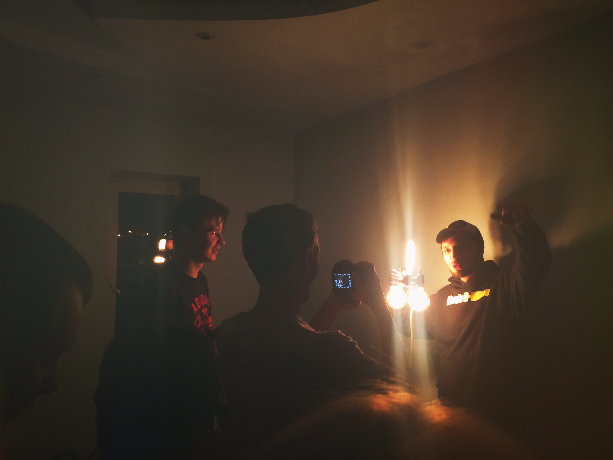
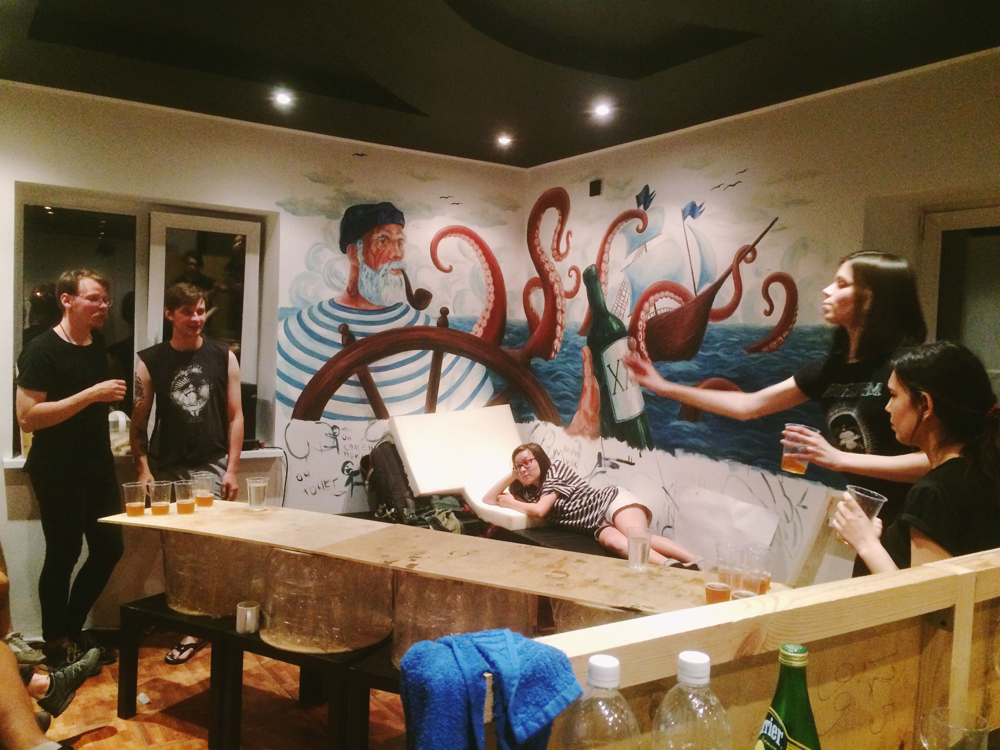

Прошло лето активного строительства и ребята уехали в августе в отпуска. Мне с Пашей Орехом и Илюхой предстояло провести "открытие" - первую вечеринку в "Доме". Это был [KRUG FEST.](https://vk.com/festivalkrug3_backtothesummer)  Фестиваль какого-то инди музла. Я попросился стоять барменом, потому что всегда хотел узнать что это такое. Ребята с недоверием отнеслись к моей этой просьбе, потому что я всегда имел репутацию нервного и неуклюжего человека и никто меня в этой роли бармена не видел. Но стоять было некому, и оставили право быть хозяином таверны мне и Илюхе, который тоже стоял в первый раз. Фестиваль прошёл многолюдно и пьяно, была куча молодежи. Вроде всем всё понравилось, а мы с Илюхой хорошо отстояли на баре. Я же понял, что барменить - это не моё, но потом меня часто просили встать на бар, видимо ребята видели, что я не безнадежен в этой профессии. Хотя это приятно, когда ты хозяин положения и всегда был хороший предлог узнать имя какой-нибудь симпатичной девчонки.

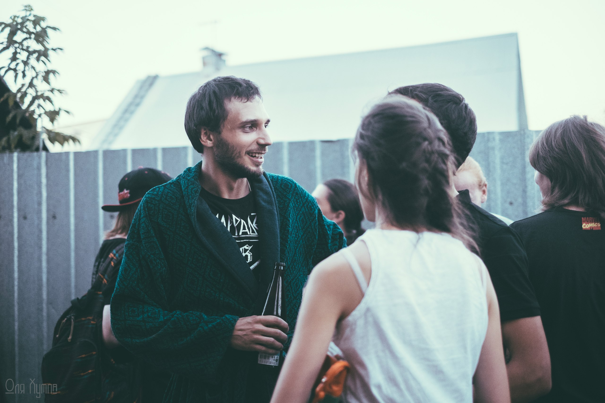
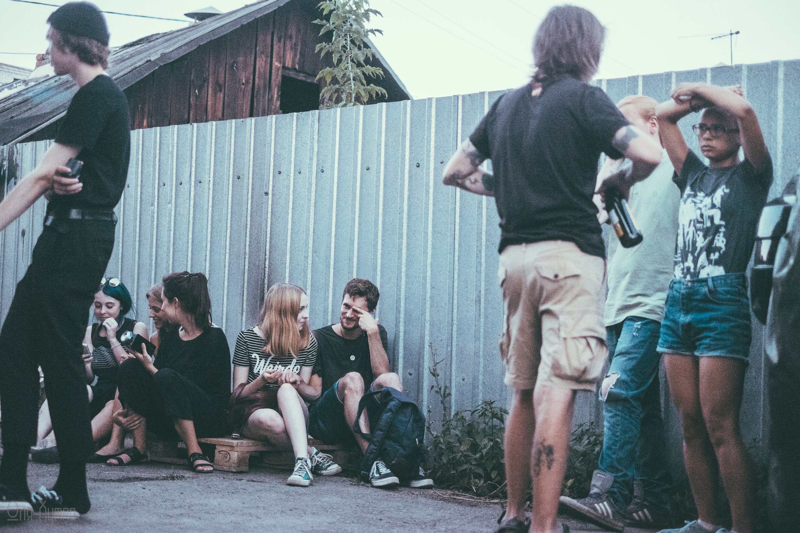
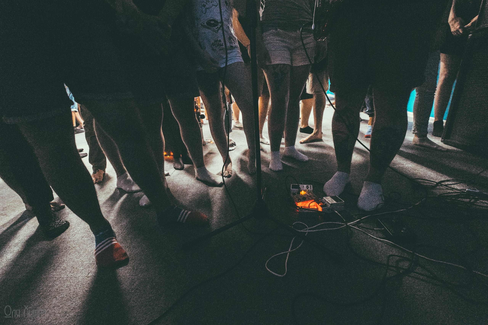
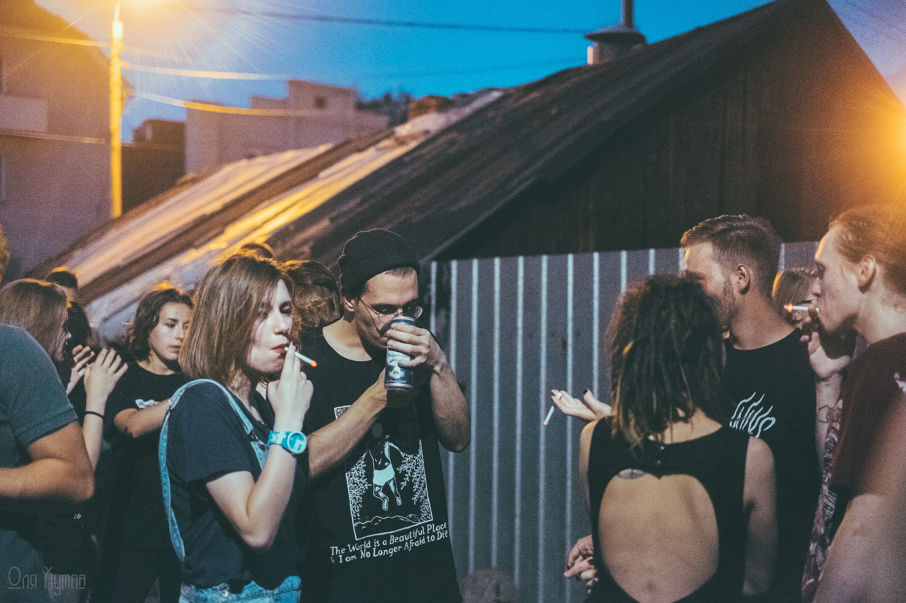
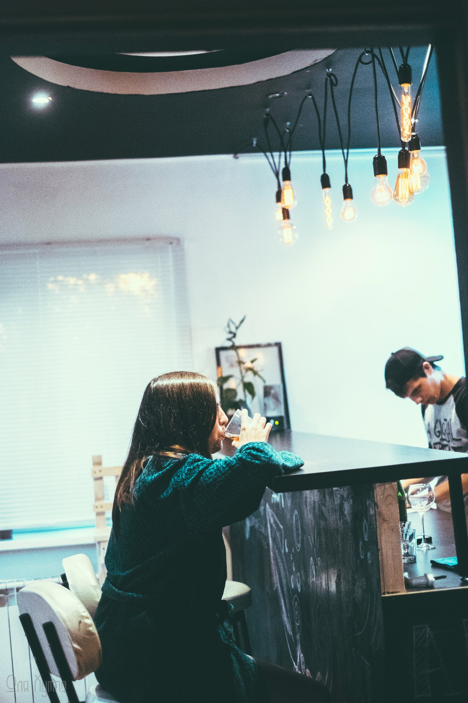

Приехали чуваки из отпуска и всё завертелось. Всё, что вы видели на протяжении этого полугода началось в августе.  Так открылся клуб "Дом" для всех тех, кого мы считаем своими друзьями.

## **Самые клёвые тусы в "Доме" на мой взгляд?**       
Я думаю, что я - алкотусовщик. Мне всегда нравилось напиваться, но после открытия "Дома", когда алкоголь оказался в настолько близком доступе, мне было трудно держать свой рок-н-ролл в руках и после нескольких тус в стиле "дорвался до бухла", я попустился и сейчас практически не пью. К чему это я? Мои самые нелюбимые тусовки в клубе - это когда посетители нажирались как школьники, у которых родители уехали на дачу. Было противно смотреть на все эти пьяные тела и убираться потом за этими свиньями.

Но, конечно, были и крутые тусовки.

Мы мутили это место в первую очередь для себя, поэтому хочу отметить все дни рождения и посиделки, которые там были, когда мы собирались только "своими". Я люблю вас, чуваки, и рад, что мы вместе делили радость этих моментов, вы мне как семья.

## **Какие мероприятия были крутыми?**

**Первый [WAXXX](https://vk.com/waxxxblog) в коттедже.**

Было нереально много народу, было много друзей, все круто тусовались. Я простоял всю тусу до шести утра на баре (нас было 6-ро и мы почти не вывозили, аншлаг был дикий, коктейли мастерились как на конвеере). Под утро уже пьяный включал Газманова каким-то местным с посёлка алкашам, пока меня не урезонили: "Миша, ты включаешь им Газманова и наливаешь водку! Они никогда не уйдут!". Было круто обнять уставших чуваков в шесть утра, потому что это была первая туса, когда мы вывезли столько народу. В целом, смотрите видео.

[Видео с вечеринки WAXXX в VK](https://vk.com/video-41587532_456239025)

**Также, запомнилась туса [18/11 CLOSET DISCO QUEEN (Швейцария).](https://vk.com/closetdiscoqueen_garoldadventure)** 

Когда в моей жизни появился "Дом", то я стал много общаться с различного рода музыкантами совершенно разных стилей.  "Дому" приходилось делать совсем не панк-концерты и были как хорошие группы, так и приходилось  делать концерты всяким отстойникам, названия групп которых я не буду упоминать, а иногда "отстойники" оказывались очень клёвыми ребятами. Поэтому я понял, что панк-панком, а хорошие люди есть везде, даже если они играют реальную херню. Ну кроме сами знаете каких групп, конечно же. В "Доме" с этим было строго и сканировалось всё еще на старте.

 И вот, мне было поручено встретить швейцарскую группу CLOSET DISCO QUEEN. Организатор плохо говорил по-английски, поэтому трещать приходилось мне. Я с ребятами сразу нашёл общий язык и иногда даже забывал, что я говорю на неродном мне языке. Вечером же началась официальная программа их тура под названием "Russian alcotour. Draining Russia's vodka reserve". Что ж, резервы мы им предоставили в полном количестве и к концу вечера мы с Люком и Джонатаном были уже почти братанами. Выпивали, смеялись, обсуждали музыку, обсуждали "Дом", обсуждали сцену и андерграунд, говорили обо всём на свете и стучали стопками по барной стойке. Возглас "Where is fuckin' Misha? It's vodka time!" еще долго напоминали мне чуваки, называя меня "Факин МиЩей". Джонатан оказался другом чуваков из хардкор-панк группы KRUGER и мы обменялись с барабанщиком "приветами". 

Было очень весело и к концу вечера я уже еле стоял на ногах выпивая последнюю стопку "NA POSOSHOK, BRATAN". Было очень здорово.

**Еще запомнилась** туса, где я диджеил пост-панк в маске свиньи. На вечеринку пришло 10 человек и я отыграл на пустой зал, но что-то было в этом особенное. Один мой друг сказал, что после этой тусы начал слушать пост-панк и постоянно благодарил меня за мой сет. Ха.

- 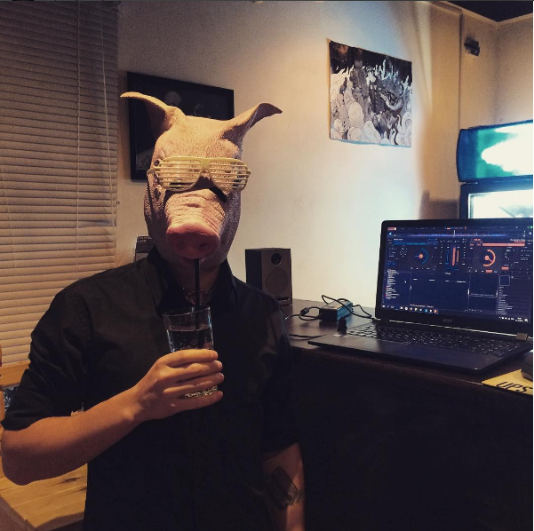
  
- 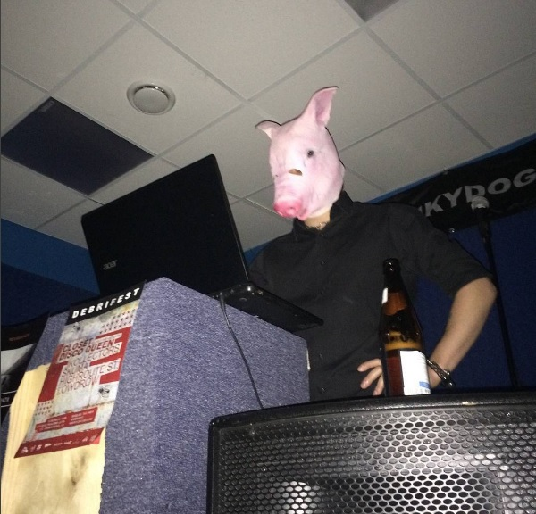
  

Ну вот, кажется, всё. Было еще много тусовок, где мне не нравилась музыка, но нравилось что всегда здесь друзья, какое бы дерьмо не играло на сцене. Всегда можно было с кем-то посмеяться в баре или поиграть в плейстейшн на втором этаже. Или встретиться с каким-нибудь знакомым и поговорить за житуху. Много хороших моментов было даже на плохих тусовках.

## Итог.

Самоорганизация не работает. На голом энтузиазме и диайвае не уедешь. Ребята уставали и устали, это было видно по глазам, например, арт-директора Толи, который сначала организовывал тусу, потом на ней нервничал и на следующий день шёл один убираться. Из того количества энтузиастов, которые тогда галдели на кухне весной: "ДАВАЙТЕ ЗАМУТИМ! Я БУДУ ПОМОГАТЬ! Я БУДУ ДЕЛАТЬ МЕРОПРИЯТИЯ!" осталось 2-3 человека, на которых всё и держалось. Никто ни за что не хотел брать ответственность. Желание тратить себя на свою подростковую мечту оказалось слабее того, чтоб быть в своей зоне комфорта. Кому-то надо было зарабатывать деньги на жизнь, а "Дом" это слишком дорогое "хобби". Кто-то просто устал от постоянных неприятных тусовок с отстойными группами, когда тратишь свою творческую энергию на каких-то обсосов и ничего не получаешь взамен. Кто-то и вовсе не повесил даже полки в "Доме", хотя на старте был чуть ли ни в первых рядах. Энтузиазм кончился после открытия. И всё, что построилось начало медленно ломаться. Дверные раздолбанные косяки месяца 4 уже никто не может починить. Но это так, всё лирика, но это показатель отношения. Я никого не обвиняю в том, что получилось. И я не святой, возможно мне тоже стоило тратить больше времени, денег и сил на "Дом", чем я тратил, но за себя скажу, что я ко всему относился максимально ответственно и не раз убирался один или помогал тогда, когда никто не пришёл. Да и одной из причин расставания с девушкой было то, что я слишком много времени трачу на клуб и слишком мало на нее, так, к слову.

О "Доме" я думал как о новой эпохе жизни тусовки. Апогеем нашего единства был тот факт, что на фестиваль "Все Вместе 2016" за 2000 км от Челябинска пригнало около 30 человек, и наших друзей было больше, чем всех остальных. То есть, все свои только так далеко от места обитания. И все добрались своим ходом.

Тусовка была как девушка, с которой ты в серьезных отношениях. Надо развиваться, куда-то расти, достигать чего-то большего. В случае с девушкой следующим шагом в отношениях, наверное, должна была быть свадьба. "Свадьбой" нашей тусовки стал клуб "Дом". Новая эпоха, мы все были объединены в одной теме. И каждый показал себя с разных сторон и показал своё истинное лицо.

Согласен, звучит пафосно. Но мне было приятно узнавать друзей с новых сторон и видеть неожиданные их грани. Например, чувак-социопат, который ненавидит почти каждого, мой друг,  помогает мне стоять на баре, потому что я не вывожу и помогает мне пройтись по дому для сбора мусора и посуды. Или то, что у меня появился очень хороший друг, хотя до "Дома" мы не очень хорошо общались. И тому подобные примеры. Всем, кто помогал Сергуне и строил "Дом", строил реп-точку-концертный зал, стоял на баре, стоял на звуке, я хочу сказать спасибо. Ну и отдельное спасибо самому Сергуне, который как неунывающий капитан падающего самолета "Бройлер-747" из передачи "Крутое пике" тащил на себе вообще всё и никогда не унывал, даже если мы ныли как наказанные за двойки школьники и пытались слиться.

Обидно, что уходит и эта "эпоха". Альтернативные варианты никто не предлагает, все просто молча и грустно смотрят, как закрывается этот аттракцион под названием "Подростковая мечта". К чему мы вернулись? К кухням, алкоголю в рюкзаках, разобщенности. Только с воспоминанием о том, что и в нашей жизни было что-то СВОЁ крутое. Только по факту это "крутое" оказалось никому не нужным "хобби". Такого, как "Дом" больше никогда не будет в Челябинске. Могло ли быть всё иначе? Не знаю. Всем спасибо, все расходимся.

P.S. Я всё-таки рад, что у нас получилось сделать кайфовую тему для себя хотя бы на год. Пусть это укрытие, этакий абстрактный "домик на дереве" с пивом и винилом не получилось сохранить, но он всегда останется легендой для тех, кому довелось там тусить.

 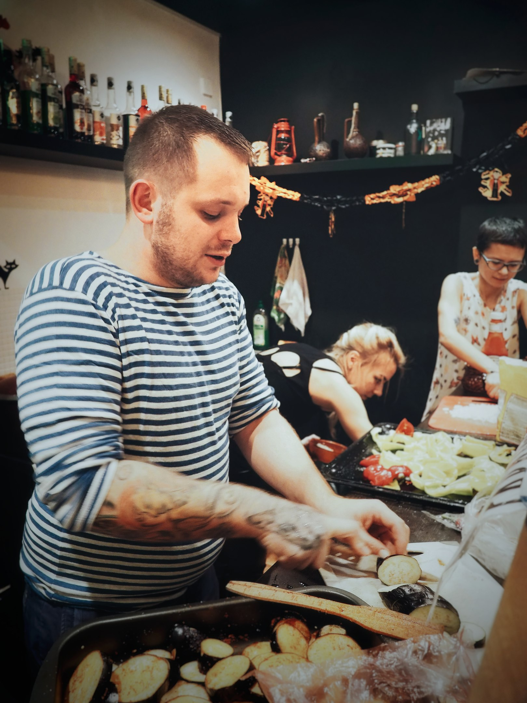

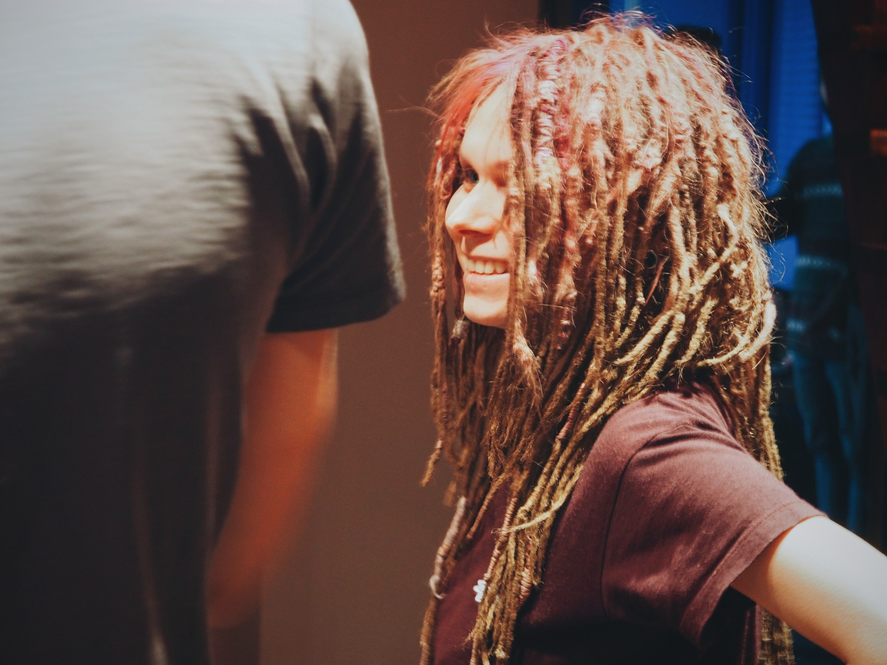
  
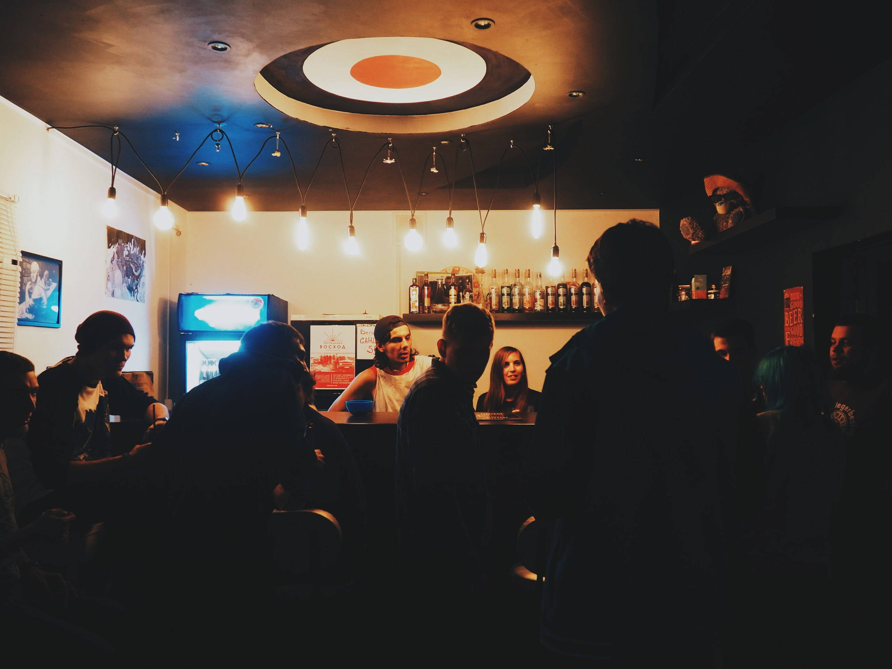
  
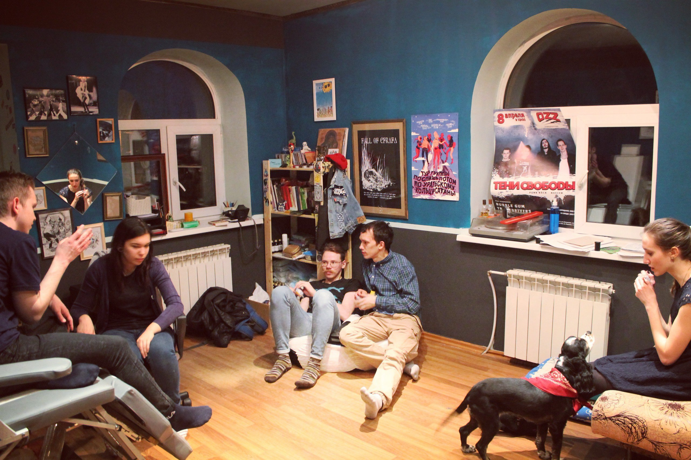
  
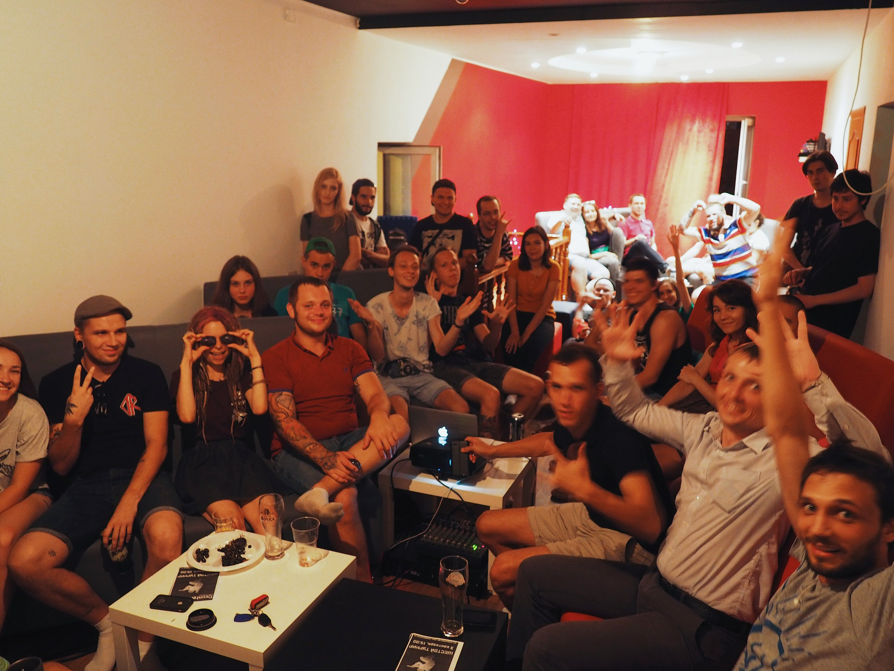
  
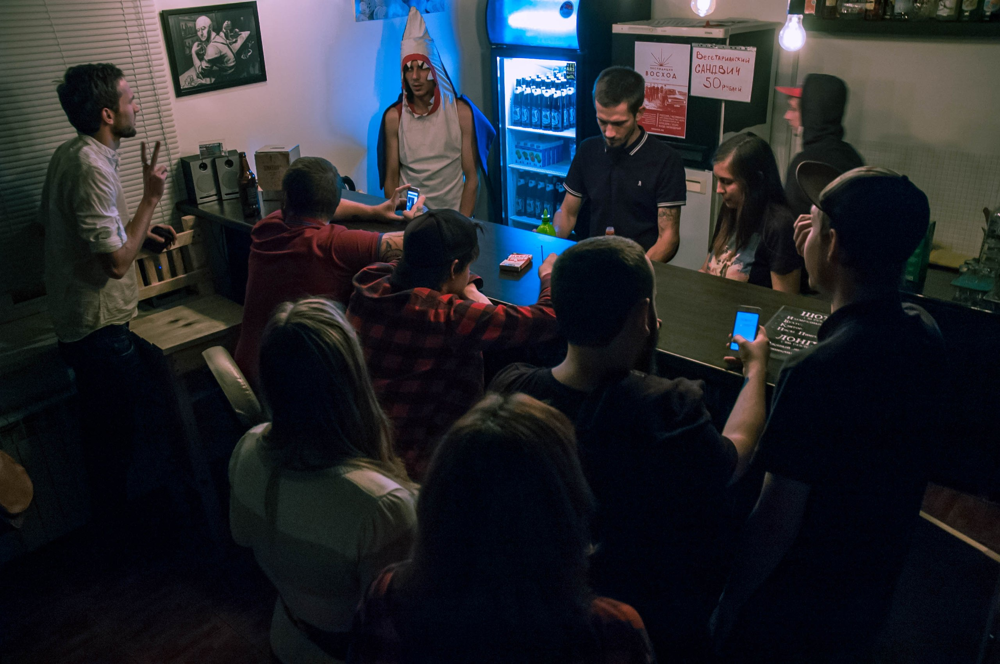
  
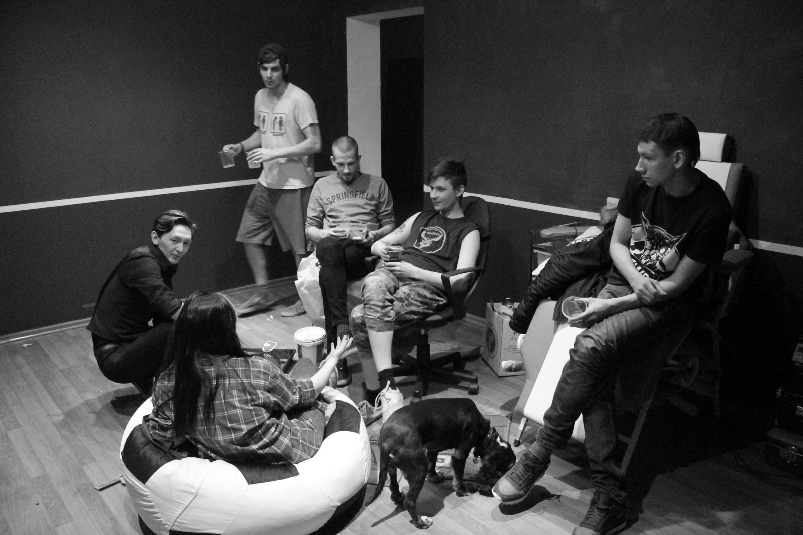
  
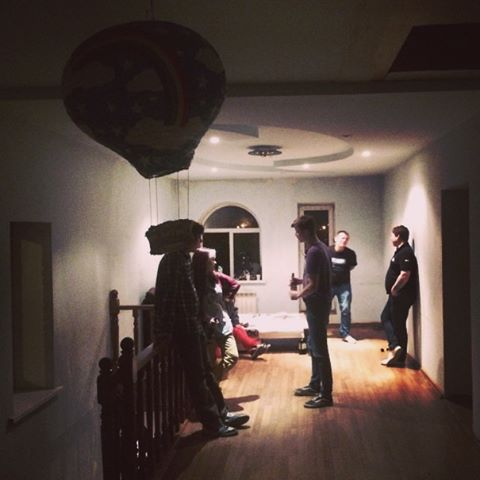
  
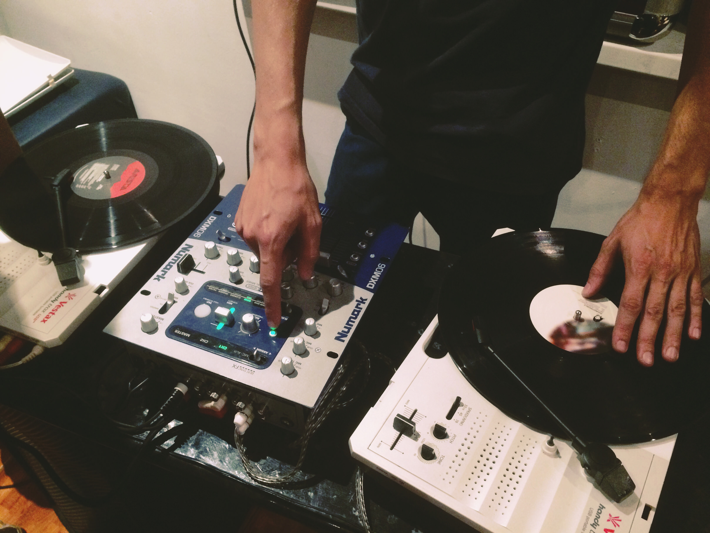
  
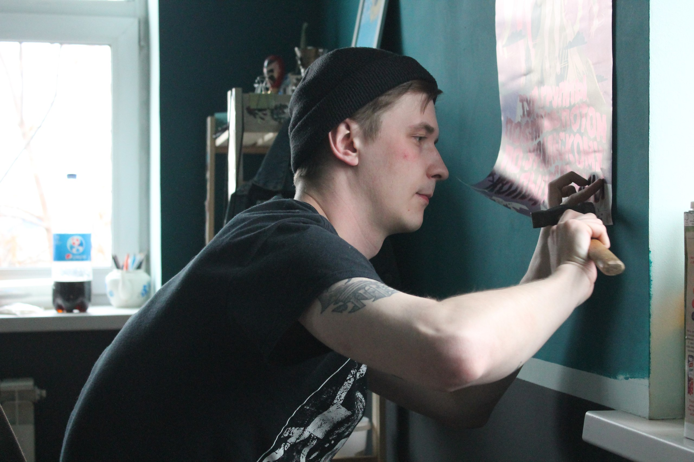
  
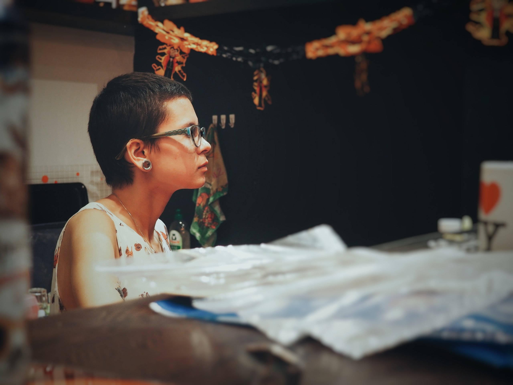
  
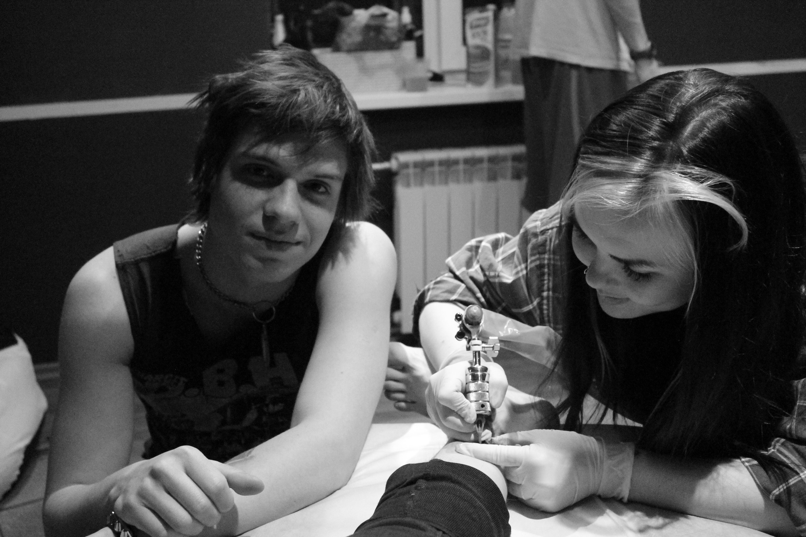
  
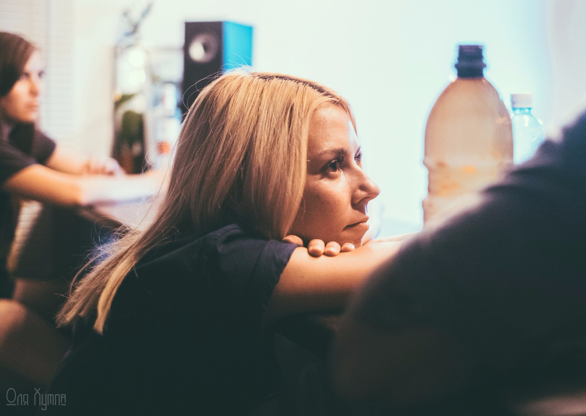
  

Посмотрите, как это было в нашем [Инстаграме.](https://www.instagram.com/artdom74/)

