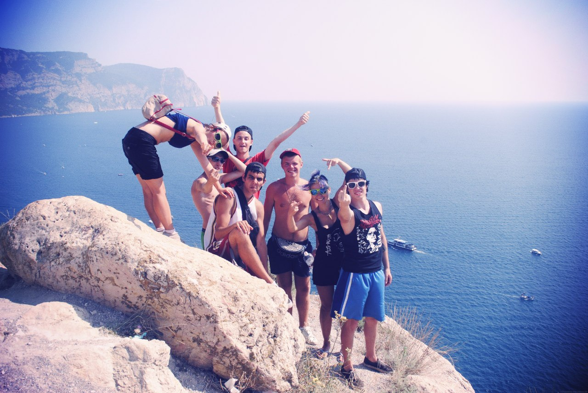
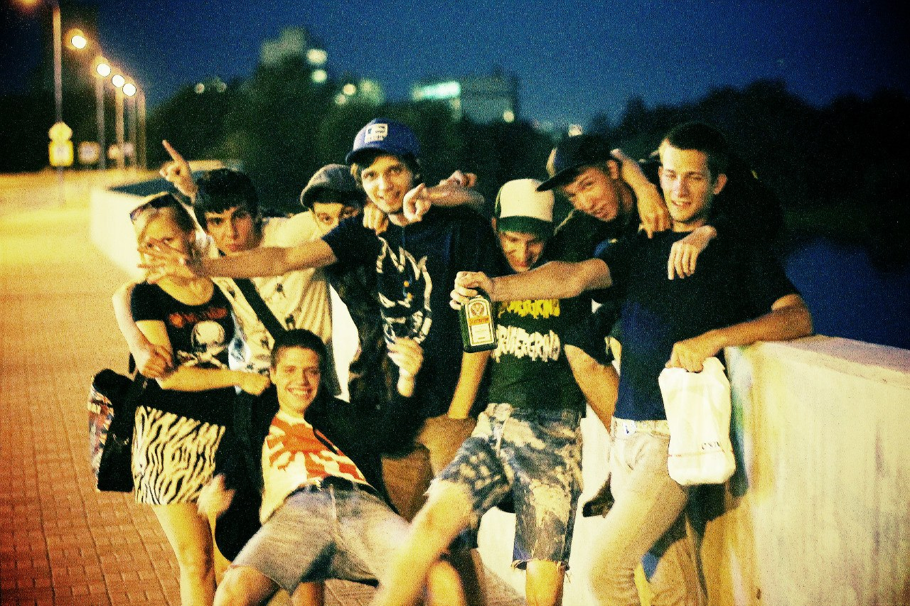
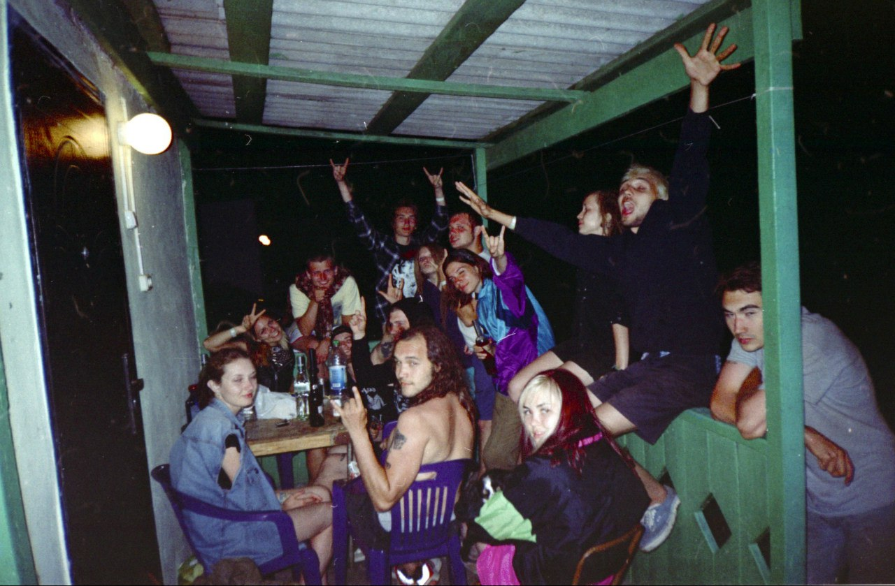
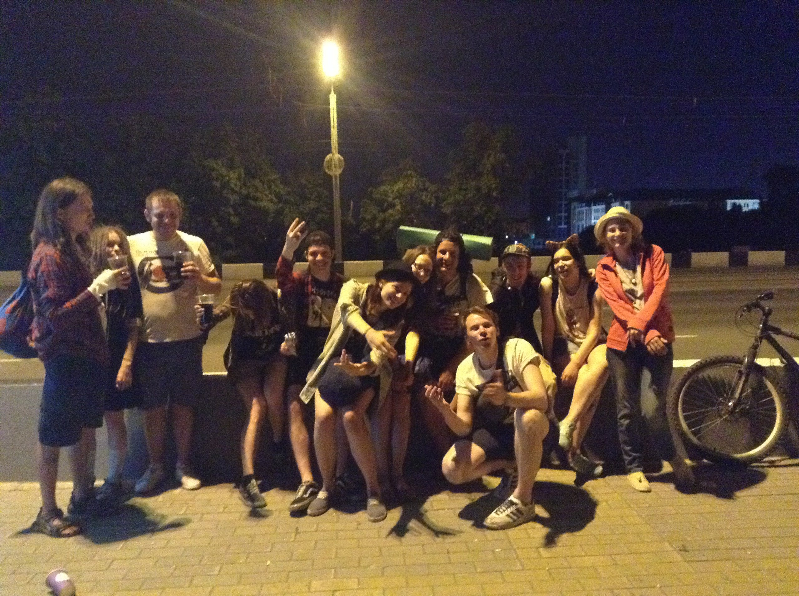
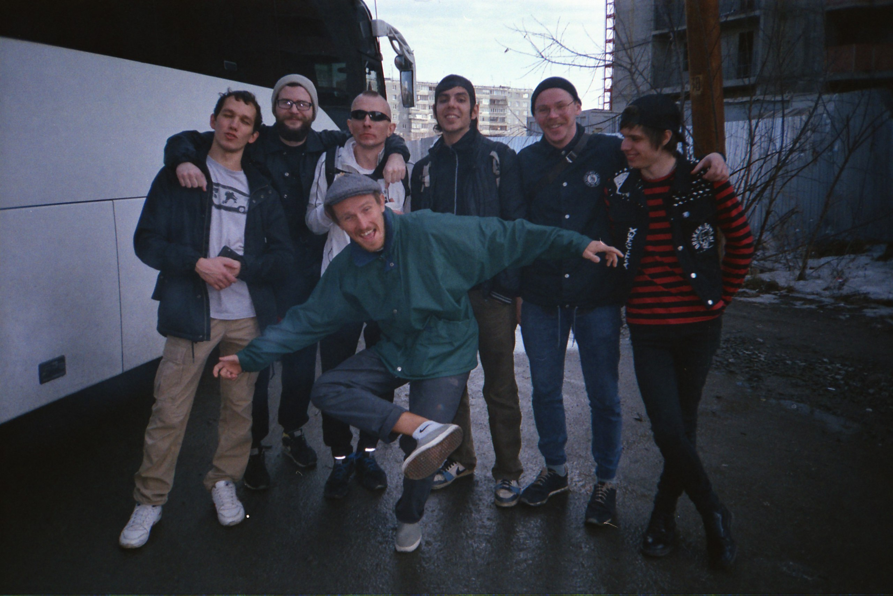
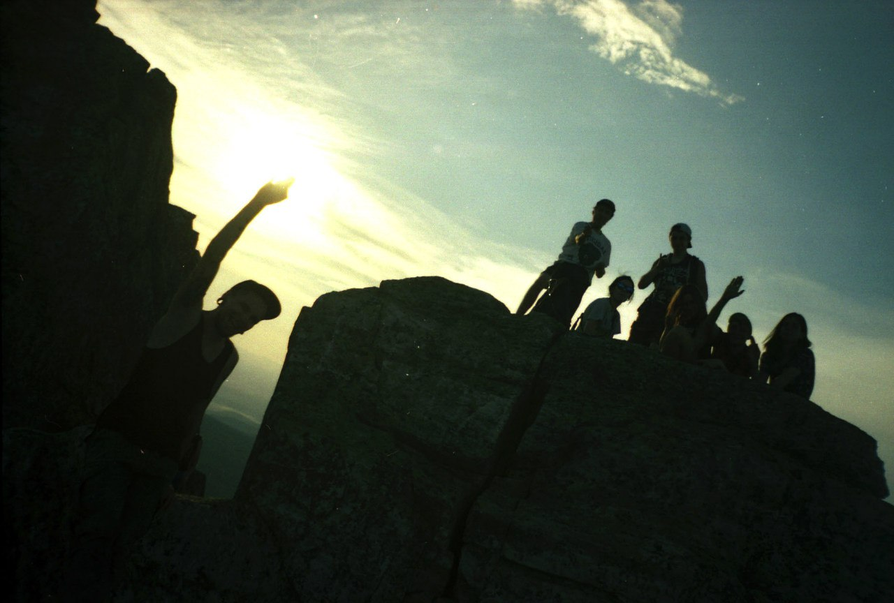
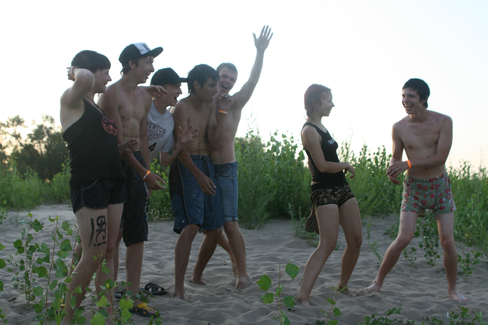
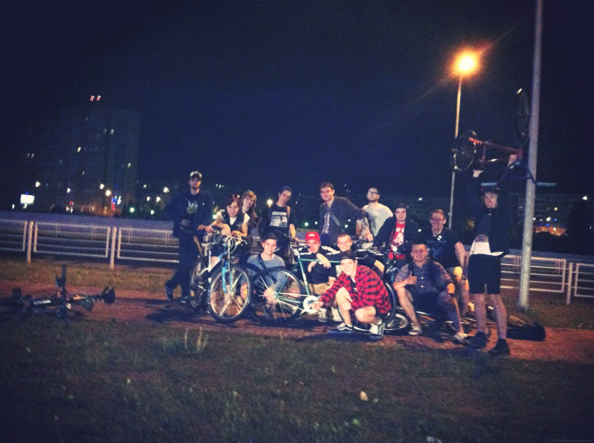
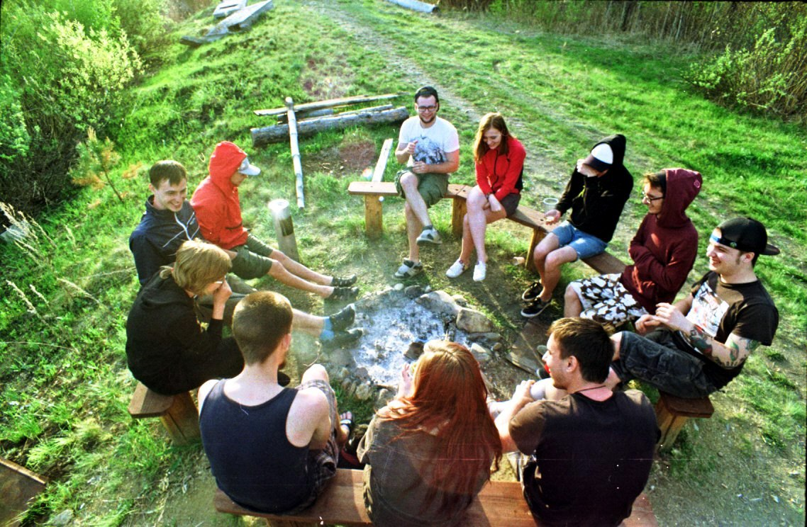

> *"Столько лет живешь, а толку!?" Поспишь Потом*

Вот и мне исполнилось 25 лет и как-то хочется подвести какие-то итоги по прожитии трети жизни и написать сентиментальную телегу, которую я бы наверное, лучше бы рассказал на чьей-нибудь кухне. Я заметил такую тенденцию - чем ты старше, тем быстрее бежит время. Может быть это связано с тем, что рабочая рутина начинает преобладать над хорошими и яркими событиями, которыми были насыщены годы до 20 лет. И теперь из месяца одинаковых рабочих дней ты можешь припомнить лишь пару-тройку моментов. И вот, с моментов, которые я помню из раннего детства до момента, когда я пишу это всё прошло уже два десятка лет и сейчас кажется, что это всё было непростительно быстро.

Я не считаю года и не особо парюсь сколько мне лет (учитывая то, что у меня до сих пор на кассе по-хамски спрашивают паспорт, думая, что это очередной школьник пришел за дешевым кайфом), но сейчас я замечаю, что я и всё мое окружение находится в каком-то пограничном положении на пороге из безрассудной молодости до расчетливой "взрослой" жизни.

Итак, с чего бы начать. Один мой друг сказал: "по-сути то, у меня и нет нихрена, кроме друзей". Так вот, когда я оказался в панк-роке, то в моей жизни много чего изменилось. Были и хорошие моменты и такие моменты, при которых я благодарю свою совесть, что помогла мне не быть конченым придурком, ведь всё могло закончиться бедой. Но самое главное, что я не знаю, следствие ли это воспитания и окружения, где я вырос или может быть это взрыв в голове, когда я первый раз нажал на "play" на плеере с диском "Пурген" повлиял на то, что я оказался в немного другой социальной группе и приобрел кучу всего другого. В частности, друзей, некоторые из которых разбросаны по всей стране в разных городах, а другие проверены уже почти десятилетней выдержкой дружбы, какую-то собственную модель ценностей и возможность быть в любой точке земного шара как дома.

И вот ты стоишь на вершине горы Демерджи в Крыму и просто рад тому, что ты здесь оказался не просто так, а сюда тебя завела дружба и панк-рок. И пусть я уже давно отошел от хардстайла, это всё еще горит во мне и заставляет просыпаться по утрам. За все крутые моменты, путешествия, поездки да и просто тусовки спасибо вам, чуваки.

Хочу попросить прощения у людей, которым я нравился, но не оправдал надежд. Пересматривал фотки и вспомнил, что с некоторыми хорошими людьми я вёл себя как полнейший урод. Поступал эгоистично, но по совести.

Хочу сказать спасибо друзьям "с района", что принимают меня таким какой есть со всеми моими загонами и приступами меланхолии.

Да вроде и всё. Друзья - это единственное, чем я горжусь из того, что я нажил за 25 лет жизни. Всё остальное - лишь обязательные этапы жизненного плана в стиле "родись-учись-работай-умирай". Спасибо вам.

