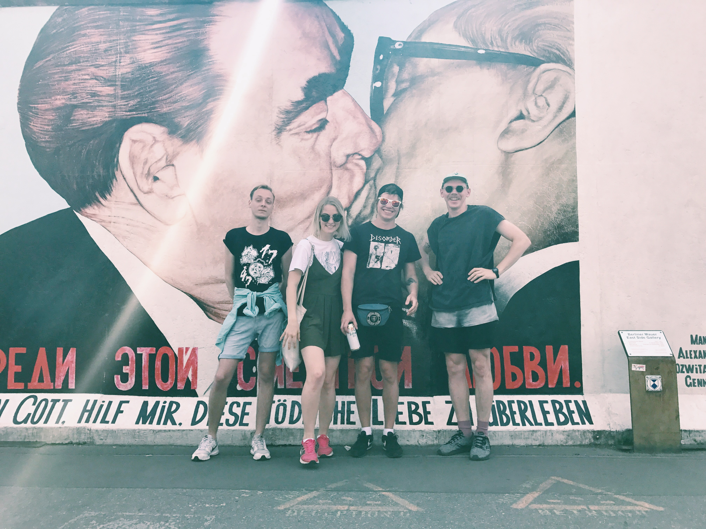

Наконец-то, между приступами лени я нашёл время для того, чтоб привести в порядок содержание этой истории. Так что, если вы вдруг пропустили:

Мои истории (в хронологическом порядке):

[Берлин](https://skndlst.wordpress.com/2017/09/01/%d0%bf%d0%b0%d1%80%d0%ba%d0%b8-%d1%81%d0%b0%d0%b4%d1%8b-%d0%bf%d0%b5%d1%80%d0%b5%d0%ba%d1%80%d1%91%d1%81%d1%82%d0%ba%d0%b8-%d0%b8-%d0%b3%d0%be%d1%80%d0%be%d0%b4%d1%81%d0%ba%d0%b8%d0%b5-%d0%be%d0%b3/)

[Гамбург](https://skndlst.wordpress.com/2017/09/02/%d0%b3%d0%b0%d0%bc%d0%b1%d1%83%d1%80%d0%b3/)

[Амстердам](https://skndlst.wordpress.com/2017/09/22/%d0%bf%d0%b0%d1%80%d0%ba%d0%b8-%d1%81%d0%b0%d0%b4%d1%8b-%d0%bf%d0%b5%d1%80%d0%b5%d0%ba%d1%80%d1%91%d1%81%d1%82%d0%ba%d0%b8-%d0%b8-%d0%b3%d0%be%d1%80%d0%be%d0%b4%d1%81%d0%ba%d0%b8%d0%b5-%d0%be%d0%b3-2/)

[Франция](https://skndlst.wordpress.com/2017/11/30/%d0%bf%d0%b0%d1%80%d0%ba%d0%b8-%d1%81%d0%b0%d0%b4%d1%8b-%d0%bf%d0%b5%d1%80%d0%b5%d0%ba%d1%80%d1%91%d1%81%d1%82%d0%ba%d0%b8-%d0%b8-%d0%b3%d0%be%d1%80%d0%be%d0%b4%d1%81%d0%ba%d0%b8%d0%b5-%d0%be%d0%b3-3/)

Истории от Толи. Мы договорились разделить рассказ и он свою часть оформил на платформе Medium.:

[Италия](https://medium.com/travelru/matta-corsa-in-italia-692c141807f8?source=user_profile---------3----------------)

[Пиза и Болонья](https://medium.com/travelru/pisa-and-bologna-efb44308247a?source=user_profile---------2----------------)

[Верона и Милан](https://medium.com/travelru/verona-milan-cba02a6b231b)

Такие дела. Блог немного простаивает ввиду того, что мне пока не о чем вам рассказать. Но скоро лето, а значит калейдоскоп историй закрутится с новой силой. А пока что вы можете читать меня в [Telegram.](https://t.me/skndlst_thoughts)

East Side Gallery
