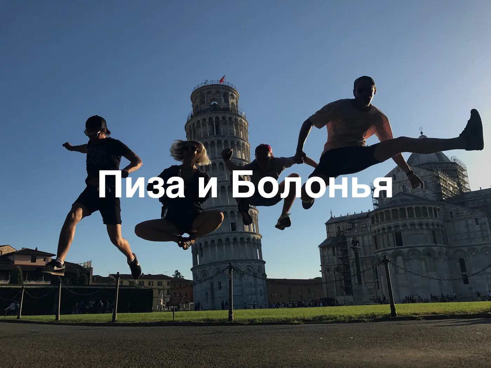

Наконец-то, между приступами лени я нашёл время для того, чтоб привести в порядок содержание этой истории. Так что, если вы вдруг пропустили:

Мои истории (в хронологическом порядке):

Истории от Толи. 

Такие дела. Блог немного простаивает ввиду того, что мне пока не о чем вам рассказать. Но скоро лето, а значит калейдоскоп историй закрутится с новой силой. А пока что вы можете читать меня в [Telegram.](https://t.me/skndlst)

