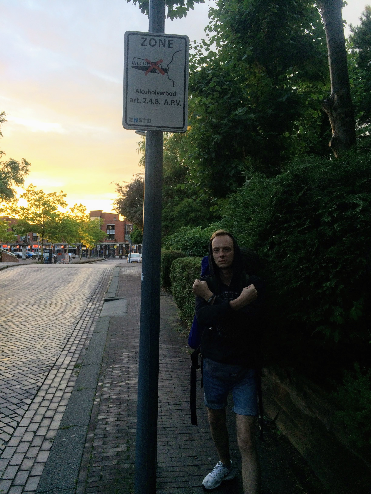

 **23 июля**

 По расписанию наш автобус отходил около 11-ти утра. Зервано попрощался со своим электоратом, а мы, в свою очередь, пообещали отдать свои голоса за его кандидатуру на грядущих выборах президента мира. Опять небольшая перепалка с Толяном в прихожей, ну шо тут сказать, деды. Позже, если получится, составлю список того, что бесит Толяна, хаха.

 Наверное, стоит ответить на вопрос: "неужели в вашей компании не было ссор?". Была шутка, что в конце путешествия мы с Толяном приземлимся в Челябинске, сядем в разные такси и больше никогда не будем общаться.  На самом деле, из относительно спокойных людей у нас были только Оля и Миша. Нас было четверо и трудно было ругаться, потому что всегда можно было узнать видение скандала со стороны и сделать какие-то выводы и придти к компромиссу. Толян стал раздражительным уже к концу поездки, в Милане. А я пару раз не совладал с негативными эмоциями и поругался с ребятами. По ходу рассказа я еще вернусь к этому. Но в целом, мы все понимали загоны друг-друга и старались договариваться, всё заканчивалось мирно, просто бытовые ссоры. Ну и, если вы не можете понять, хотите ли вы жениться на своей даме сердца или нет, то берите ее в подобный трип. Если вы вернулись домой и вас не посадили за мокруху соотечественницы, то не раздумывая можно жениться! А, вообще, как говорит Павел Мятный: "Пока жив - не женись!"

 Я не успел написать записку с респектами для президента, но за меня это сделал Толя, подарив вождю игрушку-спиннер. Долгие прощания- лишние слёзы и вот мы уже с рюкзаками за спиной едем на автовокзал сквозь пасмурный Гамбург.

 На вокзале решаем с Толей разделиться, потому что я хочу поесть в кафешке, а Толе срочно нужно в супермаркет. Пока я пытался удержать в руках пирожок, стакан с кофе и рюкзак, и при этом еще смастерить самокрутку до меня постоянно докапывались различного рода привокзальные бичи и бродяги с просьбой отсыпать денег или скрутить сигаретку. Толяна нет уже минут 40, и я начинаю нервничать, к тому же я не могу найти автобус на Амстердам, а связи с Толей, кроме договоренности встретиться на том же месте через полчаса нет. Встретил Толю уже почти в последний момент за столом с Эммой, которая пришла нас проводить в столь нелегкий путь. От них я узнаю, что Толян влюбился в какую-то привокзальную бомжиху, хаха. Говорит, у нее очень милая улыбка, а если её отмыть, то можно было с ней встречаться, хаха. Но я ему сказал, что у него нет шансов, потому что она способна полюбить только бомжа. Проходит десять минут, и мы грузимся в наш автобус прощаясь с шансами на счастливую жизнь с гамбургскими бомжихами. Ну знаете, ладонь к стеклу и светлая грусть. "Я такой же, как и ты - бродяга...".

 Из Гамбурга мы стартанули на автобусе от фирмы-перевозчика FlixBus, предварительно купив билеты в приложении. Автобус оказался вообще супер-кайфовым, есть туалет, много места для ног и даже есть wi-fi, правда всего 150 мб на рейс. Воспользовавшись комфортом и потратив положенные мегабайты на прослушивание музыки онлайн, я завалился спать и так и проспал до самого Амстердама.

 

 На этот раз вписка была пробита еще в Челябинске и наш хост жил в пригороде Амстердама – городке Вормефир (Wormerveer). Чувак, что вызвался нас приютить написал на каучсерфинге сам, видимо среагировав на тег «punk», потому что, судя по профилю, чувак был полностью в теме, правда с довольно требовательной анкетой. Одним из условий было написать своё мнение по поводу такого явления как «джентрификация» в отклике на предложение вписки. Я его упустил, и потом мне пришлось в спешке на работе гуглить, что это блин нахер такое и уже писать, что я думаю по поводу всего этого безобразия. Сделано это было для того, чтоб у него не вписывались случайные люди, которые даже не удосужились прочитать его анкету и всё в таком роде. Сложилось впечатление, что это очень серьезный человек. "Ты вписываешься у меня дома, но ты делаешь это без уважения. Ты даже не знаешь, что такое "джентрификация".

 И вот, уже вечер и мы выгружаемся из нашего автобуса, чтоб на своей шкуре ощутить дух «города свободы». В голове крутится песня Макса Коржа про Амстердам, а в воздухе уже витает аромат дудки. До города, где живёт Сёрж (Sjors), так звали нашего хоста, надо было ехать около 20 минут на электричке. На вокзале не работал банкомат, поэтому решено было прогуляться по окрестностям и дойти до другого банкомата. Судя по карте, мы находились в центре города, да и время позднее, но на улицах практически никого не было. Идёшь с рюкзаками по пустым улицам, на которых заметно грязнее, чем в Германии и лишь одинокие прохожие медленно провожают нас с Толяном взглядом. Город выглядел так, будто он вымер. Как позже выяснилось, это был какой-то бизнес-квартал в выходной день. Еще мы встретили попугайчика на одном из деревьев. Северная Голландия по климату весьма прохладная страна и по погоде больше напоминает Питер, поэтому я удивился, что эти теплолюбивые братаны тут делают. Позже, я прочитал в Википедии, что в 70-х годах из амстердамского зоопарка сбежала колония попугаев и вместо того, чтоб замерзнуть они решили ассимилироваться. Так что, тут попугаев можно встретить как воробьев, чему я дико радовался.

 

 Ладно, уже вечер, гулять с тяжелыми рюкзаками не очень весело и комфортно и мы решаем всё же поехать на вписку. Обожаю вечерние перроны вокзалов и этот «дух дороги», когда сидишь один на станции и приезжает поезд со светом в окнах, который отвезет тебя куда-то еще. Зассали ехать без билетов, так что проезд был санкционирован и вскоре мы оказались уже в пригороде Амстердама. Вормефир представлял из себя тихую и уютную деревню с офигенно красивым каналом на центральной улице. Чуваки с рюкзаками всегда вызывают интерес у прохожих и в этот раз у нас случился диалог с какими-то парнями, что остановились в тачке на светофоре:

 \> *—Парни, вы откуда?*
 \>
 \> *—Из России.*
 \>
 \> *—Из России!?,— чувак на заднем сидении оживился и, чтоб продолжить разговор, перескочил к другому окну.*
 \>
 \> *—Да-да.*
 \>
 \> *—Нихера! А вы водку пить будете?*
 \>
 \> *— Уже нет, — я хотел сказать «not now», но перепутал и сказал «not already».*
 \>
 \> *— Всмысле, «не сейчас»?*
 \>
 \> *— Да, чуваки, не сейчас.*
 \>
 \> *— А когда?*
 \>
 \> *— Завтра.*
 \>
 \> *— Ооо, ну это не дело, вы ж русские, — расстроенно сказали они и уехали.*

 

 Вормефир сразу запал в сердце. Он был очень уютный, очень тихий с частными домами и таунхаусами, чистыми улицами, аккуратными тротуарами и зеленью. Еще я обратил внимание, что здесь у людей нет занавесок на окнах и нет трёхметровых заборов из профнастила, которые ставят россияне на своих участках. Из-за этого кажется, что все друг-другу доверяют и им всем хочется доверять в ответ, что очень здорово. Позже мне подсказали, что занавесок и заборов нет, потому что голландцы двинуты на безопасности, и для того, чтобы случайный прохожий мог увидеть скандал в семье голландского Сюткина или какую-нибудь сектантскую оргию и мог сообщить куда следует. Но мне это кажется не очень логичным. Сёрж тоже не смог объяснить это. Просто так повелось, вот и всё.

 

 

 С трудом найдя адрес, мы ломимся в дверь и знакомимся с Сёржем. Тот серьезный чувак из профиля на каучсерфинге оказался очень простым и душевным, своим в доску, чуваком. Сёрж живёт на втором этаже таунхауса в очень творческой квартире, которая больше похоже на мастерскую и занимается он тем, что работает школьным учителем искусств в младших классах, а летом устраивает для детей воркшопы типа рисования граффити или конкурса костюмов. В свободное от работы время он тусуется в сквотах с местными анархистами, помогает беженцам и слушает подземный рок. В двух километрах от вписки проходил какой-то панк-рок фестиваль, на котором из знакомых мне групп играли D.O.A., но там уже играла последняя группа и Сёрж оставил нас в своей хате, а сам поторопился и уехал успеть посканковать под De Hardheid.

 

 Миша и Оля должны были приехать только послезавтра, так что завтра мы хотели потусоваться по Амстердаму и посмотреть местные кайфы «города свободы». Эта вписка была одна из самых комфортных, потому что нас определили в отдельную комнату и выделили нормальные кровати. Я сразу отрубился, правда я кричал во сне, повторяя слово «Sorry», как на утро рассказал мне Толя. Походу, нервы сдают! Сорян!

 **24 июля**

 Элитно позавтракав, мы отправились хулиганить и покорять город грехов. Заметно похолодало, так что теплые шмотки тоже пригодились, а еще супер-кайф гулять без рюкзаков, чувствовать себя подвижным и всё такое. Пока пишу это я пью кофе, так что тут может быть много лишнего, потому что я на кофеиновых скоростях!

 Вроде в этот раз мы не купили билеты и контроллер нас не настиг, так что всё было круто. Я вообще никогда заранее не искал и не гуглил, что я хочу посмотреть в городах. В Германии это была история Второй Мировой, а о Голландии я совсем ничего не знал кроме тюльпанов, кофешопов и района красных фонарей. Короче, что смотреть мы не знали и решили просто праздно шататься по улицам. А вообще, в поиске достопримечательностей круто помогал GoogleTrip. Все фирмы, о которых я упоминал - заплатите мне за рекламу!

 

 На вокзале просто миллион человек народу, короче, все туристы на месте. Трудно лавировать среди этого потока, хочется свалить куда-нибудь подальше и где потише. Кругом сувенирные лавки с всякой бездуховной похабщиной да кофешопы для любителей ддос-атак. Присесть решительно негде, весь город разделен каналами, но чего греха таить, выглядит он очень красиво. Чем-то напоминает Санкт-Петербург - каналами и симпатичной архитектурой.

 

 

 Дошли до дома, где пряталась Анна Франк от нацистов во время Второй Мировой, но километровая очередь внутрь просто отпугнула нас. Тогда было решено идти оскорбляться бездуховщиной в парк. У Толи был челендж - попробовать как можно больше необычных безалкогольных напитков и, скажем так, выстрелило у него где-то две из десяти покупок, хаха. То он купит какую-нибудь острую имбирную газировку, то какое-нибудь не очень вкусное безалкогольное пиво, но в этот день ему повезло - тот безалкогольный имбирный эль, что он купил был превосходен и я бы даже сейчас не отказался от баночки этого эликсира. Но, если бы в Европе продавалась газировка со вкусом плова или со вкусом «мятный карась», то не сомневайтесь, эта бутылка уже бы лежала в потребительской корзинке Анатолия Пузырька.
 

 

 Я, кстати, ощутил какую-то сильную зависимость от кока-колы и выпивал в день минимум банку, в лучшие дни по два литра. Здесь почему-то такого со мной не происходит.

 Говорят, что в Амстердаме супер-развито велосипедное движение, но мне оно не показалось более развитым/интенсивным, чем в Германии. Но постоянно свербила мысль - надо раздобыть велики! По слухам, где-то был район, где торчки продавали краденые велики по 10 евро, а потом эти же велики можно было продать им же за 5 евро назад. Но, когда мы в этот день туда пришли, уже никого не было, ибо вечер. Вот сейчас пишу и дико хочется покататься на велике по Амстердаму и Вормефиру, жаль, что в этот раз не срослось. В общем, мы целый день просто гуляли по Амстердаму, бродили по его узким улицам, смотрели на эти пряничные дома и любовались видами с каналов.

 

 

 Под конец вечера х ТОЛЯН х предложил узнать врага державы поближе и пойти в то, что клятi європейці называют «кофешоп», чтоб посидеть там и «прочувствовать атмосферу». Скажем так, ддос-атака моего разума уже была совершена днём в парке, так что мы просто заказали в кофешопе кофе, хаха. «Кофе и всё? Дудку не будете?», ехидно спросил нас продавец кошмаров, искушая и без того беззащитную на чужбине русскую душу. Мы сказали, что нет, но он всё равно посмотрел наши паспорта, чтобы убедиться, что мы имеем право тусоваться в этом злачном месте. Наши россиянские чувства были оскорблены, мы наблюдали как бездуховные европейцы ширяются своей марихуаной прямо у всех на виду никого при этом не стесняясь. Представляете, один из них при этом смотрел футбол, а другая компания поганых нарколыг при этом просто молча пила газировку. Не выдержав подобных зрелищ, мы решили, что не хотим сидеть больше ни минуты в этом притоне, мы допили кофе и поспешили покинуть этот шалман. Циничное «всего хорошего!» торговца смертью отдавалось эхом в голове еще несколько кварталов...

 Вообще кофешопов там дохрена, и можно найти заведение на любой вкус, с любой музыкой и с любым антуражем. Я задавался вопросом, есть ли кофешопы с антуражем зассаного и исписанного гадостями подъезда панельного дома, где все употребляют из ведра (в котором еще час назад лежала половая тряпка) и обрезанной баклахи жигуля с колпаком. Но все заведения предлагали только кресла-мешки и качели на искусственном газоне. Как говорится, нахер оно нам надо.

 

 Поспешили успеть на вокзал, потому что не знали, когда уходит последний поезд и, зацепив по пути продуктов и пивка, мы прыгнули в электричку. Блин, чуваки, Вормефир на контрасте с Амстердамом просто вери вандефул. Эти тихие улицы с частными домами, каналы, яхты, гирлянда...Ни одно фото не сможет передать той гармонии, которая царила в этой деревне. Я бы хотел встретить старость именно здесь, а не в панельке на районе. Несколько раз просто останавливались позалипать и посмотреть на всё это вокруг. И всё же доковыляли до Сёржа. 
 Сёрж очень смешной чувак! Никогда не думал, что буду понимать чувство юмора иностранцев, но над его шутками я смеялся искренне и от души. Увидел у него стикер от чуваков из мастерской «Чёрный Ракель», круто, если они тоже у него вписывались. Завтра должны были пригнать Миша и Оля, а значит, что всё станет немного веселее. Допив пиво, я завалился спать.

 **25 июля.**

 Ленивое пасмурное утро. Сёржа нет дома, так что мы просто залипаем в вай-фае, слушаем какую-то грустную херню, которую включил Толя и ждём воссоединения нашей шайки.

 Сообщение от чуваков, и мы идём на ж/д станцию, чтоб встретиться.

 Готовить обеды и ужины — это одни из немногих вещей, что мы могли предложить хостам. Это, наверное, какая-то русская традиция - кормить гостей, но мало кто отказывался от russian zastolye и вот в этот раз мы решили есть все вместе. Для этой цели нам, очевидно, нужны были продукты.

 Мы отправляемся в супермаркет низких цен Lidl (где мои деньги, Лидл?), и там затариваемся едой. Параллельно с этим мы с Мишей решаем испить вина и вдогонку ко всему этому я покупаю сыр-санкционочку.

 Короче, когда я принёс сыр домой, то понял, что он капец как воняет грязными носками, трусами, бомжами, подъездами, пердежами в твоей утренней маршрутке и прочим замогильным смрадом. Я смог осилить только ахаха половину и то запивая вином, но, на самом деле, на вкус он не такой херовый как на запах, так что с вином зашло нормально. Есть мнение, что только такие сыры и надо пробовать, обычный сыр можно и на родине поесть.

 

 

 Ребята знакомятся с Сёржем и Оля, как обычно, начинает расспрашивать хоста обо всём на свете. Мы иногда говорили между собой на русском и разговор зашёл про то, что «...у одной девчонки есть собака...». Услышав слово «собака» Сёрж активировался и сразу сказал мимо диалога: «Sobaka! Poshli Poshli!». Как позже выяснилось, Сёрж встречался с русской девчонкой из Москвы, но у них что-то не срослось, но некоторые русские слова он помнил и позже нам сказал, что очень был рад снова услышать русскую речь.

 После ужина мы решили пойти гулять по Вормефиру уже в компании с нашим хостом. Душевный вечер, вино, шуточки-шутёхи, прогулки по паркам и садам, да и просто разговоры. Сёрж на вопрос о легальности наркоты рассказал странную тему. Он говорит, что все нелегальные наркотики у них выцепляются рыбаками. Мол дилер проходит мимо канала и выбрасывает закладку с магнитом в воду. Потом подходит зян с удочкой и ловит на магнит этот сверток. Звучит очень тупо! Но позже мы стали всех подозрительных людей, что нам встречались считать дилерами, в том числе и очень подозрительного гуся на берегу озера в парке.

 

 

 К концу вечера на нашем пути попалась скейт-площадка с встроенной в неё воркаут-площадкой. И мы пьяные начали качаться на этих турниках как настоящие славяне-турникмены во славу Руси! Правда, мы очень быстро выдохлись и пошли бухать дальше уже на вписку. Амстердам для меня пока что еще непонятен, а вот Вормефир - one love. Завтра проверим уже вчетвером, где же свобода в этом городе свободы!

 

 **26 июля**

 Фраза «самая комфортная вписка» означала еще то, что спать мы могли сколько хотели. И да, спали мы с огоньком, от души и со всей силы - пока не заболит башка! Так что, дни у нас были априори короче, но при этом нам еще мешала лень.

 Так что, позавтракав с Сёржем, мы снова отправились в город порока. Миша и Оля днём ранее тоже зассали не платить за билеты, но в этот раз выяснилась фишка - у Сёржа есть "панковский подход" - хер пойми откуда взявшиеся льготные карточки, но благодаря им билет до Амстердама стоил всего 1 евро с человека.

 С Сёржем мы разминулись на вокзале и теперь нам предстояло развеять "туман войны" уже вчетвером. Миша и Оля, как и мы, не знали, что смотреть в этом городе, поэтому мы просто, как и двумя днями ранее пошли гулять. Ожидалось, что неделя моды будет в Милане, но в магазинах масс-маркет брендов одежды типа H&M оказались скидки до 80% и чуваки провели около 1,5 часа выбирая себе шмотки по бич-цене. Я урвал себе тонкий бомжатский свитер с дырами, как давно искал.

 Второй целью было найти местный бордшоп. Судя по советам друзей, там продавали панк-рок мерч и винил, так что я очень хотел туда зайти. Прикольное место, но майки оооочень дорогие - 32 евро за тишку, а винил мне не на чем слушать, так что я там даже не рылся. Но место, конечно, атмосферное.

 

 

 Что ж, по старой русской традиции, шоппинг и покупки надо обмыть - для этой цели мы как russian alkashy взяли пива, Оля и Толя взяли чипсов с газировкой и мы отправились гулять по парку в поисках удобного для употребления места.

 Парки, наверное, здесь ключевые места, где проходит грань между лигалайз-бесием города и спокойной голландской житухой. Очень много спортсменов, бегунов, девушки занимаются йогой, кто-то играет в футбол на газоне - круто, наверное, такое место иметь под боком там, где ты живешь. Ну и здесь никто никого не напрягает. За всё время мы не встретили ни одного буйного или упоротого человека.

 Лавочка с видом на канал была найдена, и мы активировали нашу Russian Time-Travel Machine - упаковку с пивом. Смеялись с того, что начали икать на третий день в Нидерландах и просто обсуждали насущные вопросы.

 

 У меня было две вещи, которые я хотел ощутить на себе в Амстердаме - одну из них я сделал двумя днями ранее, а вторая вещь - выпить настоящего голландского абсента с туйоном в каком-нибудь баре города. Сейчас я уже выяснил, что в Евросоюзе тоже действует ограничение на количество туйона в абсенте, так что изначально затея была провальная, но об этом позже.

 Время шло к вечеру и осталась одна достопримечательность - Район Красных Фонарей. Пока мы до него дошли (кстати весь Амстердам отлично проходится во все стороны пешком, общественным транспортом мы совсем не пользовались) уже стемнело и на улице образовалась толпа туристов и зевак. У меня опять обострилась социофобия и особо раздражают пешеходы, которые как аутисты медленно идут и с открытым ртом смотрят по сторонам и, соответственно, всем приходится обходить их. Ну и сказать, что я не поклонник клубов, веществ, «найт-лайф» и прочего текно, так что эта часть жизни города точно была не для меня.

 Ну шо сказать... Да, публичные дома. Да, проститутки на витринах зазывают парней на вандерсекс. Толян хотел заплатить за сеанс, но не чтоб «дико пароться например», а чтоб объяснить женщине, что она не товар и секс-индустрия угнетает её. Это стоило бы около 50 евро. Но как-то не удалось, и мы отправились искать мне бар, где я могу опрокинуть за воротник шот абсенту.

 Короче, обошли где-то пять баров и в них есть абсолютно всё, кроме абсента! Я был в замешательстве, пока не нашёл маленький бар, где всё-таки подают эту отраву. Разогнанный пивом, я выпиваю долгожданный шот ии.. и ничего не происходит. Это обычный абсент из бутылки, которую можно точно так же купить у нас в стране. Разочарованный этим фактом я выпиваю еще стопку текилы, и мы отправляемся на вокзал, чтоб поехать домой.

 Не знаю, раз я уж тут настолько всё подробно тут описываю и всё получается скорее как дневник нежели как статья или публикация (я до сих пор думаю, что много лишнего пишу), то расскажу вам и об этом. Мне очень нравится, когда ты ночью куда-то идёшь с друзьями. Все эти пустые улицы, городские огни и витрины, меняющиеся банки с пивом в руках, глупые угары и пьяные выходки, дурачества, смешные пьяные разговоры и тишина улиц. В Челябинске очень редко удается так круто тусоваться, мы в основном сидим по кабакам да квартирам и вообще относительно мало гуляем, так что тут подобное - как глоток свежего воздуха.

 Завтрашний день для нас был загадкой. Еще раз в Амстердам ехать не хотелось, но и не хотелось грибовать дома, так что надо было себе придумать развлечение. Одним из вариантов была тема поехать к морю и там затусить. Еще один день нашего путешествия подошёл к концу. Пока что всё проходит как нельзя лучше, и я уже получил всё, что хотел. Но впереди еще три недели, а значит будет еще больше всего. Вы не удивитесь, если я скажу, что я опять допил своё пиво и лёг спать.

 

 **27 июля.**

 Очередное пасмурное ленивое утро. Разгоняться в этот день особо не хотелось, потому на следующий день нам предстоял переезд в следующий город - Париж, а что нам смотреть в самом Амстердаме не смог бы придумать даже Друзь со своей командой знатоков.

 Была тема поехать к океану, и Оля даже узнала у Сёржа точку на карте, где будет максимально кайфово, но мы лишь ели и ленились. Грандиозный завтрак сменился грандиозным обедом, а день обещал быть максимально скучным.

 

 Это, кажется, была пятница, вернулся с занятий Сёрж и сам предложил нам составить компанию до пляжа, на который мы так хотели попасть, но почему-то обламывались. Мы согласились и после недолгой дороги по пасмурной Голландии и пары электричек, мы оказались уже в парке на пути к пляжу. Нидерланды в два раза меньше по площади, чем Челябинская область, так что тут всё рядом.

 Нам предстояло пройти примерно пять километров, но за беседами и шутками время пролетело почти незаметно. Правда мы постоянно спрашивали у Сёржа: «ну чо, где пляж то?», на что он отвечал, что мы уже на нём, имея ввиду какое-то английское выражение типа «под булыжниками пляж». Еще раз повторюсь, что Сёрж нам казался вообще своим пацаном и с ним было дико классно тусоваться. Меня дико веселили его шутки и чувство юмора. Мы встретили лебедей, и Оля сказала ему, что лебеди, когда ныряют похожи на пластиковые пакеты. На что Сёрж сразу крикнул стае лебедей: «ЭЙ, ПТИЦЫ! ВЫ ПОХОЖИ НА ПЛАСТИКОВЫЕ ПАКЕТЫ!» и показал своим видом, что теперь нам надо убегать. Естественно, за нами никто не погнался, хаха.

 И вот мы доковыляли до ступеней, за которыми должен был быть пляж. Блин, тут даже на пляже в каких-то долбаных пердях есть урна и велопарковка! Вряд ли получится передать то ощущение, когда мы поднялись и увидели океан и песок, простиравшиеся без каких-либо границ! Все пришли в дикий восторг, побросали свои вещи и побежали к воде. Вода оказалась очень тёплой несмотря на то, что воздух был довольно-таки прохладный. Ну фигли делать, раз уж мы на пляже, то надо купаться! Я считаю, что если ты летом не купался нагишом, то это лето прошло зря! Мы не рассчитывали, что будем купаться, поэтому из пляжного стаффа у нас собой ничего не было. На бесконечно длинном пляже никого не было кроме нас, но Оля, как порядочная леди, отказалась от молодежного угара. Так что, мы просто побросали одежду на песок и побежали на встречу волнам. Поплавать вряд ли удастся, поэтому всё купание представляет из себя борьбу с волнами и стихией. Но у всех будто припадок - смех и счастье на лицах. Мы оказались супердовольны этой стороной Нидерландов и для нас это было всё как реабилитационная клиника. Оставшееся время мы провели, играя в пляжные игры с мячом и поеданием фруктов.

 

 

 

 

 

 Обратная дорога была долгой, я натёр себе ногу до боли из-за песка и каждый шаг давался с трудом. Сёрж предложил зайти в сквот к панкам на ужин, там обещалось карри по вегану и пиво. Я засомневался, смогу ли я дойти, и чуваки предложили ехать сразу на вписку, но потусоваться в сквоте тоже хотелось, поэтому я решил идти через боль. Сквотом оказался небольшой андерграундный бар, битком забитый людьми. Походу ребята праздновали день рождения какого-то чувака, и мы были не совсем кстати. Но я взял пивка, чтоб унять душевную и физическую боль и остаток вечера мы провели за беседой с девушкой по имени Суна, которой было интересно, что русские забыли в пригороде Амстердама.

 По пути домой Сёрж отвёл нас еще к одной достопримечательности. Для меня стало новостью, что в пригороде стоит памятник Петру I и дом, где жил первый российский император. Что забыл Czar Peter в Голландии? Судя по Википедии, он изучал судостроительное дело инкогнито под псевдонимом Пётр Михайлов и потом увёз эти знания в Россию. Тем не менее, я преклонил колено перед памятником, а Олю, на всякий случай, заставил перекреститься перед первым российским императором.

 По приходу домой накатила сильная усталость, так что сбор рюкзаков мы отложили на утро и рухнули спать. Завтра нам всем срочно надо было в Париж.

 
