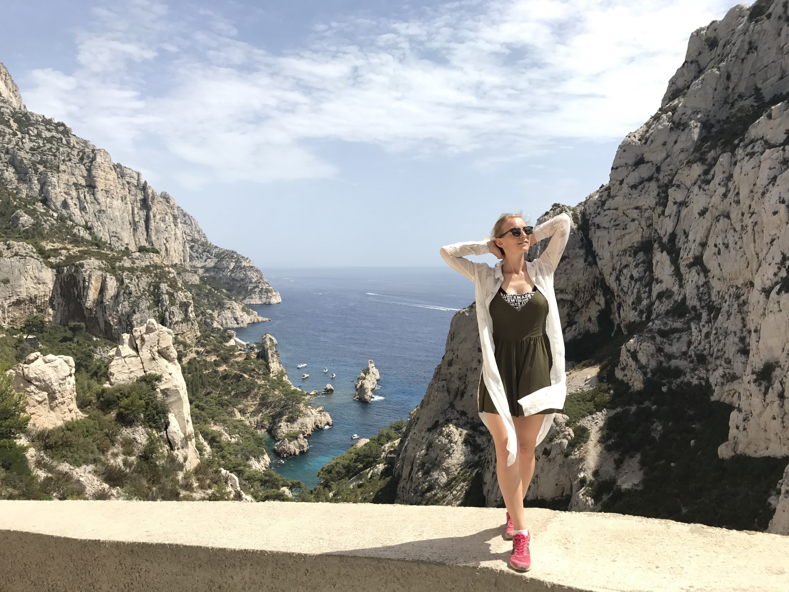

Блин, чуваки, дико приятно, что некоторые из вас подходят ко мне на светских мероприятиях и делятся впечатлениями о рассказанном, и спрашивают подробности и нюансы минувших событий, хаха. Есть одна особенность: другая платформа (wordpress) ограничивает получение мною комментариев и отзывов, так что я с каждой публикацией я немного в замешательстве и не понимаю, нравится ли вообще это кому-то и стоит ли писать дальше эту ахинею и записки городского сумасшедшего или нет. Так что, спасибо за все устные респекты, чуваки. Я уж хотел было хотел всё бросить, но опять нахерачился кофе и вдохновился на еще одну историю. Так что, читайте.

Знаете, есть видео на YouTube, которое называется  "Александр Невский ходит 10 часов"? Иногда, когда я перечитываю то, что написал ранее, то думаю тоже самое - "чуваки ходят 10 часов". Так что, в этот раз я постараюсь из формы дневника и путевых заметок перевести всё в просто интересную историю, без неуместных подробностей, ходьбы и прочей нудятины. Как говорится, только голые факты и без купюр!

**29 июля.**

Утро, мы стоим с рюкзаками в прихожей и прощаемся с Сёржем. Спросонья не смог найти нужных слов, но хотелось много чего крутого сказать на прощание, но, надеюсь, лихая позволит еще раз попить пива с этим парнишкой. Очень уж круто и душевно мы тусовались.

Добираться до Парижа нам так же предстояло на автобусе, а Мише и Оле, по традиции, автостопом. Гарантированной вписки у нас не было и, судя по слухам, в плане вписок Париж в принципе проблемный город. Но мы договорились встретиться вечером и уже на месте разобраться где нам сегодня бросать кости.

С трудом нашли место, где останавливается наш транспорт и чуть не упустили его. У автобуса какие-то азиаты-торчебосы мастерят и курят свои последние джоинты, в других странах Евросоюза это всё нелегально. Загрузились в автобус. Я был немного с бодуна с прошлого вечера, поэтому постарался побыстрее оказаться в состоянии гибернации, а Толя как обычно проверял на прочность автобусный вай-фай.

Проехали Брюссель, который мы решили проигнорировать в нашем путешествии, но все советовали его посетить вместе с Брюгге. В следующий раз.

И вот, спустя пару часов мы оказываемся в Лилле. Открывается одна передняя дверь и в автобус заходят несколько человек. Одна пожилая женщина сразу целенаправленно идёт в нашу с Толей сторону и, достигнув цели, начинает нас о чем-то расспрашивать на французском показывая какой-то документ. Я изначально подумал, что она хочет чтоб мы ей уступили место, потому что оно её и она якобы показывала какой-то проездной билет. Но, когда она начала спрашивать наши ли вещи находятся в сетках сидений и везем ли мы с собой только еду, я начал подозревать что-то неладное. Спросила про нашу национальность, на что я попытался с французской картавостью сказать «хрусси» (Russie), но она всё поняла и показав жестом свой документ, в котором на этот раз я разглядел слово «poliсe», она попросила нас сделать то же самое, после чего забрала наши аусвайсы и попросила пройти с ней и другими уже полицейскими.

Я подумал, что нас снимают с автобуса, но причин не понимал, но догадывался, что это как-то связано с наркотиками. Но я был чист, а Толя ваще стрейтэдж-пацан, так что я больше волновался о просранном автобусе. Мы достали по их просьбе наши рюкзаки и прошли в какую-то подворотню для досмотра. Шмонали без понятых, довольно грубо, разбрасывая вещи и при этом расспрашивая че мы тут ваще делаем и кто по жизни, ёпту. Один мужик в штатском начал у меня интересоваться:

> *— Марихуана, каннабис, грибы, LSD, экстази при себе имеются?,-начал он допрос с пристрастием.*
>
> *— Нет.,- спокойно ответил я.*
>
> *— Ты уверен...?*
>
> *— Да.*
>
> *— Ты уверен!?, - ле полисмен начал повышать голос.*
>
> *— Да.*
>
> *— ТЫ УВЕРЕН!?, - уже орёт. Мне кажется, что если бы у него была при себе настольная лампа, то он бы направил мне ее прямо в лицо.*
>
> *— Да говорю-же, что нет!*

Ну и после их недолгих переговоров между собой я услышал слово «touristes». Нам отдали паспорта и сказали, что мы можем идти.

Встретились взглядами с водилой, он всё понял и сказал мне: «ce qu'il faut faire, il est Amsterdam» и я с ним полностью согласен. Позже еще вывели пару парней, но вроде ни у кого не было проблем.

Добрались наконец до Парижа. Первое впечатление было не очень понятным. Много бичей, заметно грязнее и, в целом, пока не хотелось надеть водолазку и пойти с багетом, торчащим из авоськи, по улице под аккомпонемент Эдит Пиаф.

Миша и Оля застряли на трассе, а вписку пробивала Оля, так что у нас не было ни адреса, ни контактов, только имя и аккаунт на каучсерфинге. Вариант был максимально мутный: мало того, что у чувака был абсолютно пустой профиль без отзывов и какой-либо инфы, так он еще и не отвечал. Но хост всё таки вышел на связь и Толя отменил операцию «пробиваем жилье на airbnb».

Появилась другая проблема: у нас нет симки + чувак захотел нас встретить, но мы не знаем как с ним связаться. И вот, мы с рюкзаками за спиной подходим к адресу и нас с улыбкой и распростертыми объятиями встречает парнишка с внешностью кавказца по имени Рафаель.

> *"Он живёт так же как ты, Миша - у него в холодильнике ничего нет кроме пива!"* 

Короче, тот парень, что прятался за пустым профилем на каучсерфинге оказался просто супер-крутым чуваком! Не успел я положить рюкзак и присесть на диван, как у меня в руках оказалась бутылка хайнекена и тут же я начал узнавать, что у нас с этим чуваком намного больше общего, чем кажется на первый взгляд. «Раф», как он попросил его называть, - француз родом с Корсики. Он студент, но сейчас находится в бессрочном академическом отпуске и не учится. Под пивко разговор сразу зашёл о музыке и выяснилось, что этот парень любит пост-панк, шугейз, фанк, всякие «вейвы» и прочее всякое андерграундное, никому не известное музло. Показал нам свою огромную коллекцию винила. Я прям загорелся! Я очень сильно люблю говорить о музыке, так что площадка для обсуждения оказалась довольно обширная из-за чего я уже был в диком восторге, ведь наш хост еще не знает о существовании таких бриллиантов музыкальной индустрии как Король и Шут, Сектор Газа, Ария и A Global Threat и моя миссия рассказать ему обо всём этом!

Помимо музла, он еще любит старые видеоигры для нинтендо и дримкаст и является большим поклонником арт-хауса. Все эти три дня, что мы у него гостили, мы только и делали, что говорили о фильмах, музыке и видеоиграх. Короче, как вы поняли, он оказался абсолютно близким по духу и интересам чуваком, так что я уже был рад, что вписка выстрелила. Но самое крутое в этот вечер ждало позже.

Вестей от Миши и Оли всё не было и мы до последнего ждали их сообщения в телеграм, что они уже в городе, но так и не получили его. Поняли, что автостоп выдался крайне херовый и им пришлось заночевать на трассе.

Рафаель сказал, что через три дня он уезжает на месяц в Токио и поэтому хочет повидаться со своими друзьями напоследок. Поэтому он спросил у нас: не против ли мы если к нему придут в гости его друзья? Мы сказали, что конечно не против и вскоре в его квартире появились две классные девчонки и один парень. Вечер оказался максимально душевным! Я оказался на вечеринке с иностранцами и чувствовал себя, будто я нахожусь в каком-то молодежном ситкоме, а после пары бутылок пива мой словесный понос на английским уже бежал как речка и мы очень долго сидели за столом, выпивали, шутили, смеялись и обсуждали всякие вещи, но я так и не наговорился. Ребята учили правильно произносить слово «круассан», типа «кхруоссон», а Рафаель пообещал, что раз мы в Париже, мы должны обязательно попробовать круассаны только что из пекарни и пообещал это всё устроить завтра с утра.

Классный вечер, Париж мне уже нравится!

**30 июля.**

Проснулись. Вестей от Миши и Оли не было, о чём говорил пустой телеграм. Рафаель как и обещал со вчерашнего дня смотался до пекарни и принёс круассанов. Еще одна галочка в списке дел - хрустнуть настоящей французской булкой прямо в Париже!

Мы решили дождаться Мишу и Олю и прогуляться по окрестностям и посмотреть город. Рафаель оказался супер-пытливым умом, ему хотелось обсудить, наверное, вообще все вещи на свете, но и собеседника он выбрал достойного - Михаила Скандалиста по кличке "Радио". Так что, так вот за разговорами мы и дождались долгожданных сообщений от Миши и Оли: "тiкай з сiла, тобi пiзда" в телеграм и через 20 минут уже жали руки и тела и после обеда продолжили заниматься туризмом и прочей нудятиной.

Последующие дни в Париже были классическими туристическими днями - с походами по достопримечательностям от чекпоинта к чекпоинту и употреблением местных напитков и пищи.

Я не умею разглядывать город и ходить по достопримечательностям. Мои родители могут часами ходить по улицам и разглядывать архитектуру, но для меня все эти архитектурные стили и история непонятны и всё делится на "красивое" или "некрасивое". Поэтому скажу лишь, что Париж - красивый город. Очень напоминает Питер своими жёлтыми домами и узкими улицами на центральных проспектах. Ну и все походы по достопримечательностям это стандартные туристические ачивки типа:- "Арк де Триумф" - окей, "Монмартр" - окей, "Эйфелева башня" - окей. Звучит скучно согласен, но сейчас я даже не могу припомнить, что мне запомнилось. Мне гораздо интереснее бывать в различных андерграундных или субкультурных местах и узнавать город и культуру с тех мест, о которых не знает обычный турист. Поэтому у меня много поводов вернуться и посмотреть именно на такие достопримечательности во всех городах: сквоты, бары, места тусовок.

Самый душевный разговор выдался на пикнике у знакового для нашего путешествия места -  Эйфелевой башни. Дело в том, что это самая, наверное, известная достопримечательность Европы, и Париж и этот день были ровно половиной нашего трипа и поэтому хотелось подвести примерные итоги "ожидание/реальность" и обсудить кому что больше понравилось.  От себя я скажу, что уже в эту половину я получил 500 процентов от того, что хотел и ожидал и в голове всё еще был вихрь из впечатлений и событий, но впереди было еще две недели туристского кайфа, от неопределенности которого захватывало дух и я понял "две избитых истины, в которые я верю":

1. "_Делай, что должен и будь, что будет"_. Слишком много вещей мне мешало осуществить задуманное, так что в этот раз я понял, что ради мечты нестрашно отказаться от того, что мешает, как бы ты сильно к этому ни привык. И если ты не играешь в эту лотерею, то и , следовательно, никогда не выиграешь.

3. _"Свободы не надо достигать, ей надо пользоваться. Она как велосипед - сел и поехал"_. Это цитата Паши Мятного, которую я однажды услышал от него в далеком 2011 году на концерте и запомнил на всю жизнь. Есть только "здесь и сейчас", future is unwritten.

Миша сказал, что до конца не верил, что я всё-таки поеду. Я сказал, что не ожидал, что Толян просто без разговоров впишется в эту авантюру. И в то, что мы окажемся в одной компании с Мишей и Олей, которые договорились поехать вместе в Новый год. Каждый здесь оказался "как бы случайно", но завела нас всех сюда дружба и панк-рок. От этого и было тепло в этот вечер. Ну еще от упаковки пива в животе.

Пришла пора собираться в наш следующий город - Марсель. Разделяться нам уже не хотелось, поэтому мы решили воспользоваться хитростью - поехать на поезде без билета. Я поспрашивал советов у бывалых бродяг о процедуре безбилетного проезда, но всё равно не был уверен в успешности этого рискового предприятия. Рафаель согласился нас вписать еще на одну ночь, но это был ваще край, в этот день у него был самолет в Токио.

Мы боялись расстроить очень доброго и порядочного Рафа тем, что хотим как уроды поехать на ваших вонючих французских поездах без билетов как паразиты и нелегалы, поэтому мы просто ему соврали о том, что купим билеты на станции. Раф, если ты это читаешь, то прости. Мы не хотели, хаха.

Решили встать очень рано утром в надежде что контров не будет и мы спокойно зайдем в поезд. Но в восемь утра все контры были на месте и проверяли билеты абсолютно у каждого пассажира на пероне и попасть в поезд практически не было вариантов. Нет, у нас конечно были идеи как у "четырёх друзей Оушена" пройти с какой-нибудь семьей, замаскироваться в стариков или просто забежать в поезд внаглую, но всё это звучало как какая-то жесть. Особенно я охренел с предложения: "Давайте обойдем поезд спереди и перебежим по путям, чтоб оказаться за спиной у контролеров". В общем, мы отправили взглядом три таких поезда и решили, что с главных станций уехать не вариант и решили ехать вечером на автобусе. Была шутка, что бомжи на вокзале - это такие же туристы как и мы, только они уже несколько лет ждут поезд, у которого не будет контров.

День оказался суперленивым и вечером мы уехали на автобусе в Марсель.



**1 августа.**

Автобус в Марсель оказался средневековой инквизиторской пыткой: ехать всю ночь 12 часов, очень душно, очень тесно и даже невозможно принять хоть сколько-нибудь удобное положение, чтоб уснуть хотя бы кошмарным сном.

Неудивительно, что в 8 утра в жарком и душном, и грязном Марселе мы все сидели голодные и злые. "Зато выспались!" цинично подметил Толян. Хрен знает как мы не поругались. Наверное, потому что на вокзале оказался Wi-Fi и все были заняты своими телефонами.

Выйдя из вокзала в зной Марселя, мы под стрёкот цикад отправились искать еду и вписку. В Марселе почему то было особо тревожно остаться без вписки: очень грязный город, везде воняет ссаньём, какие-то маргиналы провожают тебя взглядом и очень жарко - плюс сорок, мать его, градусов.

Ну и вот долгожданная весть от Кости Муджуда - есть вписка! Спасибо тебе Костя, ты нас тогда реально супер-выручил.

Нашего хоста зовут Хазем и он организатор концертов в Марселе. Тяжелая дорога в горку до центра города, заскок в супермаркет и вот мы уже здороваемся с нашим хостом.

Хазем - это здоровяк ливийского происхождения, организовывал концерты для Distemper, SMG, MDB и 210, в майке которых он открыл нам дверь. Хазем оказался крутым хостом - ему ваще было похер на нас. Он просто перекинулся с нами парой дежурных фраз и отдал ключи. Мы были предоставлены сами себе.

В этот вечер я впервые несовладал с эмоциями и поскандалил с ребятами из-за мытья посуды. До сих пор не понимаю, кто из нас был прав, но тогда мне казалось, что уже 14 долбаных дней мою посуду за всеми только я. Всё, конечно, разрешилось, но после этого эмоционального выброса я стал чувствовать себя тотально опустошенным и единственное, чего мне хотелось, так это выйти на улицу и броситься под машину. Но я купил пива.

Мы отправились гулять по Марселю и он напомнил мне Ялту, причем не с хорошей стороны. Кругом грязь, мусор, крысы, какие-то бичи, тараканы. Я себя не чувствовал в безопасности и от толпы на набережной мне стало максимально дискомфортно. Ребята поели мороженого, я попил пива и мы отправились домой.

"Чуваки, едете на автобусе вот сюда (точка на карте), потом идёте пешком вот сюда, потом находите скалы здесь и Марсель в вашем сердце навсегда" - сказал нам Костя и это единственное, что могло исправить впечатление о этом городе. Как вы поняли, завтра мы должны были поехать на пляж со скалами - "Каланк де Марсель". Судя по всему - безумно красивое место.

Спал я плохо, потому что проиграл в "камень-ножницы-бумага". И меня отправили спать в проходную комнату, в которой было так же душно, как от моих историй.

**2 августа.**

Встал я всё еще опустошенный от вчерашней около-ссоры и чувствовал какое-то напряжение в общении с ребятами, так что настроение было отстойное.

После завтрака мы отправились в это легендарное место. Минут 40 на автобусе и час пешком и нам открывается удивительный вид на лазурную воду и скалы. Место было супер-классное, заповедник и, наконец-то, долгожданное море ибо если не купался летом, значит лета у тебя не было.

Появилась другая проблема - как купаться? Ибо у меня с собой все мои пожитки - документы, деньги, карточки, обратные билеты, мобильник - вообще всё. Естественно, я не хотел рисковать и оставлять всё это на пляже без присмотра. Но моим друзьям на свои вещи было похер, так что так получалось, что когда все купались я сторожил свои вещи и еще вещи друзей в придачу. Супер-обидно было и причем я говорил, что мне такая херня не нравится, но в ответ получал полнейшее недопонимание.

Так что, купался я один и не почти не попрыгал со скал и поэтому, очень жалею, что недополучил эту ачивку.



Так же, редакции журнала "SKNDLST" удалось получить комментарий и от уроженки Саранска Ольги Май:

>"Началось все с малого. Мы забрались наверх самой маленькой скалы из тех, что нас окружали. Прыжок с высоты собственного роста, ничего особенного, но синее море и волны, разбивающиеся о скалы, говорили об обратном. Немного страшно. Первый прыжок делают ребята. Если кто-то из них смог, то и я смогу. Прыжок. Темнота. Резко светло. Оказалось все безопасно и весело. Продолжаем. Две высоты моего роста. Никакого страха. Только азарт. Все выше и выше. Вижу красивую девушку, которая с высоты третьего этажа собирается прыгнуть. "Если она это сделает, то и мне придется" - говорю Мише и Толе. И что вы думаете? Она через секунду разбегается и проваливается в объятия моря. Ооо! Это уже серьезно.Минут 15 готовилась к прыжку. Пропускала французских женщин, детей и мужчин вперёд, наблюдала за их отвагой. Нет, надо прыгать. Вдох. Выдох. Глубокий вдох и время замедляется. Вижу небо, море, скалу, внутри что-то кричит "вау", а потом темнота и что-то холодное обволакивает меня с ног до головы! Вот это кайф! Смотрю на Мишу и Толю из моря, бегу на повторный прыжок. Второй раз была уже не так. Зато на соседней сколе, на уровне четвертого этажа есть выступ. Недолго думая забираюсь на вершины, встаю в полный рост и ощущаю сильную дрожь в коленях. Нееет, это не для меня... Надо вернуться, спустится с этой скалы, зачем рисковать...Внизу была группа французов, которые, заприметив мое присутствие, начали кричать "ОЛА! ОЛА!". Ага, им не страшно, они уже в море и ноги их не трясутся. С другой стороны спускаться по этим скалам ещё хуже, чем подниматься... Ладно, это тут я все так расписала, а там все это занимало секунд 7, не больше. Я встала спиной к морю и кричащим, сделала шаг вперёд к скале, резко развернулась, оттолкнулась и полетела. Помнишь, что говорила про "время замедляется"? Тут оно остановилось. Чувствовала каждую частичку соли и лучи заходящего солнца на теле, смотрела на небо, на море, на французов внизу, на закат. В голове проскакивали мысли, что слишком долго лечу, что очень красиво вокруг, нужно запомнить этот момент до мельчайших подробностей. И этих людей в море, и солнце красного цвета, и сосны, что растут на соседней скале, и соль на губах, лёгкое жжение ссадин на коленях... Все было прекрасно. Время остановилось. Мне оставалось только закрыть глаза и наслаждаться."

Пришла пора ехать на вписку. Настроение было паршивое, я всё еще злился на своих друзей. Мы обсудили в метро то, что сегодня происходило, но мне не стало легче, так что я просто хотел бы, чтоб этот день быстрее закончился. Хотя и завтрашний день обещал дичайший стресс - мы хотели попробовать поехать без билетов на поезде уже из Марселя. Следующая станция была неизвестна, потому что мы сами не знали, где окажемся завтра.

Я снова напился и лёг спать.

Как видите, изменить концепцию заметки мне не удалось и "чуваки снова ходят 10 часов". Ой, да и хер с ним.


