Привет, друзья. Вот я вернулся из своего грандиозного путешествия по Европе и готов поведать вам сказание о скитаниях вечных и о Земле и рассказать вам, как там живется, в загнивающей.

Начну с того, что евротрип был моей давней и, казалось бы, несбыточной мечтой. Еще в 2009-м году мы с друзьями со школы сидели в машине и «планировали» как следующим летом повторим фильм «Евротур». Понятное дело, что ничего не получилось и не могло получится, но мечта никуда не делась и я продолжал жить с этим свербящим чувством.

Шли года, мои друзья-рокеры тянули меня за руку в авантюры различного рода и одним из главных событий стало путешествие автостопом в Крым летом 2011-го года и почти такое же путешествие в 2013-м году. Эти два события разделили мою жизнь на «до» и «после» и я понял, что осознавать и созерцать мир во всех его многогранных проявлениях  – лучшая профилактика нудежа и тоски серых будней. Компания друзей, полный выход из зоны комфорта, приключения, неожиданные знакомства – всё это на протяжении долгих лет грело меня по пути на работу и я думал – что же со мной стало? Почему тогда я мог так жить, был лёгок на подъем, и постоянная жажда приключений сносила крышу, а сейчас я только хожу на работу и живу химерами?

В общем, я хотел повторить. Шли годы, я слушал истории от моих друзей о поездках в Европу, о их приключениях и дико им завидовал. Я хотел свои собственные приключения, но мне всё время что-то мешало: задержки зарплаты на работе, проблемы с деньгами и свободным временем, депрессия или просто банальная лень. И вот, очередное новогоднее обещание себе, что этим летом всё будет по-другому.

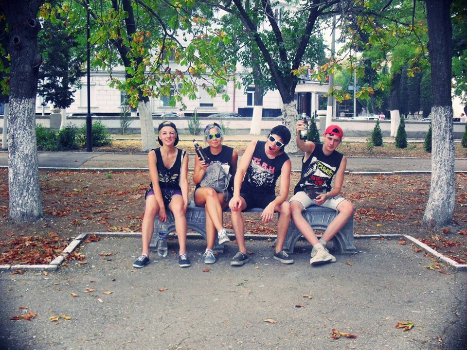
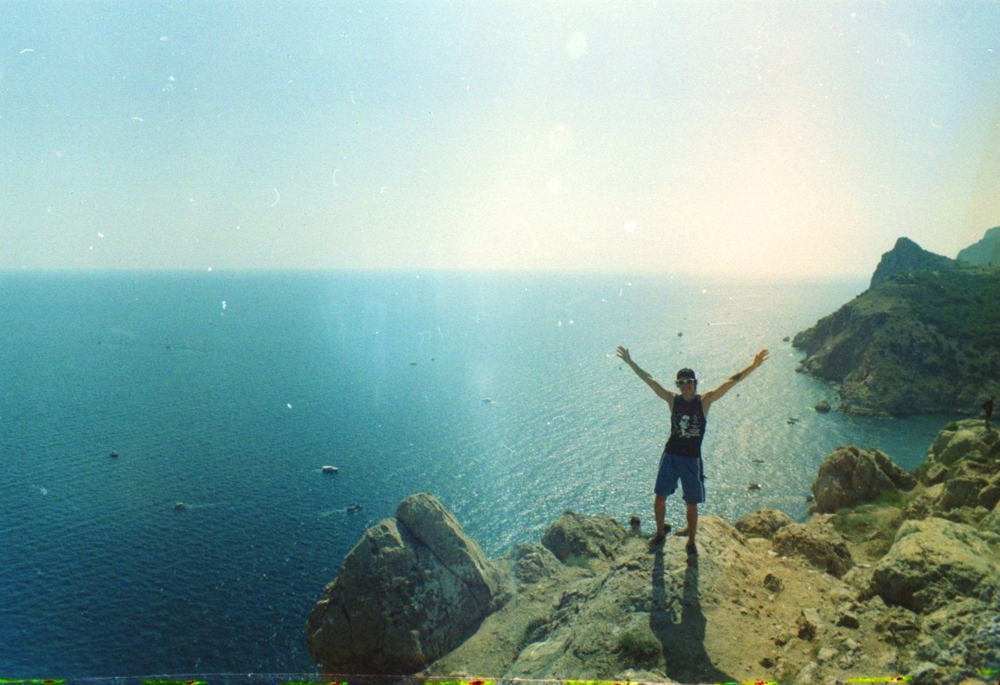
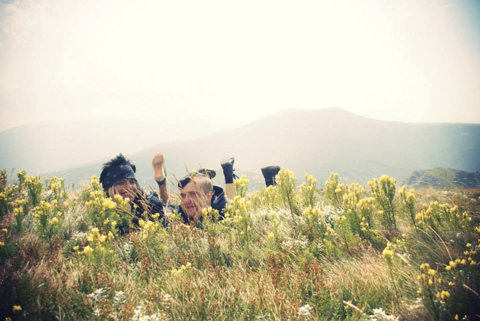
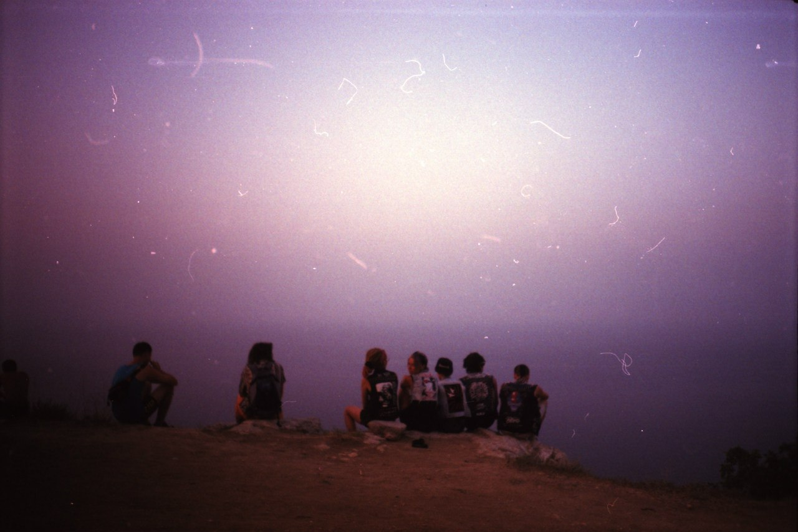
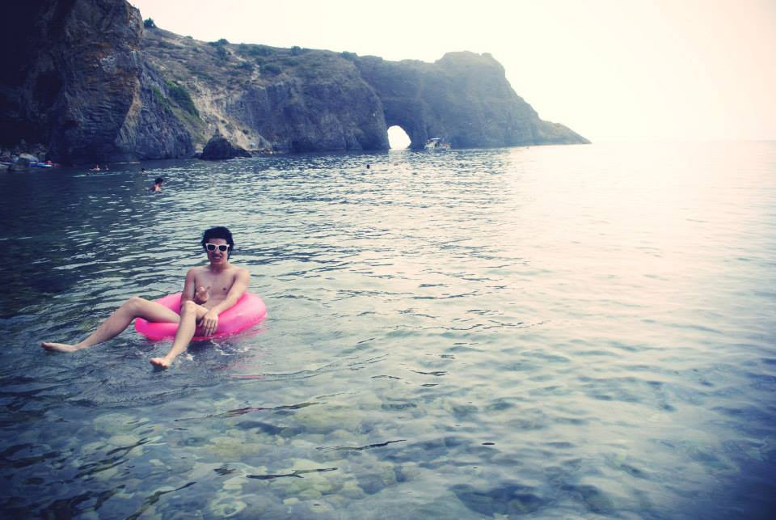
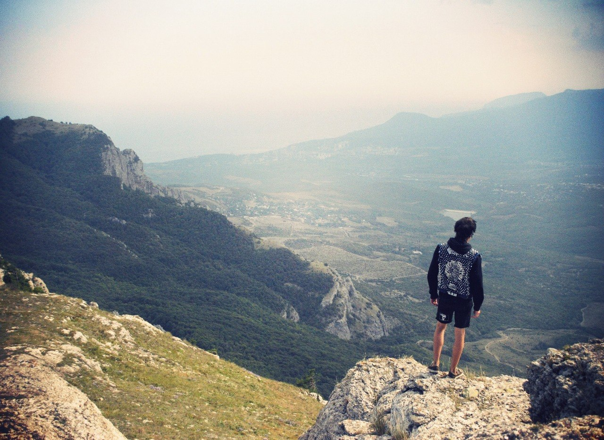
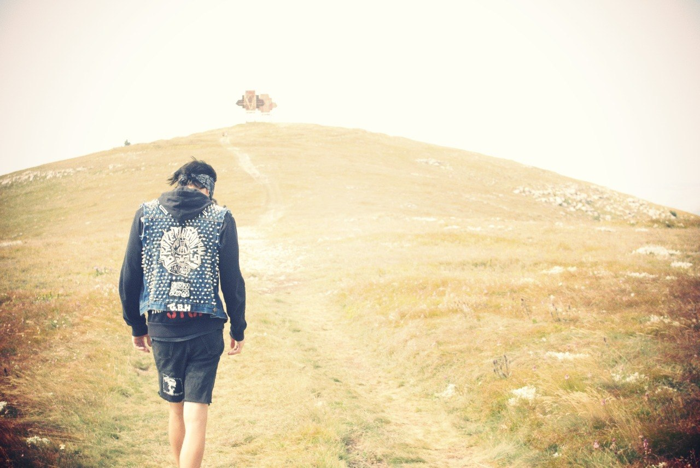

Почему именно Европа? Конечно, я мог поехать куда угодно, но Европа меня прельщала возможностью посмотреть изнутри на лучшую жизнь, на то как живут люди. Вы можете подумать, что я слишком много смысла вкладываю в обычную поездку, но для меня это был способ почувствовать что-то новое, утолить свою жажду приключений. И показать, в-первую очередь себе, что «мой панк-рок поизносился, но он мне всё еще впору». Ну или скрыться от догоняющего чувства безнадеги и одиночества.

И вот, наступил 2017-й год, я начал планировать как я проведу свой отпуск. Поначалу я откладывал деньги на весенний тур с Truckdrivers, но меня не вписали в минивен. Для группы тур – это серьезное занятие и брали только самых нужных и, в итоге, мне не хватило места и я остался дома. Чуть ранее этих событий до меня дошёл слух, о том, что мои друзья собираются в поездку в европейские страны на тачке и я сразу загорелся: «Вот оно!». Но и с этим возникли разногласия – люди поссорились и всё отменилось. Но желающие-то остались! И, в итоге, я оказался в квартире у Дани Бомбера, где собрались люди, которые хотят круто провести время в евротрипе.

Поначалу, нас было четверо – Миша, Оля Май, Даня Бомбер и я. Когда мы обсудили примерные детали и договорились делать визы, Миша мне сказал, что сомневается, что я поеду, потому что я имею привычку соскакивать в самый последний момент и это было справедливым замечанием. Но я сказал себе «нет, не в этот раз» и пообещал сделать всё возможное, чтоб этот трип состоялся. Шесть лет я копил силы и уже ни работа, ни отсутствие денег, ни моя лень и страх перед неизвестным не помешают мне получить еще одно лето 2011-го года. Меня было не остановить.

Позже начались обсуждения маршрута и здесь уже появились разногласия с Даней Бомбером (у Миши и Оли не было маршрута, им, в принципе, было без разницы как и куда ехать) и мы начали спорить о том, как именно мы хотим ездить, питаться и спать. И тут я узнаю, что еще один мой друг Толя тоже устал от такой жизни и хочет вписаться к нам трип, в попытках отвлечься от переживаний и найти вдохновение. Хочется сказать, что считаю Толю максимально близким по духу человеком и обрадовался, что именно он составит мне компанию в этом приключении.

Толян был в деле и теперь надо было договариваться уже втроём. Маршрут, который устраивал нас с Толей подразумевал редкие переезды и чилл-тусовки без рюкзаков, а Даня не хотел тратить время на праздное безделие и хотел зацепить как можно больше городов и селений в туре. В конце-концов, Даня решает, что его маршрут круче и говорит, что поедет самостоятельно, чтоб не ссориться в пути и кайфовать одному. Теперь мы с Толей вдвоем начинаем продумывать детали маршрута, искать хостов на каучсерфинге и прикидывать финансовые расходы. Уже пост-фактум, тур у нас получился вот по этому маршруту:



Ну и собственно всё, все чуваки получили визы, шли последние дни приготовления. Изначально было пробито три вписки на каучсерфинге: Берлин, Гамбург и Амстердам. Остальное мы оставили на самотёк, мол, как-нибудь само всё разрулится.



И вот, мой работодатель оставлен на произвол судьбы, а Толя, я и наши рюкзаки трясемся в блаблакаре по пути в аэропорт Кольцово. Приключения начинаются!

**Берлин.**

**17 июля.**

Вечер, мы приземляемся в Берлине и я понимаю, что моя мечта начинает сбываться. Таможенник, увидев итальянскую визу в паспорте Толи, спросил: «What are you doing here?». Толя ответил «toorisme» и получил штамп в паспорте. Со мной вопросов уже не было, он понял, что мы друзья с Толяном.

Чуваки, мы в Европе! Первое, на что я обратил внимание, это воздух. Сладкий свежий воздух, которым хочется дышать, вместо химической отравы родного Челябинска. Первый день предполагал, что у нас нет вписки и до последнего мы не знали, где будем ночевать. Миша и Оля к тому времени уже были в Берлине и пообещали вписать, но в аэропорту мы получаем от них сообщение, что они в тюрьме, хаха. Но они говорят нам, что мы можем попросить вписаться у их хоста, но мы застеснялись тусоваться у него без друзей. Мы решили идти туда, куда планировали изначально – в кемпинг.

Дошли до метро, там нихера непонятно, как платить, какие-то городские зоны, билетики. В итоге насобирав на один тикет, мы поехали до нужной нам станции. Позже мы узнали, что для туристов берлинское метро бесплатное, если вы понимаете о чём я. В кемпинге обнаружилось, что все, кто был на ресепшн уже ушли спать домой и место для палатки нам никто не продаст. Вариантов у нас не много: ночевать в ближайшем парке или ворваться на поляну и поставить палатку беспалева, а утром или объясниться и заплатить, или свалить не заплатив.

>-- *Ну чо, Мих, ты реально хочешь спать в лесу или здесь в безопасности?, - Толян берёт дело в свои руки.*
>
>-- *Да тут чето отстойно, завтра нас выгонят и я даже не понимаю, где мы тут поставим палатку, тут всё занято!, - я, как всегда, осторожничаю.*
>
>-- *Да вот здесь и поставим! Помогай!, - говорит Толя и показывает на пустое место на поляне с палатками.*

Поставив палатку, я улёгся и наконец-то смог расслабиться от перелетов и от того, что не спал почти сутки.

**18 июля**

Утром мы решили поспать лишний час и когда уже в 7 утра вылезали из палатки, то встретили какого-то мужика, который сказал нам «Guten Morgen!» и пошел по своим делам. Я подумал, что это просто кто-то из отдыхающих, но позже мы узнали, что это мужик с ресепшена и, когда наша палатка была почти собрана, он начал проверять стикеры оплаты на других палатках и медленно продвигался к нам. Я уже предчувствовал разговор, что мол мы не специально и мы готовы заплатить за эту ночь, но этот мужик просто проигнорировал нас и пошёл дальше. Поняв удачность ситуации, мы с Толяном решаем как можно быстрее покинуть кемпинг, чтоб нас не заставили платить. Первая же ночь в нашем Евротуре и нелегальная! Я понимаю, что приключения уже начались.



Днём мы должны были встретиться с отсидевшими за чужие дела Мишей и Олей и ждали сообщения от них в наших мессенджерах. Ну, а пока они не выходили на связь, мы решили начать делать дела, которыми обычно занимаются туристы. Едем на метро до Alexanderplatz и от него уже начинаем ходить по достопримечательностям.

Очень понравился парк «Большой Тиргартен». Ярко-зеленый густой газон, на котором можно валяться, красивые аллеи и чистота! В нём мы и провели первую половину дня валяясь на траве и ожидая встречи с нашими друзьями.

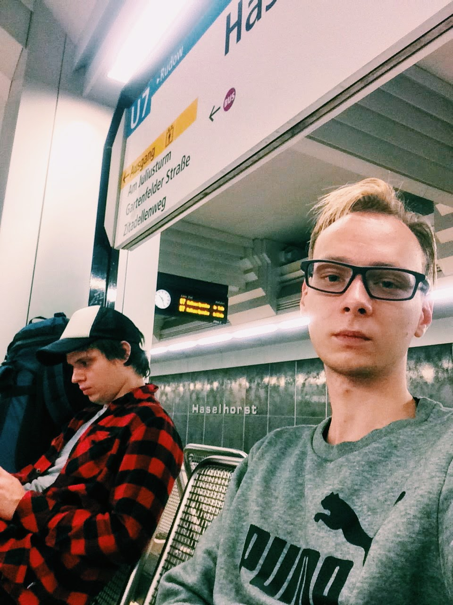

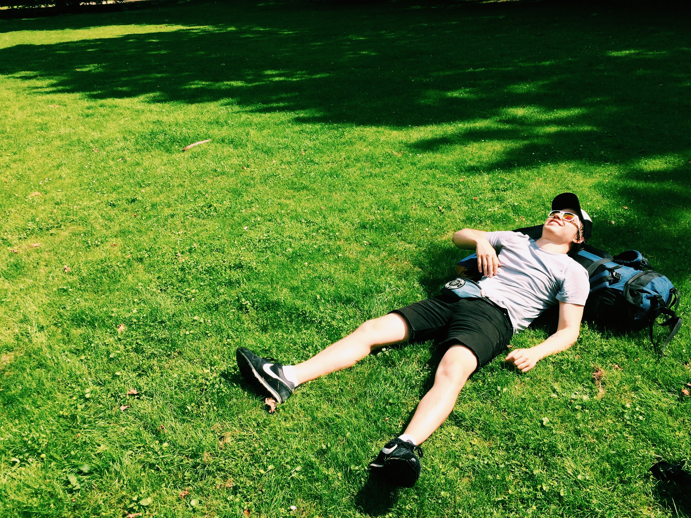

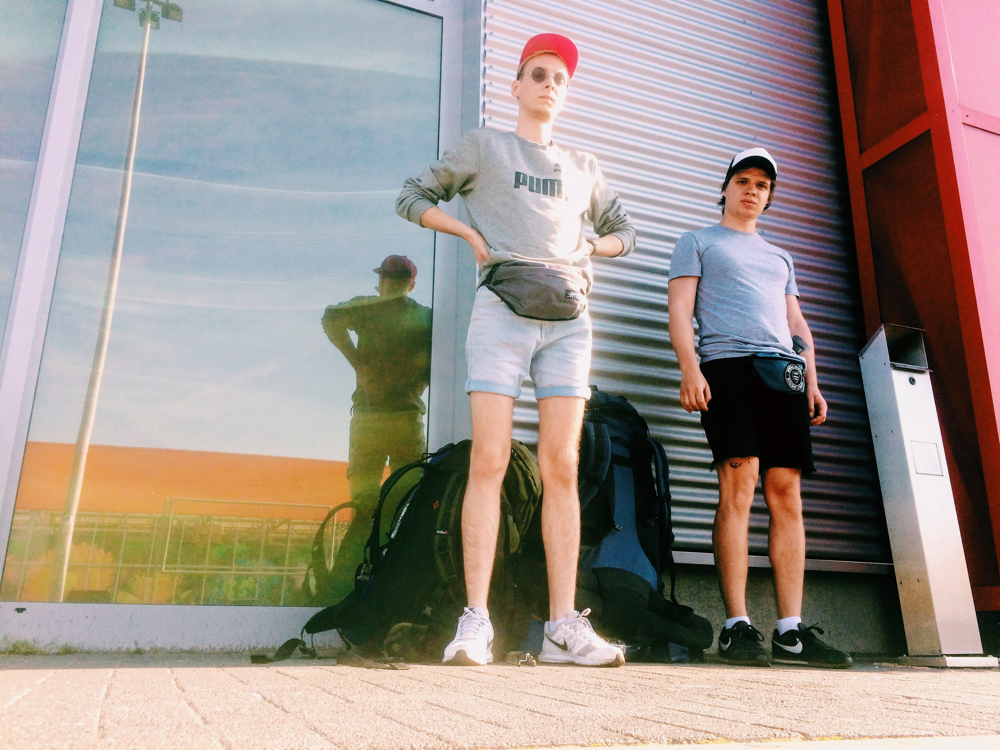

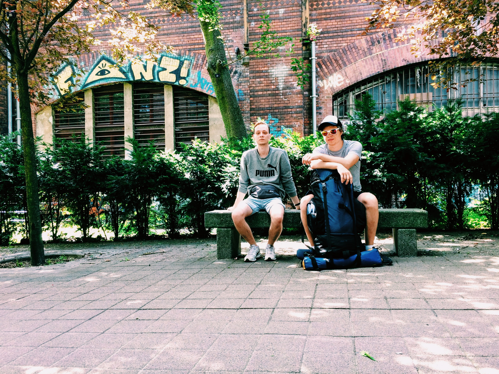

И, вот, долгожданное сообщение от друзей: "Мы откинулись, подрастайте на Alexanderplatz, ёпту!" и уже через 40 минут мы уже здороваемся и спрашиваем про произвол европейских фараонов по отношению к честным русским туристам. Оказалось всё прозаично: шоплифтинг:) Но у одной гражданки при себе был выкидной нож, и полицаи расценили это как потенциальную попытку ВООРУЖЕННОГО ограбления. Мол был при себе нож, могла и применить. Закрыли их в кутузку, продержали ночь и отпустили восвояси, подарив обоим штрафы и брюки Михаилу.



Чуваки рассказывают про своего хоста, у которого они договорились о ночевке для нас. Как я изначально понял, что это какой-то чувак с очень специфическим чувством юмора, который говорит по-русски. Ну пофиг, пошли, не на улице же спать.

Дойдя до вписки мы дождались, когда Миша и Оля договорятся о нас окончательно. Зашли, бросили рюкзаки, познакомились с Николасом.

Николас еще с вечера позапрошлого дня договорился с Мишей и Олей, что сегодня они пойдут в греческий ресторан и, так как мы с Толей прилипли, то тоже идём. Стоим, ждём внизу. Спускается Николас и говорит нам: "Nu chto? Poshli, suchki!".

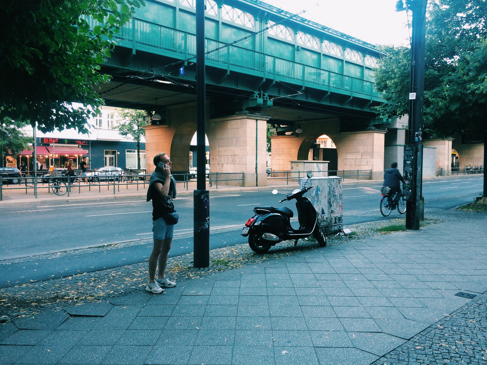

В греческом ресторане нам выделили столик и когда я увидел меню, то охренел: мне походу придется оставить здесь бюджет одного дня. Ну фигли поделать, ты в ресторане. Все сделали заказ, я заказал себе пасту с сыром и бокал пива. Принесли бадью, которую я так и не смог съесть за вечер! Там было грамм 600 макарон и мы вполне могли разделить на троих.

К концу вечера мы с Мишей уже изрядно напились и напор пошлых шуточек от Николаса приобрел колоссальный размах, его было не остановить. Говорит, вы хотите взять бухла и тусоваться на улице "like a BYDLANY"? Как быдланы мы не хотели тусоваться и решили пойти уже на вписку. Ребята видели, что я парюсь, от того, что Николас набухался и шутит весьма жёсткие и очень пошлые шутки и дико угорали с этого. В итоге Николас заметил это и доставал своими телегами уже только меня. Я старался просто идти, но разговор зашёл про русскую попсу и он начал петь.

> *— (пауза) Младший лейтенант!, - заорал Николас и показывает пальцем на меня, желая чтоб я подпел.*
>
> *— Мальчик молодой!, - подпеваю я от безысходности.*

В итоге он даже станцевал для меня и мы дошли до вписки. Очень смешно было, когда мы решали, кто будет спать на одной кровати с Николасом, ахаха.

Я возвращаюсь из ванной и вижу, что мой спальник, который я стелил на матрас на полу, лежит на его кровати. Тогда мне было не очень смешно, но сейчас шутку чуваков я оценил. В итоге Николас спал на отдельной кровати, Миша с Олей, а я и Толя на полу.

**19 июля.**

Какое счастье было проснуться с утра и понять, что Николаса нет дома, и что больше никто не будет доставать меня своим своеобразным чувством юмора. Позже я узнал, что помимо него в хате живут две красотки, чьи довольно эротичные снимки висели на стене на кухне.

Днём мы отправились смотреть достопримечательности Берлина. Этот город интересовал меня тем, что у него богатая история и, в частности, мне была интересна история Второй мировой войны и всё, что связано с ней: холокост, холодная война, разделение Германии на ФРГ и ГДР, памятные таблички на тротуаре напротив домов, где жили люди, которых отправили в концлагеря и прочее "never again". Город прям дышал историей. Я ходил и представлял, как по улицам маршируют солдаты, как они поднимаются по лестницам подъездов, в поисках квартир "преступников режима".



И вот мы находим берлинскую стену (East Side Gallery), которая сейчас используется как арт-объект. Прогуливаясь вдоль нее и разглядывая другие стрит-арт картины, мы находим то, что искали - знаменитую композицию, на которой изображен поцелуй Брежнева и руководителя ГДР Эриха Хоннекера с подписью: "Господи!  Помоги мне выжить среди этой смертной любви!".

Потом мы слонялись просто без дела, благо в центре достопримечательности на каждом шагу и мы решили просто гулять. Наткнулись на какой-то "Ramones Museum", который на деле оказался просто баром с антуражем Ramones и панк-роком в музыкальном сопровождении. Гуляли, пили пиво, покупали сладости и в целом хорошо и беззаботно проводили время.

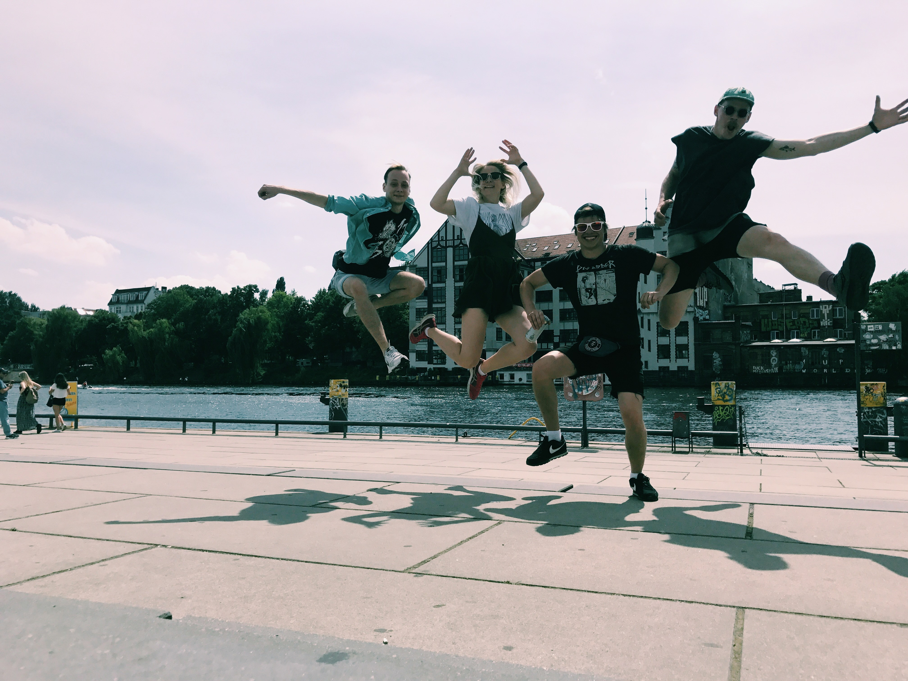
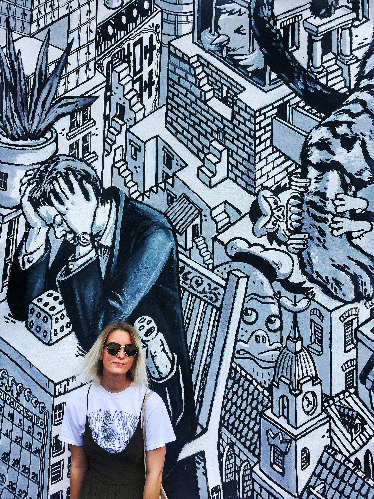
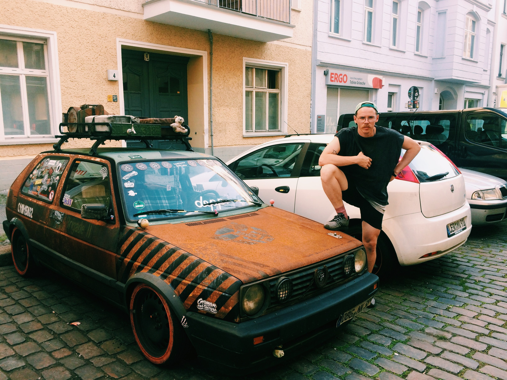
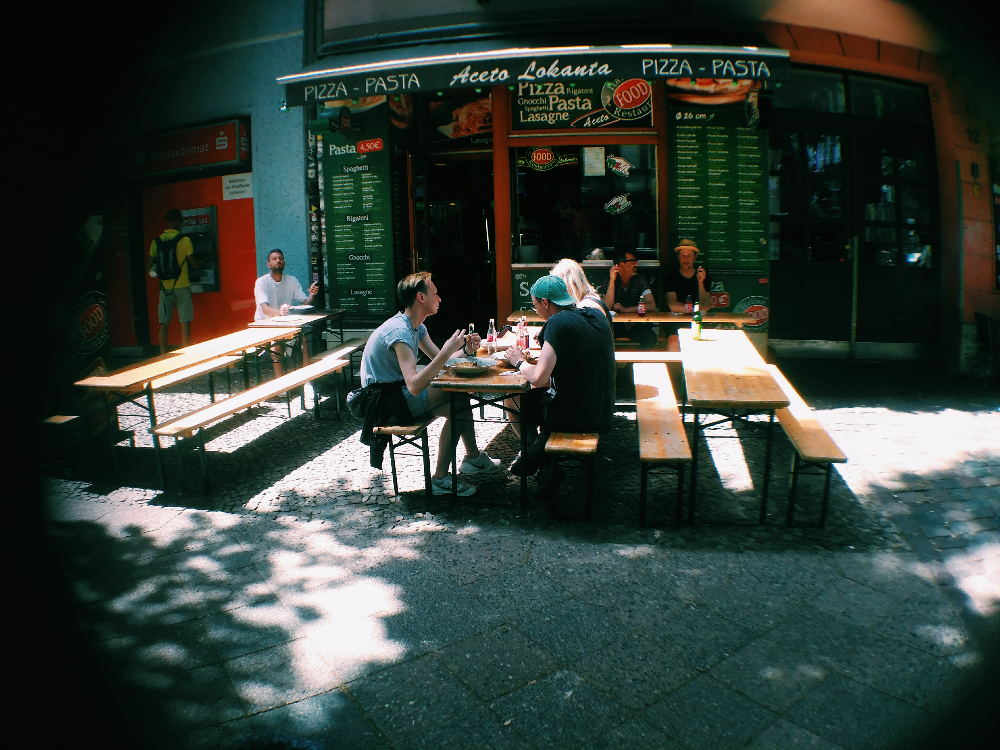
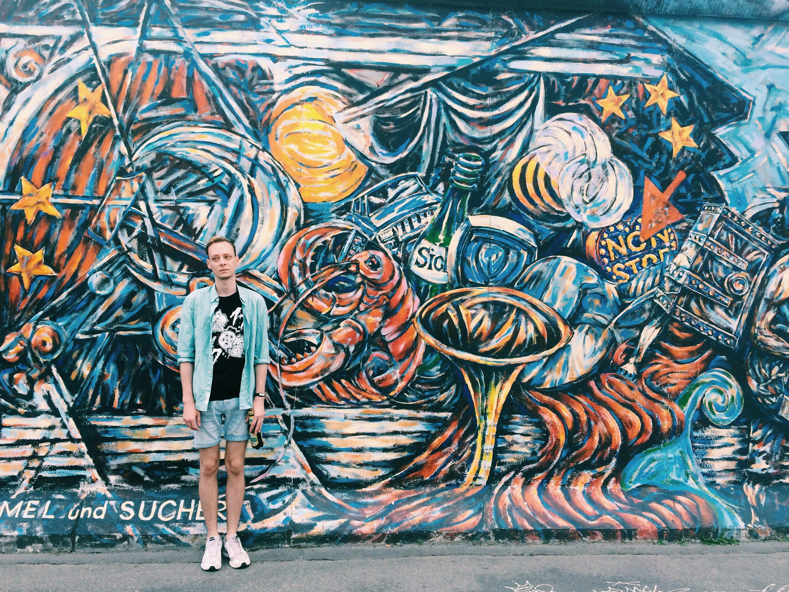
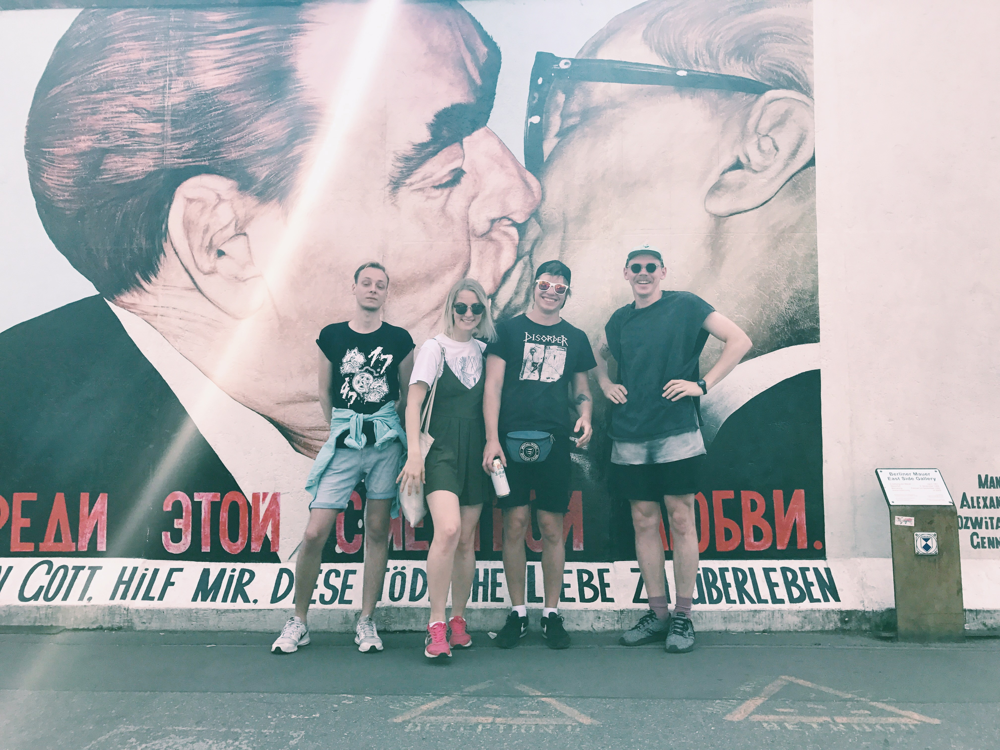
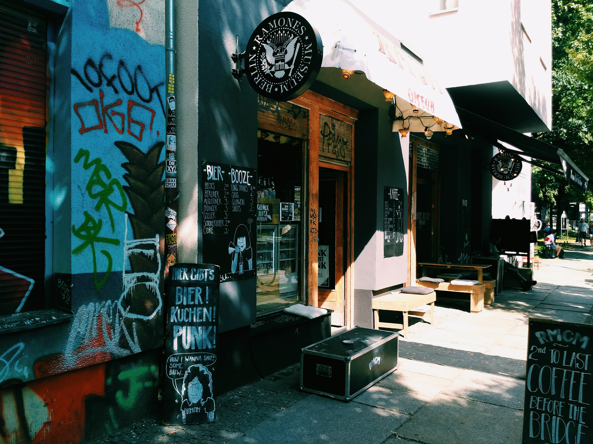
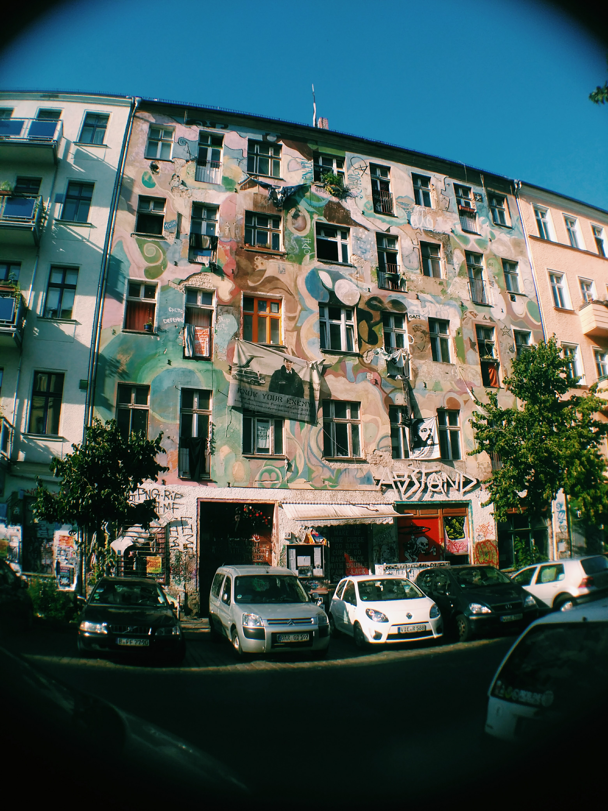

Сегодня мы должны были попасть уже на нашу с Толей вписку с каучсерфинга, о которой договорились еще в Челябинске и заодно договориться о вписке для Миши и Оли. Забрав рюкзаки от Николаса, мы отправились в гости к чуваку по имени Дарио, нашему следующему каучу.

Дарио живет в совершенно противоположной части города (в западном Берлине), гораздо более тихой и уютной. Найдя его адрес при помощи навигатора, мы позвонили в домофон и услышали приглашение войти. Дарио оказался адекватным и очень скромным инженером-программистом, который на досуге занимается чесс-боксингом:) Это когда ты один раунд играешь в шахматы, а в другом раунде уже боксируешь с оппонентом. Я ему сказал, что в России любая шахматная партия заканчивается боксом.

Дарио был лоялен к панкам, слушал панк-рок и у него было много панковских стикеров в квартире. Но поговорить с Дарио по душам не очень получалось, потому что я с трудом понимал его английский с сильным немецким акцентом, но в этот вечер удалось с ним договориться о вписке для Миши и Оли и следующий вечер обещал грандиозный ужин и, может быть, у этого парня появится настроение познать weird russian soul.

**20 июля.**

Следующий день был по вялому туризму. Дарио выписал нас рано утром и мы не знали, чем себя занять. Погугяли по окрестностям района, где живет Дарио. Зашли на кладбище. Кладбища у них выглядят как парки. Аккуратные, ухоженные, все места погребения выполнены в одном стиле. Толя вообще впечатлился.

Потом пошли в ТРК коротать время в вай-фае, но через час были изгнаны охранником, который увидел, что Толя спит и сказал, что мол уматывайте бичи вонючие, здесь нельзя спать.

Дождавшись, когда ребята проснутся и соизволят встретиться с нами, мы не придумали чем заняться и решили просто гулять по центру Берлина. Валялись на траве, поедая сладости, чипсы и употребляя хмельные напитки. В этом городе создана максимально комфортная среда для того, чтобы гулять. Никогда не отказывал себе в дегустации очередной марки пива, но их было слишком много, чтобы запоминать или выбирать - просто берешь понравившуюся банку и идёшь употреблять. Знаю, я говорил, что тут не принято пить на людях, но в зонах отдыха было много туристов, кто скромно боролся с упаковками жидкого хлеба. В Берлине я себя чувствовал спокойной и в безопасности и всё в городе говорило: "Чувак, расслабься, ты в Берлине!". Вечером Миша и Оля выписались от Николаса и мы, по пути заскочив в супермаркет, поехали на вписку к Дарио.



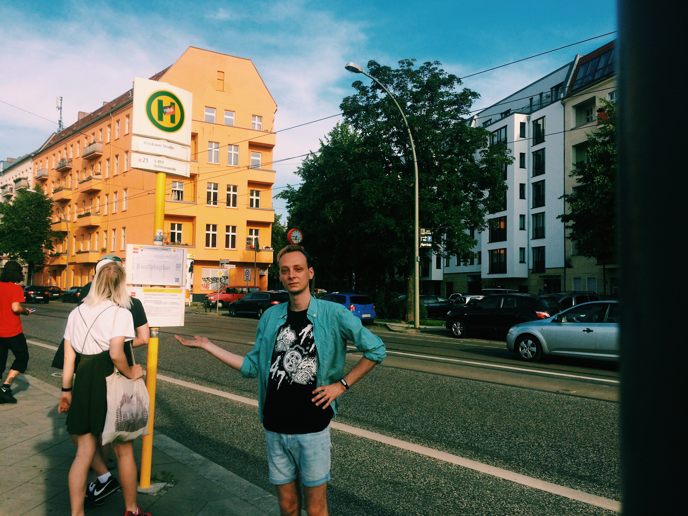

К слову, о супермаркетах. Абсолютно все товары в Берлине стоят в 3-4 раза дороже, чем в России. Например, две средних луковицы стоят два евро. На два евро в России я могу купить наверное килограмм 5 лука. Ну уже перестав сравнивать цены, мы брали то, что хотели. Но вегетарианские кайфы типа котлет и прочих тофу с сейтаном мы иногда выкладывали из корзины, потому что "чуваки, это оооочень дорого!"

На кухне у Дарио уже во всю гремели кастрюли, а Оля развлекала нашего хоста расспросами о жизни в Германии и о житухе вообще. За ужином немного поприкалывались, Дарио попросил научить его каким-нибудь русским выражениям. Я, как быдлан, предложил научить его матюкам, но Оля научила его нормальным фразам типа "спокойной ночи", "приятного аппетита", "спасибо" и "меня зовут Дарио".



На следующий день мы должны были ехать в Гамбург. Мы с Толей обговорили заранее, чтоб будем ездить автобусами (автобусы недорогие и часто есть акции на билеты) и не тратить время, ожидая тачки на трассе. Но в этот раз решили поехать автостопом, потому что мне было интересно получить и этот опыт путешествий. Так что, лечь надо было пораньше и с утра идти на трассу, но мы развлекались тем, что включали Дарио russian pank-rawk типа групп "поспишь потом" и (он сказал, что любит ska) наших Truckdrivers. И просто угорали над предыдущей впиской с Николасом. Некоторые его выражения мы шутили на протяжении всего тура. Какой же кайф, что нас четверо и мы вместе так далеко от дома.

В позднем часу мы отошли ко сну. Завтра мы едем в Гамбург.
