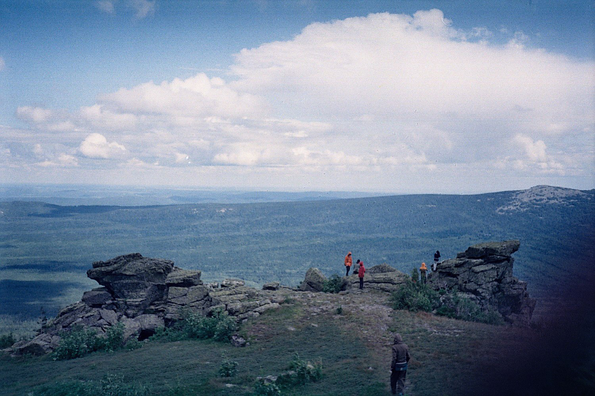

Проснулся я в 6 утра в понедельник. Попил кофе и погнал на автовокзал дабы встретиться с друзьями и вместе погнать покорять просторы уральской горной природы. Прибыв раньше всех, я начал скандалить почему все опаздывают ибо в прошлый раз я опоздал на полчаса и все ругали меня за это. Но не суть. Встретившись с корешами и девахами из города Волжского (они приезжали погостить), мы отправились в Златоуст. Я долго не мог уснуть, поэтому обсуждал всякую фигню с Линой и слушал рассказ Дани о прошедшем фестивале ОГНИ. С сей увлекательной беседой я не заметил как мы уже оказались в Златоусте. Купив всякой снеди и приколов к чаю, мы сразу отказались и решили не покупать огненную воду (о чем я очень сильно пожалел, но об этом позже). Добравшись до входа в национальный парк, я успел несколько раз переобуться, ибо погода была не очень понятной. Но при выборе из рваных в хлам вэнсов и мартинов, я выбрал мартина, что в целом оказалось крутым решением.

- 
    
- 
    
- 
    

Ну мы и пошли. Шли, обсуждали всякие штуки, прикалывались. Карине спустя 500 метров стало плохо (простыла на Огнях) и Даня отправил ее домой, забрав себе часть ее рюкзака. Попрощавшись с Кариной, мы продолжили свое путешествие. Целью нашего дня было добраться до стоянки «Заячья поляна», а также по пути забраться на Откликной. Сколько это в километрах, я не помню, но где-то порядка 12ти. Дороги были сырые и местами заболоченные, поэтому многие чуваки промочили свою обувь, но при этом не потеряли стойкости моральной. Также иногда шел мелкий противный дождь вынуждая нас надеть штормовики на рюкзаки и душные дождевики на себя. Пройдя несколько часов по парку и делая короткие остановки на стоянках чтобы набрать воды и слегка наполнить зоб, мы добрались до Откликного Гребня. Пока мы шли до самой горы прошел умеренный дождь, намочив сами скалы и, судя по лютым тучам, это была не последняя выходка непогоды. Благодаря реплике Кати, которая стала доступна лишь после прокачки таланта «красноречие» мы решили изменить свои планы: решили пойти дальше и подняться на Откликной уже на обратном пути, когда будет сухо и не надо будет бежать наперегонки с дождем. Ну и мы, собственно, пошли дальше. Спустя пару часов спуска, мы наконец добрались до места стоянки и разбили лагерь. Сырые дрова не особо хотели гореть, но, следуя заветам Беара Гриллса и его передачи «Выжить любой ценой» мы разожгли костер, согрелись и поели гречки с овощами. За день устав, мы отправились спать даже толком не попив чаю и не поговорив.

**День второй.**

Всю ночь шел дождь и было адски холодно ночью, хотя я спал в одежде и шапке + спальник.  
Вещи нихрена не высохли, но небо было ясным и это внушало надежду, что сегодня всё будет по кайфу. Позавтракав вчерашней гречкой, я начал потчевать друзей «вкусным экспрессом от бористы» (я взял с собой много свежемолотого кофе). Вроде всем понравилось, слушал респекты и радовался вместе со всеми.  
Оставив лагерь, мы двинули налегке до Метеостанции (Дальний Таганай). Прохладное утро вынудило меня и многих других граждан тепло одеться, что потом сказалось в пути: ясный день заставил все наши одежки без застежек надеть на пояса. Долгая и утомительная дорога до Метеостанции дала о себе знать и подорвала мое моральное состояние. Я уже было начал подозревать, что там совсем некруто и мы просто как олухи идем до какого-то сраного домика в поле. Сдерживаясь несколько километров, я не выдержал, и в сердцах выпалил главарю нашей шайки Родьке: «ГДЕ ЭТА СРАНАЯ МЕТЕОСТАНЦИЯ!?!?!?», на что Данил мне хладнокровно ответил: «Ну-ка, не ныть!». Как оказалось, я почти дотерпел и уже через 500 метров нам открылся удивительный вид Дальнего Таганая со всеми его равнинами, горами и горной тундрой. Извинившись перед Даней и про себя поблагодарив батю, что тот подогнал мне ветровку-дождевик, которая спасла меня от дождя и от просто супер-сильного ветра на метеостанции (говорят, что ветер бывает такой силы, что от домика приюта до туалета приходится натягивать канат и цепляться за него когда идешь по делам, чтоб нахрен не сдуло). Закутавшись в одежды, мы принялись пить чай из термосов и вкушать припасенные яства. Было супер-круто: горы, яркое солнце, лютый ветер и пикник за столом среди друзей и всякими убогими шутками и выходками с кабачковой икрой.

- 
    
- 
    
- 
    

Пообедав мы принялись изучать окрестности. Территория вокруг метеостанции считается заповедной зоной и Даня строго-настрого запретил ходить по всему, что не похоже на тропинку, пригрозив в случае неповиновения депортацией из парка и штрафом в несколько тысяч рублей от егерей. Походив по тундре и поигравшись с местным котом, мы забрались на гору и устроившись там, начали прикалываться и обсуждать насущные проблемы. Зоркие глаза Евгения и Юлии вовремя заметили дождевую тучу и мы приняли скороспешное решение спускаться и бежать в лагерь. Что оказалось мудро, ибо как только мы спустились дождь добрался и до наших тел. Дорога до лагеря была долгой и ее осложняли болотистые участки, по которым приходилось как горный козел прыгать с камня на камень. Сраный дождь обострял ситуацию и мы шли, сравнивая всё с Вьетнамом времен гражданской войны, знания о котором у нас были только из фильмов. Дождь иногда кончался, иногда начинался с новой силой, но несмотря на это мы, мокрые, замерзшие, но вроде как веселые, добрались до лагеря. Едва я ступил на поляну с палатками начался лютый ливень и мы разбежались по палаткам попутно прихватив всякие печеньки и сухари. Сняв мокрые шмотки в палатке и выкинув их на улицу под тент, мы начали согреваться спальниками и строить планы на вечер. Самым худшим раскладом было то, что ливень не кончится и мы завтра мокрые пойдем домой (целью было пожрать и высушить одежду). Лучшим: то, что сейчас всё кончится и мы будем как кайфовые пацаны кушать еду, пить «экспресс от бористы Михаила Медведки» и всячески угорать и смеяться. Просидев в палатке минут 40 и услышав, что дождь всё-таки кончился, я попросил рядового Гришуньку доложить обстановку, на что в ответ услышал: «Рядовой Гришунька докладывает: обстановка на текущий час такая — дождь кончился, небо ясное» и мы выползли из палаток. Необходимо было высушить вещи и разжечь костер, чем мы и принялись заниматься. Я был дико не рад тому, что взял с собой мало теплых вещей и дико рад тому, что кофта, которую мне утром подогнал Миша оказалсь сухая. Стоя у костра в исподнем и кофте я был рад, что наконец-то нам всем околосухо и почти тепло. Григорий ушел за дровами, а Миша решил отобрать у меня теплую кофту назад, и я был вынужден резко искать себе новый обогрев. Тут я и пожалел, что мы не взяли водяру (я голосовал против водяры, потому что я люблю на природе сидеть всем трезвыми и говорить по-душам нежели тупо облуженными в хлам гудеть и ржать как кони) ибо согреться да и настроение поднять явно не помешало. Быстро стемнело и вернулся Григорий…без дров и топора. Объяснив расклады, почему всё так оно вышло (топор был мой) мы приняли решение взять фонарики (тьма была хоть глаз коли) и отправиться в те места, где его в последний раз его видели и провести расследование. Григорий умно расставил ориентиры в лесу, и, забравшись в ночную глубь леса, мы принялись ходить кругами вокруг одного и того же дерева так ничего и не найдя. Я было уж начал паниковать предсказывая скорейшую кончину в лесу от переохлаждения и голода, как следопыт Григорий вышел на след. После быстрого установления обстоятельств утраты топора луч моего фонаря наткнулся на ручку искомого в зарослях папоротника и, сделав последнюю ошибку в выборе тропинки, мы исправились и благополучно принесли топор и дрова в лагерь. Дрова не хотели гореть, мы попили кофе, поели вкуснейший рис со свежесобранными грибами и поприкалывавшись над всякой фигней вроде песен группы «Кувалда» и послушав мой сомнительный талант исполнения песен под гавайскую гитару мы отошли ко сну.

**День третий.**

Проворочавшись всю ночь, я не мог уснуть поэтому просто тупо пролежал до утра (походу сказалось действие кофе, потому что Даня точно так же не мог уснуть всю ночь).

Палатка приятно была залита солнечным светом и я понял, что Олег Газманов вернул ясные дни. Просушившись, позавтракав вкуснейшей овсянкой с арахисом и изюмом, мы начали собираться. Впервые за три дня я надел шорты и солнцезащитные очки. Я собрал рюкзак и начал придуриваться с укулеле, исполнив пару песен на сей гитарке. Когда вся шайка была собрана мы двинулись в путь. Добравшись на обратном пути до Откликного и покайфовав от вида с поляны перед ним, мы приняли решение забраться таки на непокоренную вершину. Я настоял на том, что необходимо не нарушать традиции похода и пить чай на горе (в знаковых местах мы пили чай из термоса). Мне сказали, что термос понесу я сам, что я стойко выполнил. И вот, спустя минут двадцать лазания по камням и поиска удобных для поднятия своих тел в гору троп, мы добрались до вершины и уже шутили шутки с видом на всю уральскую природу с высоты птичьего полета. Супер-красиво всё было видно, ясный был день.

- 
    
- 
    

Пофоткавшись, попив чай, мы спустились, взяли рюкзаки и двинули домой. Даня поставил задачу: супер-быстро добраться дабы успеть на электричку, чтобы сэкономить денег и ехать в более крутых условиях. Но как я понял, для меня эта задача трудновыполнима, потому что я осознал что в долбаных мартинах я сбил ноги и мне адски трудно было идти. Неожиданностью стала короткая встреча с Сиегой и Ирой, но я не успел с ними поговорить. В общем, мы прошли 6 километров и, борясь с болью и усталостью, я отстал от друзей минут на 10 и в итоге перепутал тропу и вышел не туда куда надо было выйти. Чуть было запаниковав, я увидел на трассе всю банду и догнал их. На электричку мы не успели. Было принято решение ехать всем на автобусе и, спустя полчаса езды на маршрутке, мы уже мразовали на автовокзале показывая свои грязные ноги аборигенам, и воняя потом на всю округу, при этом громко смеясь. Я был бы супер-недоволен, если бы был не знаком с этими ребятами и имел вызов находиться с ними рядом. Все сходили в магазин, купили себе всякой снеди и, взяв свой скарб, уехали на автобусе. В автобусе часть пути мы спали, а часть пути мразовали играя в тупые игры и раздражали людей громким смехом и шутками из песен всё той же группы «Кувалда» (Все сбываются мечты, в морге — конкурс красоты, Алкоголик-некрофил — самый главный член жюри!). Доехали до Челябинска и на одной из последних маршруток я добрался домой. Принял душ, ноги и спина адско болели и гудели. Попил чай и просто рухнул спать.

На этом всё, спасибо за внимание! Как говорил Семен Давыдов: «Это факт!», а как говорил Дмитрий Нагиев в передаче «Окна»: «Я не прощаюсь, я говорю „До свидания!“ До свидания, друзья!

\[jetpack\_subscription\_form show\_only\_email\_and\_button="true" custom\_background\_button\_color="undefined" custom\_text\_button\_color="undefined" submit\_button\_text="Подписаться" submit\_button\_classes="undefined" show\_subscribers\_total="false" \]

[Поддержать](https://rocketbank.ru/m.skndlst)
