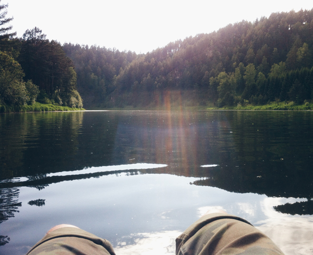
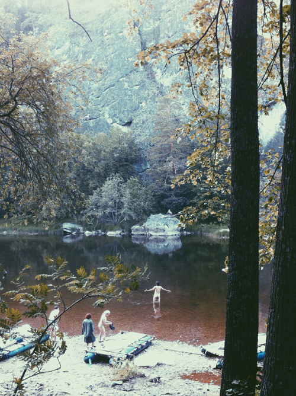
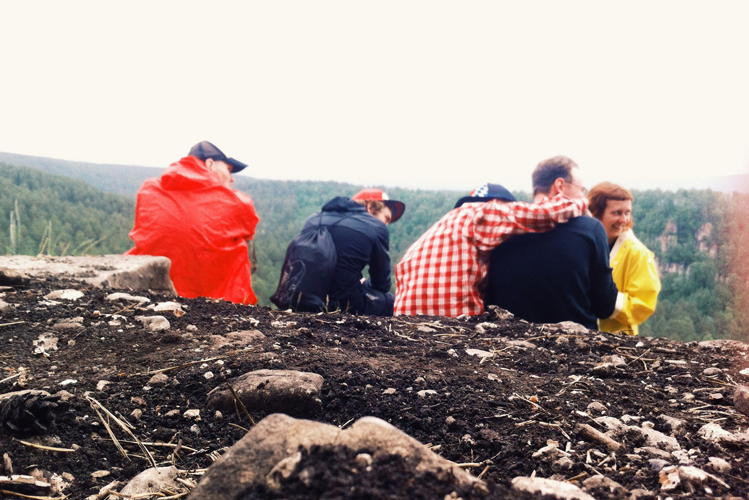
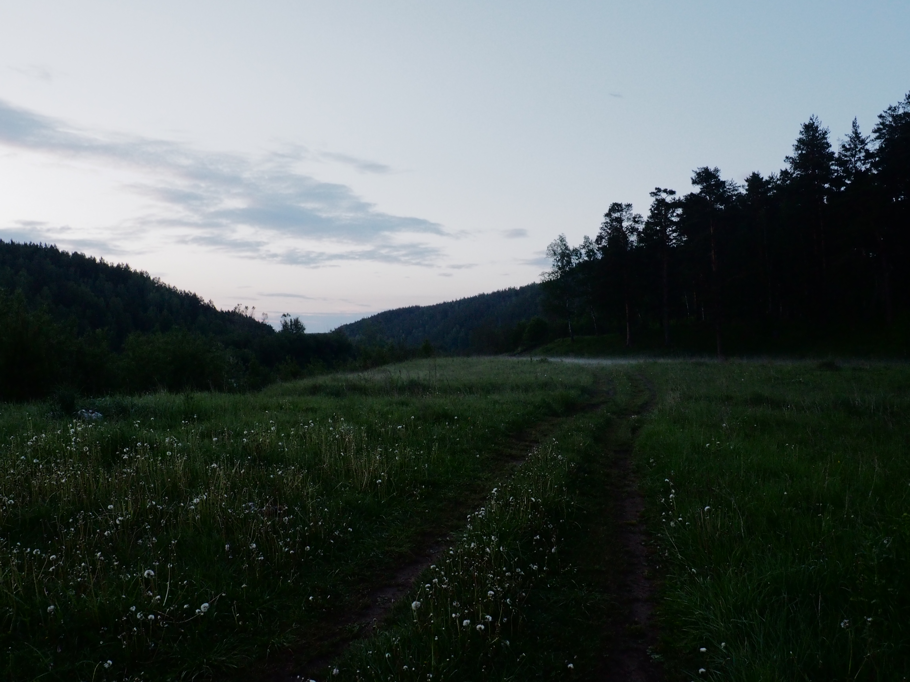
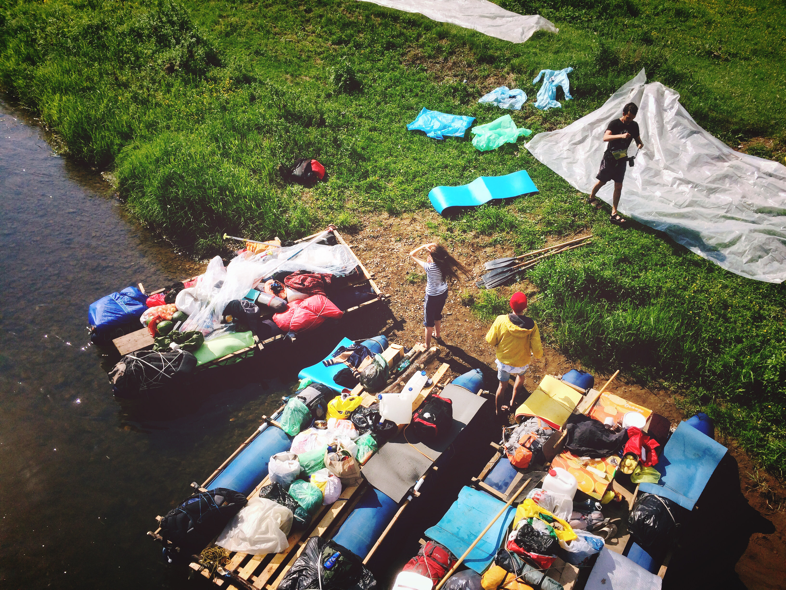
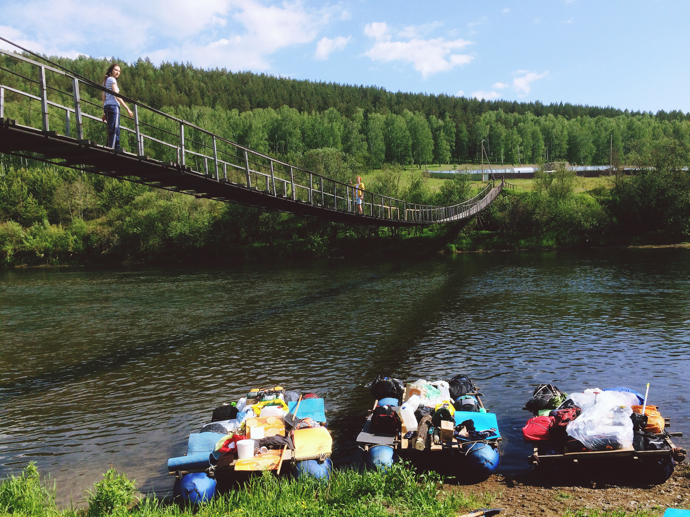
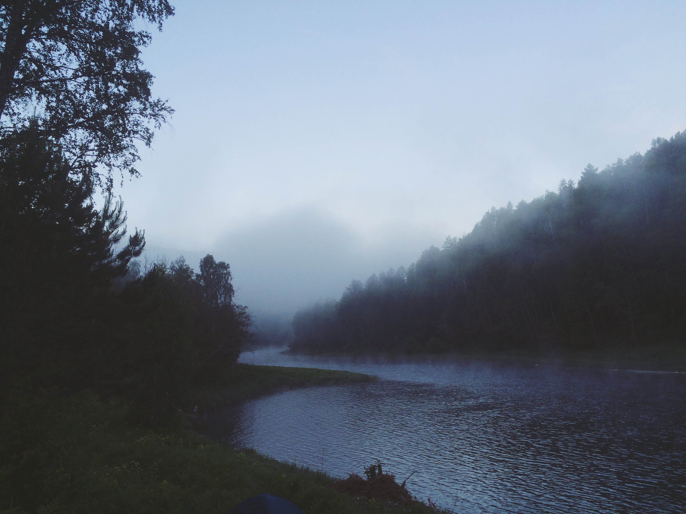
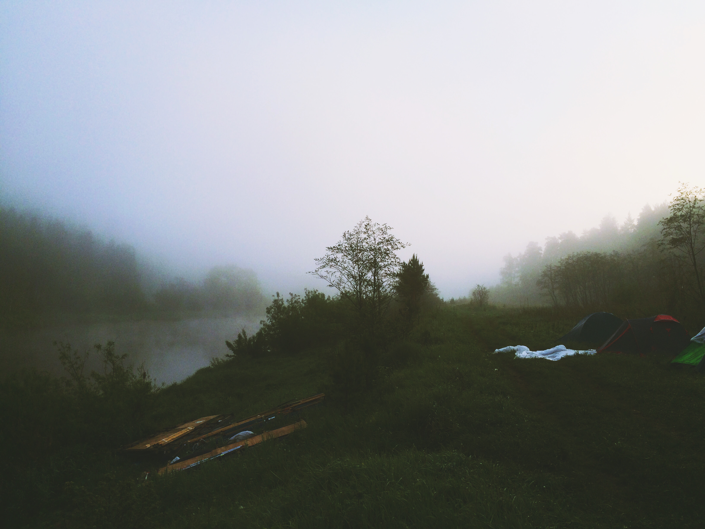
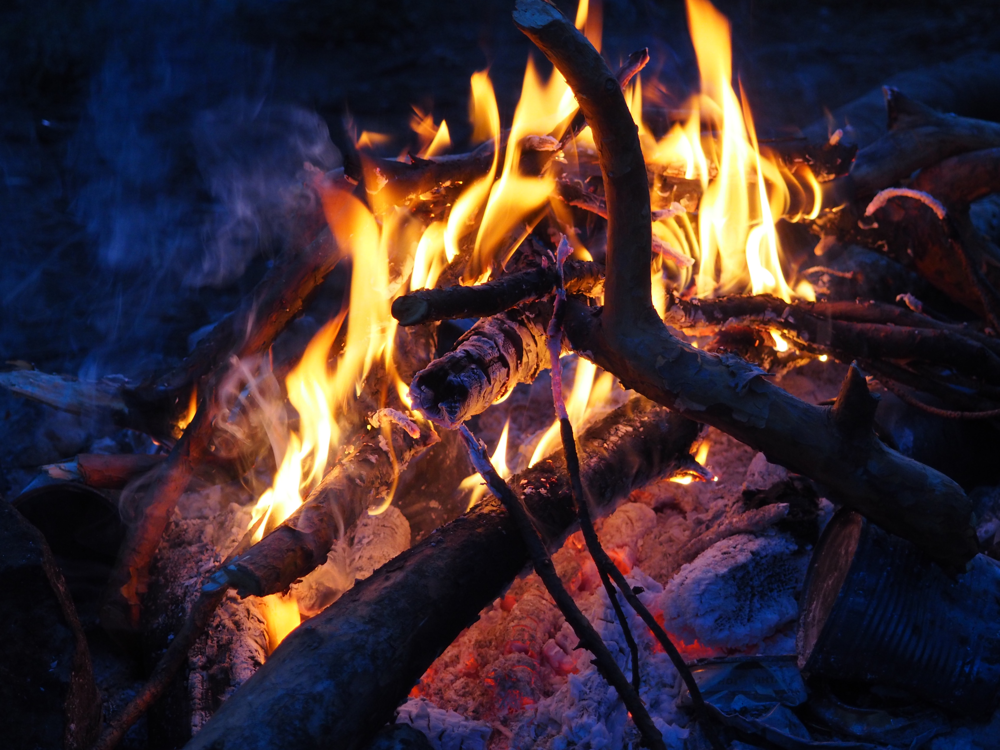
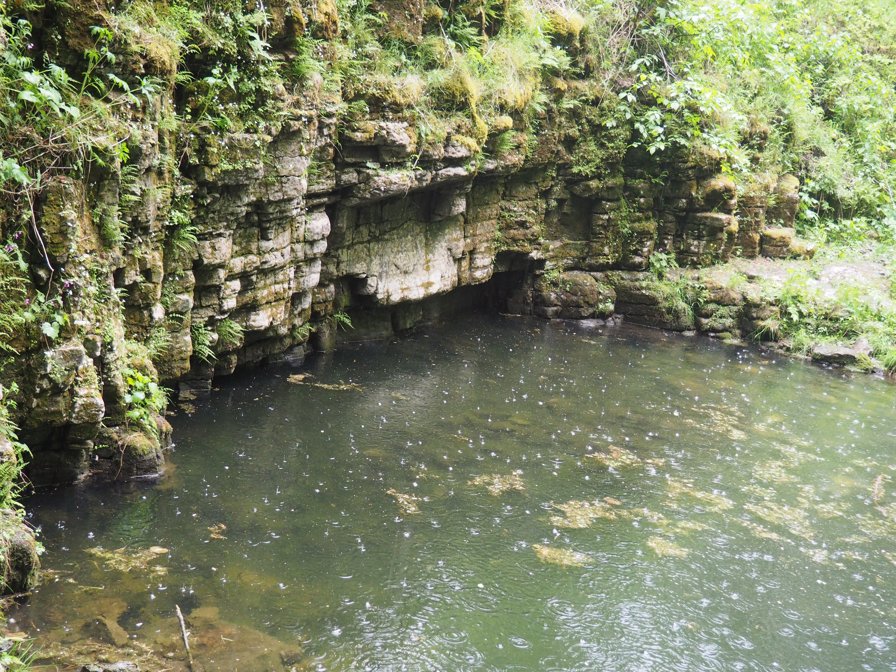

Я ни разу в жизни не был на сплаве. И вот тут мне выдалась возможность с корешами из нашей скромной тусовки познать, что такое топтать палубу катамарана посреди реки. Сплавляться было решено по реке Ай в Челябинско-Башкортостанской области. Река славится спокойным нравом и общей красотой видов, что для первого раза (а это всегда волнительно) было предостаточно. Утром 3го июня мы встретились со всеми покорителями рек и прочими любителями семи футов под килем и, якорь мне в задницу, отправились к зоне высадки.

В какой-то глухой «дярёвне» мы собрали из говна и палок свои посудины. Наши катамараны со стороны были похожи на катамараны орков, если бы орки сплавлялись бы по рекам и как кто-то круто подметил: «блин, чуваки, со стороны мы как будто мусор перевозим по реке или как беженцы, которые ломятся в Европу». Тем не менее, раздобыть эти катамараны для Никиты стоило огромных трудов и, несмотря на внешний вид (мне то ваще пофиг как они выглядели, самое главное, что они выполняли свою функцию) мы смогли сплавится на них без происшествий. Так что, спасибо Никите за оборудование и помощь в освоении навыка «сборка катамарана туристического базового».

Я не буду как обычно до мелочей расписывать чё каво, кто чем чистил зубы и кто сколько раз сходил за все эти ночи поссать, расскажу (офигеть!) лишь основное.

**Впечатления от самого сплава.** Угарно плыть на катамаране, наслаждаться гармонией тишины и природных красот. Красиво слева, красиво справа, красиво прямо. Сзади некрасиво, потому что Даня постоянно орал на меня, что я дерьмово гребу (попробуй разберись с инерцией этой шлюпки, да еще и управление инвертировано!). В целом, по кайфу. Плывешь, загораешь, пялишься по сторонам, иногда разговариваешь с командой шхуны или берешь на абордаж катамаран корешей, потому что там всегда есть чем поживиться из съестных приколов да пошутить пару шуток.

Ранее, еще в городе, в приступе меланхолии я даже было хотел передумать ехать на сплав, но жажда заняться тем, чем никогда не занимался победила и вот я сажусь на борт и плавно отрываюсь от берега и понимаю, что сейчас получаю совершенно новые уникальные чувства. Мне кажется для таких вот движух и надо жить.

**Всякие мелочи, которые запомнились:**

Чуваков покусали клещи. Клещей ваще дохрена было, но чуваки решили рискнуть, вроде всё нормально, все покусаные живы и вроде нормально живут. Мы даже решили назвать панк-группу «Клещ», но Даня сказал, что «Мамкин Перегар» или «Батин Лещ» круче.

_Купание в реке напротив скалы_ тоже ништяк было. Всё как в молодежных фильмах: скала, река, вечер и смех чуваков, у которых истерика на фоне обострения чувства молодости и счастья. Кайф.

_Прогулки по лесам, горам,_ всяким тысячу лет заброшенным совхозам. Костры, всякие тупые, но очень угарные истории, которые в городе никто никогда не расскажет. Общее хорошее настроение ребят, анекдоты и осознание того, что компьютер, начальник и бытовые проблемы остались где-то там, а здесь лишь моменты и гармония с собой и природой и хариусом и клещами.

_Так и не узнал, что такое «Дилижанс»._ Коляс рассказывал полчаса анекдот про мужика, который хотел узнать что такое «Дилижанс» (какой-то вид сексуальных утех), но ему все отказали в разъяснении этого понятия. И для слушателей анекдота вопрос тоже остался открытым как и тот вопрос, почему он полчаса ссал нам в уши)

_Еще запомнился угар про рыбу хариус._ Мы проплывали мимо каких-то рыбаков, и один из них нам показал рыбу размером с предплечье и сказал с глазами безумца: «Хариус!11». С тех пор когда мы видели, что какой-то рыбак поймал рыбу и тянет её — мы всей шайкой человек, которым всем ~25 лет орали как обезумевшие школьники рыбаку:«ААААА ХАРИУС1111!!!! ЧУВАКИ, ЭТО ХАРИУС!!1 ХАРИУС!!!». Было смешно.

Ну это основное, была еще куча мелочей из которых складывается крутая картинка. Лес, река, друзья, костры и всякое такое остальное. «Я не понимаю людей, которые живут в России и не бухают при первой же возможности». Чем еще заниматься летом, как не этим? К тому же убеждаюсь, что Урал — не самое плохое место, где довелось родиться, а даже наоборот. Я как-то сидел у костра и задумался, что без панка (в каком бы он многогранном проявлении не существовал) никто из этих ребят не был бы знаком, а уж тем более не ржал у костра над хариусом. Осмеянный хариус — слабый хариус. Круто быть частью такого.

Всё было круто, спасибо Никите за такой кикстарт в самом начале лета.

- 
    
- 
    
- 
    
- 
    
- 
    
- 
    
- 
    

Нагло позаимствовал для отчёта фотки за авторством Кати и Дани, им спасибо.

Тут еще видеомастерская «Луна» смонтировала ролик, посмотрите

https://vimeo.com/174320037

\[jetpack\_subscription\_form show\_only\_email\_and\_button="true" custom\_background\_button\_color="undefined" custom\_text\_button\_color="undefined" submit\_button\_text="Подписаться" submit\_button\_classes="undefined" show\_subscribers\_total="false" \]

[Поддержать](https://rocketbank.ru/m.skndlst)
